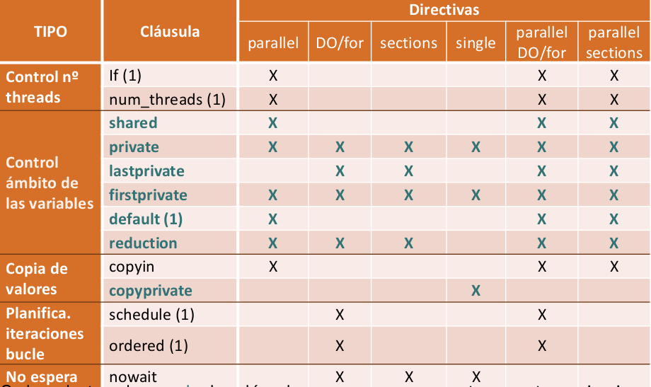

# Paralelización de código en c/c++

## Introducción

Para la paralelización de código se usará la herramienta **OpenMP**.

OpenMP es una API para escribir código en paralelo basado en el paradigma de programación de variables compartidas para ejecutar aplicaciones en paralelo en varios threads. Además es no automática, es decir, no extrae paralelismo implícito.

La API OpenMP comprende directivas del compilador, funciones de biblioteca y variables de entorno.

Se podría considerar estándar por el gran número de vendedores y fabricantes que lo han definido.

OpenMP también sirve para paralelizar código FORTRAN.

## Componentes de OpenMP

- Directivas: El prepocesador del compilador las sustituye por código.
- Funciones: Sirven entre otras para fijar y preguntar parámetros en tiempo de ejecución.
- Variables de entorno: Sirven para fijar parámetros antes de la ejecución (como el número de threads: `export OMP_NUM_THREADS=N`).

## Sintaxis

La sintaxis siempre será del tipo:

```c++
#pragma omp <nombrededirectiva> <cláusula> <newline>
```

- Las cláusulas son opcionales y especifican adicionalmente la acción o comportamiento.

- <newline\> es necesario y precede al bloque estructurado que engloba la directiva.

Por ejemplo:

```c++
#pragma omp parallel num_threads(8) if (N>20)
// El código siguiente se ejecuta en paralelo con 8 hebras si N>20
```

Para usar varias líneas de código se usa `\` para unirlas: 

```c++
#pragma omp parallel private (...) \
shared (...)
```

## Compilación

Para compilar usaremos el flag `fopenmp` o `openmp`, así se definirá `_OPENMP` en nuestro código y se tendrán en cuenta las directivas de OpenMP.

```bash
# Compilación para código c
gcc -fopenmp -O2 -std=c11 -Wall fichero.c -o ejecutable
# Compilación para código c++
g++ -fopenmp -O2 -std=c++11 -Wall fichero.cpp -o ejecutable
# Se puede usar -O3 en ambos casos, pero puede provocar errores.
# Se puede añadir el flag -march=native (tras -fopenmp)
# El estándar de c++ puede usarse también el 14.
```

Por ejemplo, el siguiente código en c comprueba si se ha compilado con `fopenmp` y en caso afirmativo paraleliza el bucle, si no, se ejecuta de forma secuencial.

```c++
#ifdef _OPENMP
	omp_set_num_threadas(nthread)
#endif
        
#pragma omp parallel for
for(i=0;i<n;i++)
    for(j=0;j<n;j++)
        // Código
```

## Directivas

### Parallel

```c
#pragma omp parallel
```

- Especifica qué cálculos se ejecutarán en paralelo. Se pasa de secuencial a paralelo.
- El thread master crea un conjunto de threads.
- Cada thread ejecuta el código incluido en la región.
- No reparte tareas entre threads.
- Se pueden anidar y usar otras directivas dentro de esta. (No se pueden usar otras directivas fuera de parallel).
- Tiene una barrera implícita al final (es decir, dado un punto no se sigu ejecutando hasta que todas las hebras han llegado a él).

```c
#include <stdio.h>
#ifdef _OPENMP
	#include <omp.h>
#else
	#define omp_get_thread_num() 0
#endif

main(){
    int ID;
    #pragma omp parallel private(ID)
    {
        ID = omp_get_thread_num(); //ID tiene el identificador de la hebra que la ejecuta.
        printf("Soy la hebra %d",ID);
    }
}
```

Para modificar el número de hebras que se lanzan se modificará en la terminal la variable `OMP_NUM_THREADS`, es recomendable no usar más hebras que procesadores físicos.

```bash
export OMP_NUM_THREADS=4 #Se lanzarán 4 hebras al ejecutar el programa
```

Las hebras se enumeran de 0 hacia adelante, la hebra master siempre es la 0.

### for

- Implementa paralelismo de datos a nivel de bucle.
- Se tiene que conocer el número de iteraciones y se debe iterar sobre un entero.
- Solo sirve para bucles for.
- Se decide automáticamente la asignación de trabajo a hebras.
- Tiene una barrera implícita al final.

```c
#include <stdio.h>
#include <stdlib.h>
#include <omp.h>

int main(int argc, char *argv[]){
    int i;
    int n;
    if (argc < 2){
        fprintf(stderr,"\nError, falta numero de iteraciones\n");
        exit(-1);
    }
    n = atoi(argv[1]);
    #pragma omp parallel
    {
        #pragma omp for
        for (i=0; i<n; ++i)
            printf("Soy la hebra %d y ejecuto la iteracion %d",omp_get_thread_num(),i);
    }
    return 0;
}
```

### sections

- Implementa paralalelismo de tareas o a nivel de función.
- La asignación de tareas a threads concretos la hace automática.
- Tiene barrera implícita al final.
- Cada hebra ejecuta un section, no lo hacen a la vez.

```c
#include <stdio.h>
#include <omp.h>

void funcA(){
    printf("En funcA lo ejecuta el thread: %d",omp_get_thread_num());
}
void funcB(){
    printf("En funcB lo ejecuta el thread: %d",omp_get_thread_num());
}

int main(int argc, char**argv){
    #pragma omp parallel
    {
        #pragma omp sections
        	#pragma omp section
        		(void)funcA();
        	#pragma omp setion
        		(void)funcB();
    }
}
```

### single

- Ejecuta un trozo secuencial por un solo thread.
- Cualquier thread puede ejecutar el código secuencial, pero solo lo hará este.
- Tiene barrera implícita al final.

```c
#include <stdio.h>
#include <omp.h>
int main(int argc, char** argv){
    int n = 9,i,a,b[n];
    for (i = 0; i < n; ++i)
        b[i] = -1;
    #pragma omp parallel
    {
        #pragma omp single
        {
            printf("Introduce el valor de inicialización a");
            scanf("%d",&a);
            printf("Single ejecutada por el thread %d", omp_get_thread_num());
        }
        #pragma omp for
        for (i=0; i < n; ++i)
            b[i] = a
    }
    printf("Después de la región parallel: ")
    for (i=0; i <  n; ++i)
        printf("b[%d]=%d",i,b[i]);
    return 0;
}
```

### barrier

- Fija un punto en el código en el que todos los threads se esperan entre sí.

```c
#include <stlib.h>
#include <time.h>
#ifdef _OPENMP
	#include <omp.h>
#else
	#define omp_get_thread_num() 0
	#define omp_get_num_threads() 1
#endif

int main (int argc, char**argv){
    int tid;
    time_t t1,t2;
    
    #pragma omp parallel private(tid,t1,t2) //Hace privadas a cada hebra tid,t1 y t2
    {
        tid = omp_get_thread_num();
        if (tid < omp_get_num_threads/2)
            system("sleep 3");
        t1 = time(NULL);
        
        #pragma omp barrier
        
        t2 = time(NULL)-t1;
        printf("Tiempo=%d seg\n", t2);
    }
}
```

### critical

- Evita que varios threads accedan a variables compartidas a la vez, es decir, sirve para evitar condiciones de carrera (esto es, el resultado del programa depende del orden en el que se ejecuten las hebras).

```c
#include <stdio.h>
#include <stdlib.h>
#include <omp.h>
int main(int argc, char **argv)   {
   int i, n=20, a[n],suma=0,sumalocal;
   if(argc < 2)     {
         fprintf(stderr,"\nFalta iteraciones\n"); exit(-1);
   } 
   n = atoi(argv[1]); if (n>20) n=20; 

   for (i=0; i<n; i++)    a[i] = i; 
 
#pragma omp parallel private(sumalocal)
{  sumalocal=0;
   #pragma omp for  schedule(static)
   for (i=0; i<n; i++)
   {   sumalocal += a[i];
       printf(" thread %d suma de a[%d]=%d sumalocal=%d \n",  omp_get_thread_num(),i,a[i],sumalocal);
   } 
   #pragma omp critical 
       suma = suma + sumalocal;
}  
   printf("Fuera de 'parallel' suma=%d\n",suma);
   return(0);
}
```

### atomic

- Es una alternativa a critical más eficiente, en especial operaciones +,-,*,/,&,^,|,<<,>>.

```c
#include <stdio.h>
#include <stdlib.h>
#include <omp.h>

int main(int argc, char **argv)  {
   int i, n=20, a[n],suma=0,sumalocal;
   if(argc < 2)     {
      fprintf(stderr,"\nFalta iteraciones\n");
      exit(-1);
     }
   n = atoi(argv[1]); if (n>20) n=20; 

   for (i=0; i<n; i++)     a[i] = i; 
 
  #pragma omp parallel private(sumalocal)
  {  sumalocal=0;
     #pragma omp for  schedule(static)
     for (i=0; i<n; i++)
     {   sumalocal += a[i];
         printf(" thread %d suma de a[%d]=%d sumalocal=%d \n",  omp_get_thread_num(),i,a[i],sumalocal);
     } 
     #pragma omp atomic 
         suma += sumalocal;
  }  
  printf("Fuera de 'parallel' suma=%d\n",suma);
  return(0);
}
```

### master

- No tiene barrera implícita.
- Establece una sección en la que solo entra la hebra master, lo que es útil para recoger datos de las hebras hijas o hacer operaciones, introducir datos...

```c
#include <stdio.h>
#include <stdlib.h>
#include <omp.h>
int main(int argc, char **argv)  {
   int i, n=20, tid, a[n],suma=0,sumalocal;
   if(argc < 2)     {
      fprintf(stderr,"\nFalta iteraciones\n");
      exit(-1);
     }
   n = atoi(argv[1]); if (n>20) n=20; 

   for (i=0; i<n; i++)   a[i] = i; 
 
  #pragma omp parallel private(sumalocal,tid)
  {  sumalocal=0;
     tid=omp_get_thread_num();
     #pragma omp for  schedule(static)
     for (i=0; i<n; i++)
     {    sumalocal += a[i];
           printf(" thread %d suma de a[%d]=%d sumalocal=%d \n",  tid,i,a[i],sumalocal);
     } 
     #pragma omp atomic 
          suma += sumalocal;
     #pragma omp barrier
     #pragma omp master
          printf("thread master=%d imprime suma=%d\n", tid,suma);
  }  
  return 0;
}
```

### Contracción de directivas ya vistas:

Las directivas for y sections se pueden condensar en una línea, lo cual facilita la legibilidad y también mejora las prestaciones.

```c
#pragma omp parallel
	#pragma omp for
//Estas dos líneas se condensan en:
#pragma omp parallel for
```

```c
#pragma omp parallel
	#pragma omp sections
//Estas dos líneas se condensan en:
#pragma omp parallel sections
```

## Cláusulas

### Introducción

Las cláusulas ajustan el comportamiento de las directivas. Las directivas con cláusulas son:

- parallel.
- Directivas de trabajo compartido: for, sections, single y workshare.
- Directivas que combinan y parallel y directivas de trabajo compartido: parallel for, parallel sections, parallel workshare.

Las directivas que no aceptan cláusulas son: master, critical, barriet, atomic, flush, ordered, threadprivate.

En esta tabla se puede ver qué cláusulas se permiten en cada directiva:



Donde las cláusulas en azul son las que se van a explicar.

### Cláusulas relacionadas con el ámbito de los datos.

Las variables declaradas fuera de una región paralela y las dinámicas son compartidas por los threads  de la región paralela, mientras que las variables declaradas dentro de la región paralela son privadas a cada hebra, esto es, cada hebra tiene una variable propia con ese nombre independiente de la que tengan las demás hebras.

Además, todas los índices de bucles for y las variables declaradas `static` son siempre privadas.

#### shared

`shared(<lista_de_variables>)`

Las variables que haya en `lista_de_variables` se comparten por todos los threads. No afecta a las excepciones de ámbito. Esta cláusula tiene sentido porque como veremos más adelante el ámbito por defecto de las variables puede cambiarse, y, por tanto ser necesario especificar las variables que son compartidas a todas las hebras.

Hay que tener cuidado cuando al menos un thread lee lo que otro thread escribe en alguna variable de esa lista.

```c
#include <stdio.h>
#ifdef _OPENMP
  #include <omp.h>
#endif

int main()
{
   int i, n = 7;
   int a[n];

   for (i=0; i<n; i++)
      a[i] = i+1;

   #pragma omp parallel for shared(a)
   for (i=0; i<n; i++)    a[i] += i;

   printf("Después de parallel for:\n");

   for (i=0; i<n; i++)
      printf("a[%d] = %d\n",i,a[i]);
}
```

#### private

`private(<lista_de_variables>)`

Las variables que haya en `lista_de_variables` serán privadas a cada hebra.

El valor de entrada y de salida está indefinido pese a que la variable esté declarada fuera de la construcción, es decir, para que la variable tenga un valor inicial en cada hebra debe inicializarse en la región paralela, de lo contrario no se sabe qué contiene. A la salida de la región paralela tampoco se sabe cuál es el valor de la variable del programa principal a menos que se especifique de forma explícita.

```c
#include <stdio.h>
#ifdef _OPENMP
  #include <omp.h>
#else
   #define omp_get_thread_num() 0
#endif

int main()
{
   int i, n = 7;
   int a[n], suma;

   for (i=0; i<n; i++)
      a[i] = i;

#pragma omp parallel private(suma)
{
   suma=0; //Es necesario inicializar la variable privada en cada hebra
   #pragma omp for 	
   for (i=0; i<n; i++)
   {
       suma = suma + a[i];
       printf(
        "thread %d suma a[%d] / ", omp_get_thread_num(), i);
   } 
   printf(
   "\n* thread %d suma= %d", omp_get_thread_num(), suma);
}

   printf("\n"); 

   return 0;
}
```

#### lastprivate

`lastprivate (<lista_de_variables>)`

Esta directiva combina `private` y además copia el último valor (de una hebra, variable privada) de las variables de la lista en la variable de ámbito compartido, es decir, hace a todas las variables de `lista_de_variables` privadas (igual que con private) y al salir de la región paralela copia el último valor (el último que se obtendría en una ejecución secuencial) de las variables de la lista en su análoga de ámbito compartido.

```c
#include <stdio.h>
#ifdef _OPENMP
  #include <omp.h>
#else
   #define omp_get_thread_num()   0
#endif

int main()  {
   int i, n = 7, v = 0;
   int a[n];

   for (i=0; i<n; i++)     a[i] = i+1;

   #pragma omp parallel for lastprivate(v)
   for (i=0; i<n; i++)
   {
       v = a[i];
       printf("thread %d v=%d / ", omp_get_thread_num(), v);
   } 

   printf("\nFuera de la construcción'parallel for' v=%d\n", v); 
   return 0;
}
```

En ese código hace v privada a cada hebra, y fuera de la región paralela v vale a[n-1], que es n.

#### firstprivate

`firstprivate(<lista_de_variables>)`

Combina `private` con la inicialización de las variables de la lista al entrar en la región paralela, es decir, hace las variables de la lista privadas y se las inicializa con el valor que tenga la variable declarada fuera de la región paralela.

```c
#include <stdio.h>
#ifdef _OPENMP
  #include <omp.h>
#else
   #define omp_get_thread_num() 0
#endif

int main()  {
   int i, n = 7;
   int a[n], suma=0;

   for (i=0; i<n; i++)       a[i] = i;

#pragma omp parallel for firstprivate(suma) 
   for (i=0; i<n; i++)
   {
       // No hace falta inicializar porque usamos firstprivate
       suma = suma + a[i];
       printf(" thread %d suma a[%d] suma=%d \n",
             omp_get_thread_num(),i,suma);
   } 
   
   printf("\nFuera de la construcción parallel suma=%d\n", 
              suma);

   return 0;
}
```

*Nota: la variable es privada a cada hebra, y si la hebra 0 hace 3 iteraciones (0,1,2) la variable suma en la prima iteración vale 0, en la segunda sería 0+1=1 y en la tercera y última 1+2=3, es decir, la variable se va acumulando hasta que se cambia de hebra, en la hebra 1 si hace otras 3 (3,4,5) se tiene que su primera iteración suma sería 3, la segunda sería 7 y la última 12*

#### default

`default(none|shared)`

Si se especifica `none` el programador deberá especificar el ámbito de todas las variables al entrar en la región paralela. Los índices de for son una excepción y no hay que especificarlo.

Si se especifica `shared` el ámbito por defecto de las variables será compartido.

Se pueden excluit variables del ámbito por defecto usando shared, private, dirstprivate, lastprivate y reduction.

Solo puede haber una cláusula default.

```c
#include <stdio.h>
#ifndef _OPENMP
    #include <omp.h>
#endif

int main(int argc, char const *argv[])
{
    int i, n=7;
    int a[n];

    for (i=0;i<n;i++)
        a[i]=i+1;

    #pragma omp parallel for default(none) shared(a, n)
    for (i=0;i<n;i++)   a[i]+=i;

    printf("Despues de parallel for:\n");

    for (i = 0; i < n; ++i)
        printf("a[%d]=%d\n", i,a[i]);

    return 0;
}
```

#### reduction

`reduction(<operador>:<lista_de_variables>)`

Cuando tenemos una variable compartida y sus copias privadas en las hebras al final de  la región paralela con esas variables se hace una reducción usando el operador especificado, es decir, en la variable con ámbito compartido se almacena el resultado de hacer la operación que indica el operador a todas las variables. Por ejemplo, almacenar en la variable compartida la suma de todas las copias privadas.

En esta tabla se ven los operadores de reducción:

| Tipo | Valor inicial variables locales |
| ---- | ------------------------------- |
| +    | 0                               |
| -    | 0                               |
| *    | 1                               |
| &    | ~0 (bits a 1)                   |
| \|   | 0                               |
| ^    | 0                               |
| &&   | 1                               |
| \|\| | 0                               |

```c
#include <stdio.h>
#include <stdlib.h>
#ifdef _OPENMP
  #include <omp.h>
#else
   #define omp_get_thread_num() 0
#endif

int main(int argc, char **argv)  {
   int i, n=20, a[n],suma=0;

   if(argc < 2)     {
      fprintf(stderr,"Falta iteraciones\n");
      exit(-1);
     }
   n = atoi(argv[1]); if (n>20) {n=20; printf("n=%d",n);}

   for (i=0; i<n; i++)    a[i] = i; 

   #pragma omp parallel for reduction(+:suma)
   for (i=0; i<n; i++)   suma += a[i];

   printf("Tras 'parallel' suma=%d\n",suma);
}
```

### Cláusulas de copia de valores

#### copyprivate

`copyprivate(<lista_de_variables>)`

Permite que una variable privada de un thread se copie a las variables privadas del mismo nombre del resto de threads.

Es útil para lectura y entrada de variables.

Solo funciona con `single`.

```c
#include <stdio.h>
#include <omp.h>

int main()  {
   int n = 9, i,  b[n];

   for (i=0; i<n; i++)     b[i] = -1;

#pragma omp parallel 
{   int a; 
    #pragma omp single copyprivate(a)
    {
       printf("\nIntroduce valor de inicialización a: "); 
       scanf("%d", &a );
       printf("\nSingle ejecutada por el thread %d\n",
             omp_get_thread_num());
    }
    #pragma omp for
    for (i=0; i<n; i++)  b[i] = a;
}

   printf("Depués de la región parallel:\n");
   for (i=0; i<n; i++) printf("b[%d] = %d\t",i,b[i]);
   printf("\n");

   return 0;
}
```

## Entorno de ejecución

### Introducción

En esta parte vamos a tratar como consultar e influir en la ejecución de un programa paralelo usando, de mayor a menor prioridad:

- Cláusulas: No modifican las variables de control y solo afectan a la directiva que las usa. Por ejemplo if, schedule, num_threads.
- Funciones del entorno de ejecución: Solo afectan al código que las usa.
- Variables de entorno: Afectan a los códigos que se ejecutan a partir de su modificación.
- Variables de control internas.

### Variables de control internas

| Variable de control | Valor          | Valor inicial | ¿Qué controla?                                           | Consultar   | Modificar                     |
| ------------------- | -------------- | ------------- | -------------------------------------------------------- | ----------- | ----------------------------- |
| dyn-var             | true/false     | Depende       | Ajuste dinámico del número de threads                    | Función     | Función o Variable de entorno |
| nthreads-var        | Número         | Depende       | Threads en la siguiente ejecución paralela               | Función     | Función o Variable de entorno |
| thread-limit-var    | Número         | Depende       | Máximo número de threads para todo el programa           | Función     | Variable de entorno           |
| nest-var            | true/false     | False         | Paralelismo anidado                                      | Función     | Función o Variable de entorno |
| run-sched-var       | (kind[,chunk]) | Depende       | Planificación de bucles para runtime                     | Función     | Función o Variable de entorno |
| def-sched-var       | (kind[,chunk]) | Depende       | Planificación de bucles por defecto. Ámbito del programa | No se puede | No se puede                   |

Donde la planificación de bucles hace referencia a cómo se reparten las iteraciones a ejecutar entre las distintas hebras.

### Variables de entorno

Cada variable de control tiene asociada una variable de entorno mediante la cuál se puede modificar (si está permitido, como viene en la tabla del apartado anterior). En tal caso, la modificación se realiza desdde fuera del programa.

| Variable de control | Variable de entorno | Ejemplo de modificación (Bash)                               |
| ------------------- | ------------------- | ------------------------------------------------------------ |
| dyn-var             | OMP_DYNAMIC         | export OMP_DYNAMIC=FALSE/TRUE                                |
| nthreads-var        | OMP_NUM_THREADS     | export OMP_NUM_THREADS=8                                     |
| thread-limit-var    | OMP_THREAD_LIMIT    | export OMP_THREAD_LIMIT=8                                    |
| nest-var            | OMP_NESTED          | export OMP_NESTED=FALSE/TRUE                                 |
| run-sched-var       | OMP_SCHEDULE        | export OMP_SCHEDULE="static,4" <br />export OMP_SCHEDULE="dynamic" |
| def-sched-var       | -                   | -                                                            |

run-sched-var admite dos valores: 

- El primero representa el tipo de asignación de las iteraciones a las hebras.
- El segundo es la cantidad de iteraciones que se asignan como mínimo o cada vez que se reparten iteraciones a una hebra a cada una de ellas. Por defecto es el número de iteraciones entre el número de hebras. La única hebra que puede tener menos iteraciones que las fijadas por el chunk es la última, pues se queda con las iteraciones restantes.

### Funciones del entorno de ejecución

Cada variable de control tiene una función para consultarla o modificarla. Si los argumentos de esta función se pasan por referencia, significa que el valor que se obtiene se guarda en lo pasado como argumento (se modifican por el valor consultado). Las funciones se llaman desde dentro del código.

| Variable de control | Rutina para consultar          | Rutina para modificar        |
| ------------------- | ------------------------------ | ---------------------------- |
| dyn-var             | omp_get_dynamic()              | omp_set_dynamic()            |
| nthreads-var        | omp_get_max_threads()          | omp_set_num_threads          |
| thread-limit-var    | omp_get_thread_limit()         | -                            |
| nest-var            | omp_get_nested()               | omp_set_nested()             |
| run-sched-var       | omp_get_schedule(&kind,&chunk) | omp_set_schedule(kind,chunk) |
| def-sched-var       | -                              | -                            |

Otras funciones útiles son:

- omp_get_thread_num() : Devuelve al thread su identidicador dentro del grupo de threads.
- omp_get_num_threads() : Obtiene el número de threads que se están usando en una región paralela. Devuelve 1 en código secuencial.
- omp_get_num_procs() : Devuelve el número de procesadores disponibles para el programa en el momento de la ejecución.
- omp_in_parallel() : Devuelve true si se llama dentro de una región paralela activa y false en caso contrario.

### Orden de preferencia para fijar el número de threads

Orden de mayor a menor preferencia para fijar el número de threads con las que comienza una sección paralela:

- El número resultado de evaluar la cláusula if.
- El número fijado por la cláusula num_threads.
- El número fijado por la función omp_set_num_threads().
- El contenido de la variable de entorno OMP_NUM_THREADS.
- El número fijado por defecto por la implementación: normalmente el número de cores de un nodo, aunque puede variar dinámicamente. 

### Cláusulas para interaccionar con el entorno

#### Cláusula if

```c
if <condicion>
```

- Si se da la condición se ejecuta en paralelo, si no se ejecuta en secuencial.
- Sólo puede usarse en `parallel`, `parallel for` y `parallel sections`.

```c
#include <stdio.h>
#include <stdlib.h>
#include <time.h>
#include <omp.h>

int main(int argc, char **argv)
{
   int i, n=20, tid;
   int a[n],suma=0,sumalocal;
   if(argc < 2)     {
      fprintf(stderr,"[ERROR]-Falta iteraciones\n");
      exit(-1);
     }
   n = atoi(argv[1]); if (n>20) n=20; 
   for (i=0; i<n; i++) {
      a[i] = i; 
   }
 
// Si n>4 se hace en paralelo con todas las cláusulas, si no se ejecuta en secuencial
  #pragma omp parallel if(n>4) default(none) \
                     private(sumalocal,tid) shared(a,suma,n)
  {  sumalocal=0;
     tid=omp_get_thread_num();
     #pragma omp for private(i) schedule(static) nowait
     for (i=0; i<n; i++)
     {   sumalocal += a[i];
         printf(" thread %d suma de a[%d]=%d sumalocal=%d \n",
                     tid,i,a[i],sumalocal);
     } 
     #pragma omp atomic 
         suma += sumalocal;
     #pragma omp barrier
     #pragma omp master
         printf("thread master=%d imprime suma=%d\n",tid,suma);
  }

  return(0);
}
```

#### Cláusula schedule

```c
schedule (kind[, chunk])
```

- kind establece la forma de asignación, puede ser:
  - static
  - dynamic
  - guided
  - auto
  - runtime
- Sólo se admite en bucles.
- Por defecto es tipo `static`.
- EL chunk por defecto es 1.

##### static

Las iteraciones se dividen en unidades de chunk iteraciones y se reparten usando round-robin (como una baraja de cartas al repartir) a cada hebra.

El reparto se hace en compilación.

##### dynamic

El reparto se hace en tiempo de ejecución.

Es útil si no se sabe cuanto tarda cada iteración.

A cada hebra se le asignan chunk iteraciones cada vez que lo solicita (cada vez que queda libre).

Supone una sobrecarga por repartirlas en tiempo de ejecución, pero aún así es más eficiente que `static`.

##### guided

El reparto se hace en tiempo de ejecución.

Es útil si no se sabe el tiempo de ejecución de las iteraciones o su número.

El tamaño del bloque va menguando, ya que se reparten  iteracionesrestantes/hebras (redondeado a entero) o chunk si el resultado de dicho cociente es menor que chunk iteraciones a cada hebra que lo solicite.

Tiene una sobrecarga adicional por ser en tiempo de ejecución, pero menos que `dynamic`.

##### runtime

El tipo de distribución (static, dynamic o guidded) se fija en tiempo de ejecución y depende de la variable `run-sched-var`, esto es, se puede modificar en el programa.

Para fijarlo desde fuera se usa `export OMP_SCHEDULE="kind,chunk"`

##### Ejemplo de reparto con los tres tipos que existen

Supongamos un bucle con 20 iteraciones (de la 0 a la 19), que se ejecuta en  paralelo con 2 hebras (0 y 1) y un chunk=3.

Suponiendo que las iteraciones no tardan lo mismo, y, por tanto, las hebras piden trabajo en este orden: 0,0,1,0,1,0,0 (tanto en dinámico como en guiado, aunque en guiado podría cambiar el orden según el reparto, el orden en el que piden trabajo las hebras en dinámico y guiado no siempre coincide, solo lo hemoos supuesto así por simplicidad).

| Iteración | Static | Dynamic | Guided |
| --------- | ------ | ------- | ------ |
| 0         | 0      | 0       | 0      |
| 1         | 0      | 0       | 0      |
| 2         | 0      | 0       | 0      |
| 3         | 1      | 0       | 0      |
| 4         | 1      | 0       | 0      |
| 5         | 1      | 0       | 0      |
| 6         | 0      | 1       | 0      |
| 7         | 0      | 1       | 0      |
| 8         | 0      | 1       | 0      |
| 9         | 1      | 0       | 0      |
| 10        | 1      | 0       | 0      |
| 11        | 1      | 0       | 0      |
| 12        | 0      | 1       | 0      |
| 13        | 0      | 1       | 0      |
| 14        | 0      | 1       | 0      |
| 15        | 1      | 0       | 1      |
| 16        | 1      | 0       | 1      |
| 17        | 1      | 0       | 1      |
| 18        | 0      | 0       | 0      |
| 19        | 0      | 0       | 0      |

Nota: Es importante remarcar que en el guiado no se han realizado todas las peticiones que en dinámico, si no que ha bastado la secuencia 0,0,1,0.

Además, en dinámico primero pide la hebra 0, y se le asignan 20/2=10 iteraciones, luego pide la 0 de nuevo y se le asignan 10/2=5 iteraciones, a continuación pide la hebra 1, a la que se le asignan 5/2=2.5, que se queda en 2, ahora, por ser 2 menor que 3 (siendo 3 el chunk) se le asignan 3 iteraciones, y a la hebra 0 al pedir de nuevo las restantes.

##### Otro ejemplo ilustrativo de guided

Suponemos ahora un programa con 20 iteraciones (de 0 a 19), 2 hebras (0 y 1) y un chunk=3 en el que las hebras piden trabajo en el siguiente orden: 0,1,1,0,0,1.

| Iteración | Hebra que lo ejecuta |
| --------- | -------------------- |
| 0         | 0                    |
| 1         | 0                    |
| 2         | 0                    |
| 3         | 0                    |
| 4         | 0                    |
| 5         | 0                    |
| 6         | 0                    |
| 7         | 0                    |
| 8         | 0                    |
| 9         | 0                    |
| 10        | 1                    |
| 11        | 1                    |
| 12        | 1                    |
| 13        | 1                    |
| 14        | 1                    |
| 15        | 1                    |
| 16        | 1                    |
| 17        | 1                    |
| 18        | 0                    |
| 19        | 0                    |

