# Tema 1. Arquitecturas paralelas: clasificación y prestaciones
## Lección 1. Clasificación del paralelismo implícito en una aplicación
### 1.1 Objetivos
- Clasificaciones del paralelismo implícito en una aplicación. Distinguir entre paralelismo de tareas y de datos.
- Distinguir entre dependencias RAW, WAW, WAR.
- Distinguir entre thread y proceso.
- Relacionar el paralelismo implícito en una aplicación con el nivel en el que se hace explícito para que se pueda utilizar (instrucción, thread, proceso) y con las arquitecturas paralelas que lo aprovechan.

### 1.2 Criterios de clasificaciones del paralelismo implícito en una aplicación.
- **Paralelismo funcional**.
      - **Nivel de funciones**. Las funciones llamadas en un programa se pueden ejecutar en paralelo, siempre que no haya entre ellas dependencias inevitables, como dependencias de datos verdaderas (lectura después de escritura).
      - **Nivel de bucle (bloques)**. Se pueden ejecutar en paralelo las iteraciones de un bucle, siempre que se eliminen los problemas derivados de dependencias verdaderas. Para detectar dependencias habrá que analizar las entradas y las salidas de las iteraciones del bucle.
      - **Nivel de operaciones**. Las operaciones independientes se pueden ejecutar en paralelo. En los procesadores de propósito específico y en los de propósito general podemos encontrar instrucciones compuestas de varias operaciones que se aplican en secuencia al mismo flujo de datos de entrada. Se pueden usar instrucciones compuestas, que van a evitar las penalizaciones por dependencias verdaderas.
- **Paralelismo de datos** (*data parallelism o DLP-Data Level Par.*). Se encuentra implícito en las operaciones con estructuras de datos (vectores y matrices). Se puede extraer de la representación matemática de la aplicación. Las operaciones vectoriales y matriciales engloban operaciones que se pueden realizar en paralelo. Por lo que el paralelismo de datos está relacionado con el paralelismo a nivel de bucle.
- **Paralelismo de tareas** (*task parallelism o TLP-Task Level Par.*). Se encuentra extrayendo la estructura lógica de funciones de una aplicación. Los bloques son funciones y se puede encontrar paralelismo entre las funciones.
- **Granularidad**. El grano más pequeño (*grano fino*) se asocia al paralelismo entre operaciones o instrucciones, el *grano medio* se asocia a los bloques funcionales lógicos y el *grano grueso* se asocia al paralelismo entre programas.


### 1.3 Dependencias de datos.
Para que un bloque de código $B_2$ presente dependencia de datos con respecto a $B_1$, deben hacer referencia a una misma posición de memoria M (variable) y $B_1$ aparece en la secuencia de código antes que $B_2$.

Tipos de dependencias de datos (de $B_2$ respecto a $B_1$):

- **RAW** (*Read After Write*) o dependencia verdadera.
- **WAW** (*Write After Write*) o dependencia de salida.
- **WAR** (*Write After Read*) o antidependencia.

``` c++
...
a = b + c
... //código que no usa a
d = a + c
...
```

``` c++
...
a = b + c
... //se lee a
a = d + e
... //se lee a
```

``` c++
...
b = a + 1
...
a = d + e
... //se lee a
```


### 1.4 Paralelismo implícito (nivel de detección), explícito y arquitecturas parlelas.
El paralelismo entre **programas** se utiliza a nivel de procesos. Cuando se ejecuta un programa, se crea el proceso asociado al programa.

El paralelismo entre **funciones** se puede extraer para utilizarlo a nivel de procesos o de hebras.

El paralelismo dentro de un **bucle** se puede extraer a nivel de procesos o de hebras. Se puede aumentar la granularidad asociando un mayor número de iteraciones del ciclo a cada unidad a ejecutar en paralelo. Se puede hacer explícito dentro de una instrucción vectorial para que sea aprovechado por arquitecturas SIMD o vectoriales.

El paralelismo entre **operaciones** se puede aprovechar en arquitecturas con paralelismo a nivel de instrucción (ILP) ejecutando en paralelo las instrucciones asociadas a estas operaciones independientes.

<p>
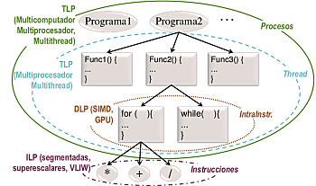
</p>


#### 1.4.1 Nivel de paralelismo explícito.
##### 1.4.1.1 Unidades en ejecución en un computador.
- **Instrucciones**. La unidad de control de un core o procesador gestiona la ejecución de instrucciones por la unidad de procesamiento.
- **Thread o light process**. Es la menor unidad de ejecución que gestiona el SO. Menor secuencia de instrucciones que se pueden ejecutar en paralelo o concurrentemente.
- **Proceso o process**. Mayor unidad de ejecución que gestiona el SO. Un proceso consta de uno o varios thread.

##### 1.4.1.2 Threads versus procesos.
$\newline$
El hardware gestiona la ejecución de las instrucciones. A nivel superior, el SO se encarga de gestionar la ejecución de unidades de mayor granularidad, procesos y hebras. Cada proceso en ejecución tiene su propia asignación de memoria. Los SO **multihebra** permiten que un proceso se componga de una o varias hebras (hilos). Una **hebra** tiene su propia pila y contenido de registros, entre ellos el puntero de pila y el IP (Puntero de Instrucciones) que almacena la dirección de la siguiente instrucción a ejecutar de la hebra, pero comparte el código, las variables globales y otros recursos con las hebras del mismo proceso. Por lo que las hebras se pueden crear y destruir en menor tiempo que los procesos, y la comunicación (se usa la memoria que comparten), sincronización y conmutación entre hebras de un proceso es más rápida que entre procesos. Luego las hebras tienen menor granularidad que los procesos.

Un **proceso** comprende el código del programa y todo lo que hace falta para su ejecución:

  - Datos en pila, segmentos (variables globales y estáticas) y en heap (BP1).
  - Contenido de los registros.
  - Tabla de páginas.
  - Tabla de ficheros abiertos.

Para comunicar procesos hay que usar llamadas al SO.

El paralelismo implícito en el código de una aplicación se puede hacer explícito a nivel de instrucciones, de hebras o de procesos.

<p>

</p>

### 1.5 Detección, utilización, implementación y extracción del paralelismo.
En los procesadores ILP superescalares o segmentados la arquitectura extrae paralelismo. Para ello, eliminan dependencias de datos falsas entre instrucciones y evitan problemas debidos a dependencias de datos, de control y de recursos. La arquitectura extrae paralelismo implícito en las entradas en tiempo de ejecución (dinámicamente). El grado de paralelismo de las instrucciones aprovechado se puede incrementar con ayuda del compilador y del programador. Podemos definir el grado de paralelismo de un conjunto de entradas a un sistema como el máximo número de entradas del conjunto que se puede ejecutar en paralelo. Para los procesadores las entradas son instrucciones. En las arquitecturas ILP VLIW el paralelismo que se va a aprovechar está ya explícito en las entradas. Las instrucciones que se van a ejecutar en paralelo se captan juntas de memoria. El análisis de dependencias entre instrucciones en este caso es estático.

<p>
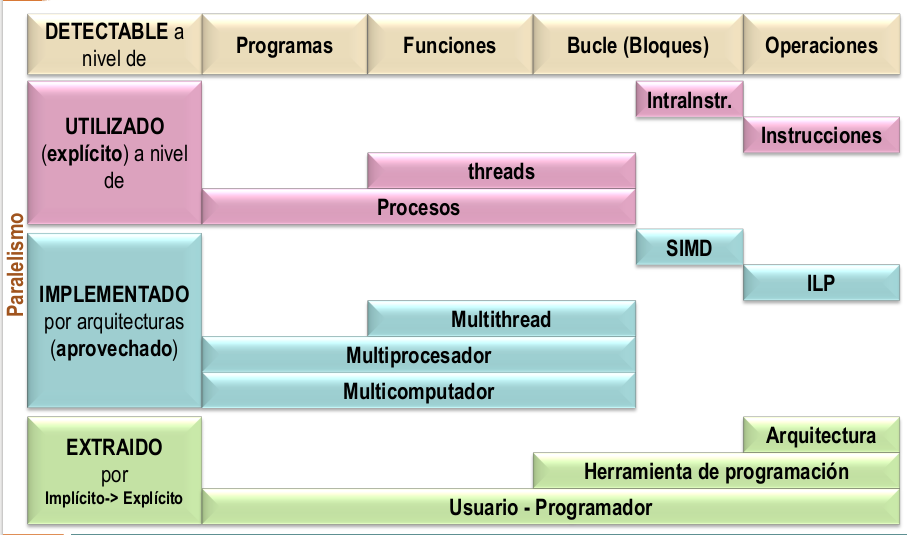
</p>

Hay compiladores que extraen el paralelismo de datos implícito a nivel de bucle. Algunos compiladores lo hacen explícito a nivel de hebra, y otros dentro de una instrucción para que se pueda aprovechar en arquitecturas SIMD o vectoriales. El usuario, como programador, puede extraer el paralelismo implícito en un bucle o entre funciones definiendo hebras y/o procesos. La distribución de las tareas independientes entre hebras o entre procesos dependerán de

- la granularidad de las unidades de código independientes,
- la posibilidad que ofrezca la herramienta para programación paralela disponible de definir hebras o procesos,
- la arquitectura disponible para aprovechar el paralelismo,
- el SO disponible.

Por último, los usuarios del sistema al ejecutar programas están creando procesos que se pueden ejecutar en el sistema concurrentemente o en paralelo.

## Lección 2. Clasificación de arquitecturas paralelas.

### 2.1 Objetivos
- Distinguir entre procesamiento o computación paralela y distribuida.
- Clasificar los computadores según segmento del mercado.
- Distinguir entre las diferentes clases de arquitecturas de la clasificación de Flynn.
- Diferenciar un multiprocesador de un multicomputador.
- Distinguir entre NUMA y SMP.
- Distinguir entre arquitecturas DLP, ILP, TLP.
- Distinguir entre arquitecturas TLP con una instancia de SO y TLP con varias instancias de SO.

### 2.2 Computación paralela y computación distribuida.
- **Computación paralela**. Estudia los aspectos hardware y software relacionados con el desarrollo y ejecución de aplicaciones en un sistema de cómputo compuesto por múltiples cores/procesadores/computadores que es visto externamente como una unidad autónoma (multicores, multiprocesadores, multicomputadores, cluster).
- **Computación distribuida**. Estudia los aspectos hardware y software relacionados con el desarrollo y ejecución de aplicaciones en un sistema distribuido; es decir, en una colección de recursos autónomos (PC, servidores -de datos, software, ...-, supercomputadores...) situados en distintas localizaciones físicas.
    - **Computación distribuida baja escala**. Estudia os aspectos relacionados con el desarrollo y ejecución de aplicaciones en una colección de recursos autónomos de un dominio administrativo situados en distintas localizaciones físicas conectados a través de infraestructura de red local.
    - **Computación distribuida gran escala**.
        - **Computación grid**. Estudia los aspectos relacionados con el desarrollo y ejecución de aplicaciones en una colección de recursos autónomos de múltiples dominios administrativos geográficamente distribuidos conectados con infraestructura de telecomunicaciones.
        - **Computación cloud**. Comprende los aspectos relacionados con el desarrollo y ejecución de aplicaciones en un sistema cloud. El sistema cloud ofrece servicios de infraestructura, plataforma y/o software, por los que se paga cuando se necesitan (pay-per-use) y a los que se accede típicamente a través de una interfaz (web) de auto-servicio. El sistema cloud consta de recursos virtuales que son una abstracción de los recursos físicos, parecen ilimitados en número y capacidad y son reclutados/liberados de forma inmediata sin interacción con el proveedor, soportan el acceso de múltiples clientes (multitenant) y están conectados con métodos estándar independientes de la plataforma de acceso.

### 2.3 Clasificaciones de arquitecturas y sistemas paralelos.
#### 2.3.1 Criterios de clasificación de computadores
- Comercial. Segmento del mercado: embebidos, servidores gama baja...

<p>
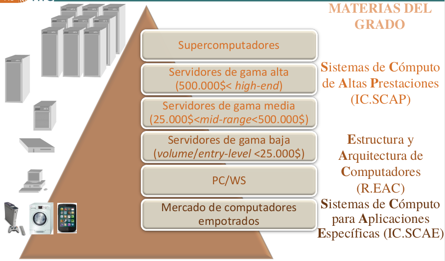
</p>

- Educación, investigación (también usados por fabricantes y vendedores):
    - Flujos de control y flujos de datos: clasificación de Flynn.
    - Sistemas de memoria.
    - Flujos de control (propuesta de clasificación de arquitecturas con múltiples flujos de control).
    - Nivel del paralelismo aprovechado (propuesta de clasificación).


#### 2.3.2 Clasificación de computadores según segmento
- **Externo** (*desktop, laptop, server, cluster...*) - R.EAC, IC.SCAP. Para todo tipo de aplicaciones:
    - Oficina, entretenimiento...
    - Procesamiento de transacciones o OLTP, sistemas de soporte de decisiones o DSS, e-comercio...
    - Científicas (medicina, biología, predicción del tiempo...) y animación (películas animadas, efectos especiales...).
- **Empotrado** (oculto) - IC.SCAE. Aplicaciones de propósito específico (videojuegos, teléfonos, coches, electrodomésticos...). Las restricciones típicas son: consumo de potencia, precio, tamaño reducido, tiempo real...

#### 2.3.3 Clasificación de computadores externos según segmento del mercado
$\newline$
<p>

</p>

#### 2.3.4 Clasificación de Flynn de arquitecturas (flujo instrucciones / flujo de datos)
$\newline$

<p>
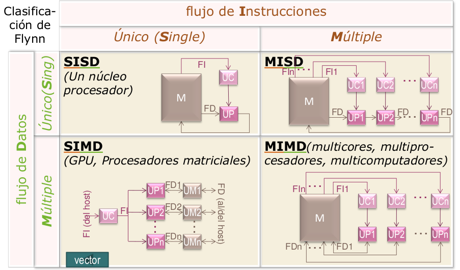
</p>

- **Computadores SISD**. Un único flujo de instrucciones (SI) procesa operandos y genera resultados, definiendo un único flujo de datos (SD).

    Corresponde a los computadores uni-procesador, ya que existe una única unidad de control (UC) que recibe las instrucciones de memoria, las decodifica y genera los códigos que definen la operación correspondiente a cada instrucción que debe realizar la unidad de procesamiento (UP) de datos.

<p>
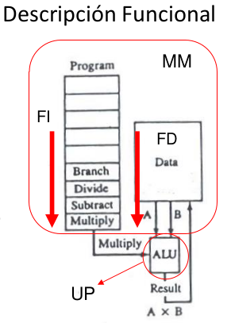
</p>

<p>

</p>

- **Computadores SIMD**. Un único flujo de instrucciones (SI) procesa operandos y genera resultados, definiendo varios flujos de datos (MD), dado que cada instrucción codifica realmente varias operaciones iguales, cada una actuando sobre operadores distintos.

    Los códigos que genera la única unidad de control a partir de cada instrucción actúan sobre varias unidades de procesamiento distintas (UPi). Por lo que se pueden realizar varias operaciones similares simultáneas con operandos distintos. Aprovechan paralelismo de datos.

<p>

</p>

<p>

</p>

<p>

</p>

- **Computadores MIMD**. El computador ejecuta varias secuencias o flujos distintos de instrucciones (MI) y cada uno de ellos procesa operandos y genera resultados definiendo un único flujo de instrucciones, de forma que existen varios flujos de datos (MD) uno por cada flujo de instrucciones.

    Corresponde con multinúcleos, multiprocesadores y multicomputadores. Puede aprovechar paralelismo funcional. Existen varias unidades de control que decodifican las instrucciones correspondientes a distintos programas. Cada uno de estos programas procesa conjuntos de datos diferentes, que definen distintos flujos de datos.

<p>

</p>

- **Computadores MISD**. Se ejecutan varios flujos distintos de instrucciones (MI) aunque todos actúan sobre el mismo flujo de datos (SD).

    No existen computadores que funcionen según este modelo. Se puede simular en un código este modelo para aplicaciones que procesan una secuencia o flujo de datos.


#### 2.3.5 Sistemas de memoria
##### 2.3.5.1 Clasificación de computadores paralelos MIMD según el sistema de memoria
$\newline$
Los sistemas multiprocesadores se han clasificado atendiendo a la organización del sistema de memoria:

- **Sistemas con memoria compartida** (SM) o **multiprocesadores**. Son sistemas en los que todos los procesadores comparten el mismo espacio de direcciones. El programador no necesita conocer dónde están almacenados los datos.
- **Sistemas con memoria distribuida** (DM) o **multicomputadores**. Son sistemas en los que cada procesador tiene su propio espacio de direcciones particular. El programador necesita conocer dónde están almacenados los datos.

<p>
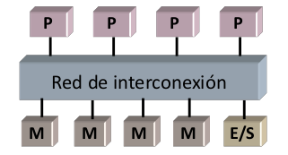
</p>

##### 2.3.5.2 Comparativa SMP (Symmetric MultiProcessor) y multicomputadores.
- **Multiprocesador con memoria centralizada (SMP)**. Es un multiprocesador en el que el tiempo de acceso de los procesadores a memoria es igual sea cual sea la posición de memoria a la que acceden, es una estructura simétrica.
    - Mayor latencia.
    - Poco escalable.
    - La comunicación es implícita mediante variables compartidas.
    - Los datos no están duplicados en memoria principal.
    - Necesita implementar primitivas de sincronización.
    - La distribución de código y datos entre procesadores no es necesaria.
    - La programación es más sencilla.
- **Multicomputador**.
    - Menor latencia.
    - Más escalable.
    - La comunicación es explícita mediante software para paso de mensajes (*send/receive*).
    - Los datos están duplicados en memoria principal y se copian datos entre módulos de memoria de diferentes procesadores.
    - La sincronización se hace mediante software de comunicación.
    - La distribución de código y datos entre procesadores es necesaria y se necesitan herramientas de programción más sofisticadas.
    - La programación es más difícil.

##### 2.3.5.3 Comunicación uno-a-uno en un multiprocesador.
$\newline$
Los diferentes procesadores que ejecutan una aplicación pueden requerir sincronizarse en algún momento. Por ejemplo, si el procesador A utiliza un dato que produce le procesador B, A deberá esperar a que B lo genere. En la siguiente imagen vemos la transferencia de datos en un multiprocesador. El proceso que ejecuta la instrucción de carga espera hasta recibir el contenido de la dirección. El proceso que ejecuta la instrucción de almacenamiento puede esperar a que termine para garantizar que se mantiene un orden en los accesos a memoria. Obsérvese que para que la transferencia de datos e realice de forma efectiva habría que sincronizar los procesos fuente y destino.

<p>

</p>

<p>

</p>

<p>

</p>

Se debe garantizar que el flujo de control **consumidor** del dato lea la variable compartida (A) cuando el **productor** haya escrito en la variable el dato.

En multicomputadores se aprovechan los mecanismos de comunicación para implementar sincronización. Con una función de recepción bloqueante, es decir, que deja al proceso que la ejecuta detenido hasta que se reciba el dato, se puede implementar sincronización. En la siguiente figura podemos ver la transferencia asíncrona (con función *receive* bloqueante) de datos en un multicomputador. EN transferencia asíncrona se requiere almacenamiento intermedio para evitar esperas. El proceso fuente continúa la ejecución en cuanto los datos se copien en un *buffer*. El destino espera en el *receive* bloqueante a que lleguen los datos, en caso de que estos no hayan llegado aún.

<p>
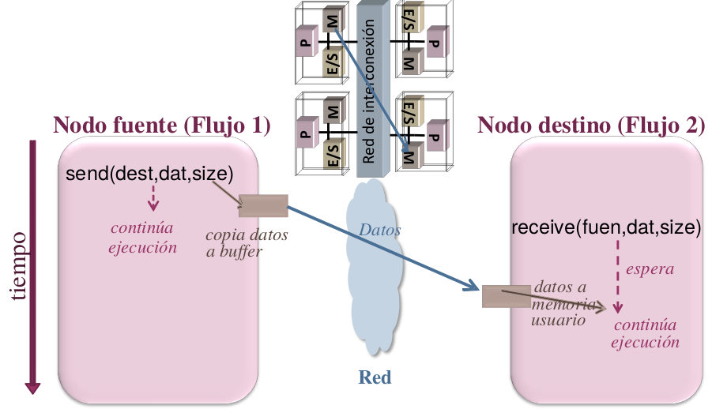
</p>

<p>

</p>

##### 2.3.5.4 Incremento de escalabilidad en multiprocesadores y red de interconexión.
$\newline$
Como los SMP tienen escasa escalabilidad, se ha intentado incrementar la escalabilidad en multiprocesadores:

- Aumentar caché del procesador.
- Usar redes de menor latencia y mayor ancho de banda que un bus (jerarquía de buses, barras cruzadas, multietapa).
- Distribuir físicamente los módulos de memoria entre los procesadores (pero se sigue compartiendo espacio de direcciones).

<p>
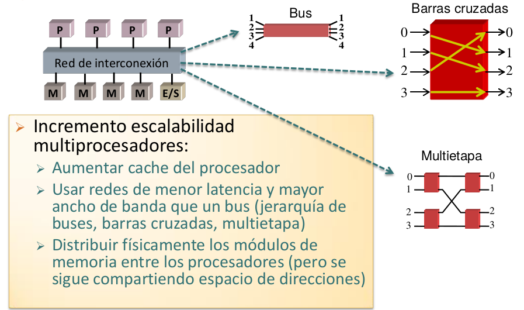
</p>

##### 2.3.5.5 Clasificación completa de computadores según el sistema de memoria.
- **Multiprocesadores**.
    - **UMA** (*Uniform Memory Access*).
        - **SMP**.
    - **NUMA** (*Non-Uniform Memory Access*).
        - **NUMA**. Arquitecturas con acceso a memoria no uniforme sin coherencia de caché entre nodos. No incorporan hardware para evitar problemas por incoherencias entre cachés de distintos nodos. Esto hace que los datos modificables compartidos no se puedan trasladar a caché de nodos remotos; hay que acceder a ellos individualmente a través de la red. Se puede hacer más tolerable la latencia utilizando precaptación (*prefetching*) de memoria y procesamiento multihebra.
        - **CC-NUMA**. Arquitecturas con acceso a memoria no uniforme y con caché coherente. Tienen hardware para mantener coherencia entre cachés de distintos nodos, que se encarga de las transferencias de datos compartidos entre nodos. El hardware para mantenimiento de coherencia supone un coste añadido e introduce un retardo que hace que estos sistemas escalen en menor grado que un NUMA.
        - **COMA**. Arquitecturas con acceso a memoria solo caché. La memoria local de los procesadores se gestiona como caché. El sistema de mantenimiento se encarga de llevar dinámicamente el código y los datos a los nodos donde se necesiten.

<p>
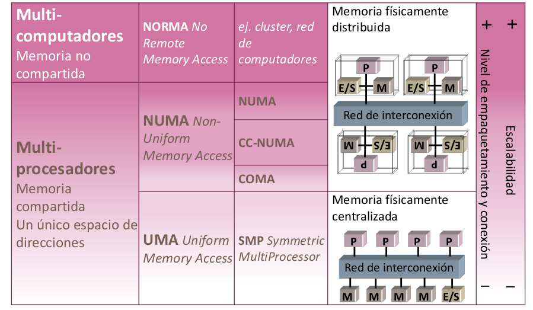
</p>

##### 2.3.5.6 Red en sistemas con memoria físicamente distribuida (NI: Network Interface).
$\newline$

<p>
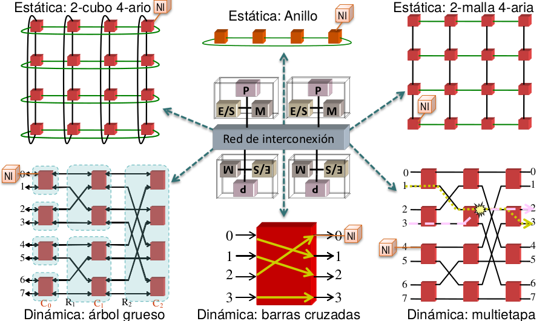
</p>

Ejemplo: Red (con conmutador o switch) de barras cruzadas.

<p>
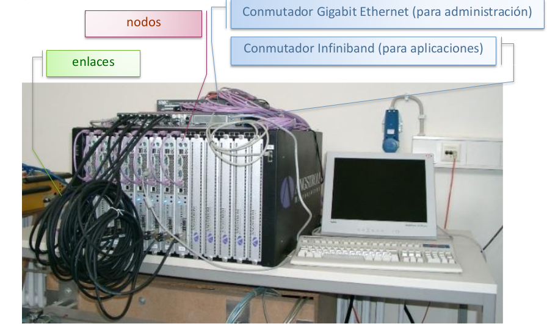
</p>

Ejemplo: Placa CC-NUMA con red estática

<p>
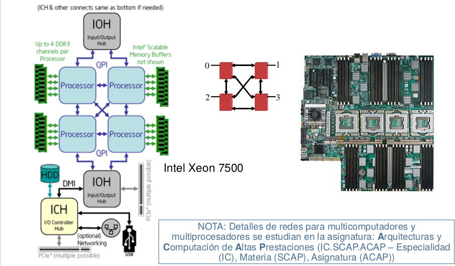
</p>

##### 2.3.6 Flujos de control (propuesta de clasificación de arquitecturas con múltiples flujos de control (o threads o flujos de instrucciones))
- **TLP** (*Thread Level Parallelism*). Ej. múltiples flujos de control concurrentemente o en paralelo.
    - **Implícito**. Flujos de control creados y gestionados por la arquitectura.
    - **Explícito**. Flujos de control creados y gestionados por el SO.
        - **Con una instancia SO**. Multiprocesadores, multicores, cores multithread...
        - **Con múltiples instancias SO**. Multicomputadores.

##### 2.3.7 Nivel del paralelismo aprovechado (propuesta de clasificación)
- **Arquitecturas con DLP** (*Data Level Parallelism*). Ejecutan las operaciones de una instrucción concurrentemente o en paralelo: unidades funcionales vectoriales o SIMD.
- **Arquitecturas con ILP** (*Instruction Level Parallelism*). Ejecutan múltiples instrucciones concurrentemente o en paralelo: cores escalares segmentados, superescalares o VLIW/EPIC.
- **Arquitecturas con TLP** (*Thread Level Parallelism*) explícito y una instancia de SO. Ejecutan múltiples flujos de control concurrentemente o en paralelo.
    - **Cores** que modifican la arquitectura escalar segmentada, superescalar o VLIW/EPIC para ejecutar threads concurrentemente o en paralelo.
    - **Multiprocesadores**: ejecutan threads en paralelo en un computador con múltiples cores (incluye multicores).
- **Arquitecturas con TLP** explícito y múltiples instancias SO. Ejecutan múltiples flujos de control en paralelo.
    - **Multicomputadores**: ejecutan threads en paralelo en un sistema con múltiples computadores.


### 2.4 Nota histórica
- **DLP** (*Data Level Parallelism*). Unidades funcionales (o de ejecución) SIMD (o multimedia).
- **ILP** (*Instruction Level Parallelism*).
    - Procesadores/cores segmentados.
    - Procesadores con múltiples unidades funcionales.
    - Procesadores/cores superescalares
    - Procesadores/cores VLIW
- **TLP** (*Thread Level Parallelism*).
    - TLP explícito con una instancia de SO.
        - Multithread grano fino (FGMT).
        - Multithread grano grueso (CGMT).
        - Multithread simultánea (SMT).
        - Multiprocesadores en un chip (CMP) o multicores.
        - Multiprocesadores.
    - TPL explícito con múltiples instancias del SO (multicomputadores): IC.SCAP.


## Lección 3. Evaluación de prestaciones.
### 3.1 Objetivos.
- Distinguir entre tiempo de CPU (sistema y usuario) de unix y tiempo de respuesta.
- Distinguir entre productividad y tiempo de respuesta.
- Obtener, de forma aproximada mediante cálculos, el tiempo de CPU, GFLOPS y los MIPS del código ejecutado en un núcleo de procesamiento.
- Explicar el concepto de ganancia en prestaciones.
- Aplicar la ley de Amdahl.

### 3.2 Medidas usuales para evaluar prestaciones.

#### 3.2.1 Tiempo de respuesta.
- Real (*wall-clock time, elapsed time, real time*).
- *CPU time = user + sys* (no incluye todo el tiempo).
- Con un flujo de control.
    - elapsed >= CPU time.

    ```
    time ./program.exe
    elapsed 5.4
    user 3.2
    sys 1.0
    ```
- Con múltiples flujos de control
    - elapsed < CPU time, elapsed >= CPU time/nº flujos control.

En el programa, `user 3.2` significa el tiempo de CPU de usuario (tiempo de ejecución en espacio de usuario). `sys 1.0` significa el tiempo de CPU de sistema (tiempo en el nivel del kernel del SO). Además, hay otro tiempo asociado a las esperas debidas a I/O o asociados a la ejecución de otros programas.

Comando time en Unix: 3.2u + 1.0s es el 78% del tiempo transcurrido (5.4).

Alternativas para obtener tiempos:

| Función | Fuente | Tipo | Resolución aprox. (microsegs)
| ---------- | ---------- | ---------- | ---------- |
| time   | SO (/usr/bin/time)  |  elapsed, user, system  | 10000 |
| clock()   | SO (time.h)  | CPU   | 10000  |
| gettimeofday()   | SO (sys/time.h) |  elapsed  |  1 |
| clock_gettime () / clock_getres()   | SO (time.h)  | elapsed   |  0.001 |
| omp_get_wtime() / omp_get_wtick()   |  OpenMP (omp.h) |  elapsed  |  0.001 |
| SYSTEM_CLOCK()   | Fortran  |  elapsed  | 1 |

<p>
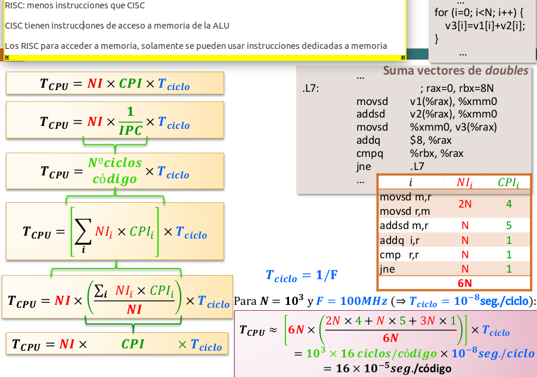
</p>

$$TiempoDeCPU \; (T_{CPU}) = CiclosDelPrograma \cdot T_{CICLO} = \frac{CiclosDelPrograma}{FrecuenciaDeReloj}$$

$$Ciclos por Instrucción \; (CPI) = \frac{CiclosDelPrograma}{NumeroDeInstrucciones(NI)}$$

$$T_{CPU} = NI \cdot CPI \cdot T_{CICLO}$$

$$CiclosDelPrograma = \sum_{i=1}^n CPI_i \cdot I_i$$

$$CPI = \frac{\sum_{i=1}^n CPI_i \cdot I_i}{NI}$$

En el programa hay $I_i$ instrucciones del tipo i (i=1,...,n).

Cada instrucción del tipo i consume $CPI_i$ ciclos.

Hay n tipos de instrucciones distintos.

$$T_{CPU} = NI \cdot (CPE/IPE) \cdot T_{CICLO}$$

$$CPI = \frac{CPE}{IPE}$$

Hay procesadores que pueden lanzar para que empiecen a ejecutarse (emitir) varias instrucciones al mismo tiempo.

- **CPE**: Número mínimo de ciclos transcurridos entre los instantes en que el procesador puede emitir instrucciones
- **IPE**: Instrucciones que pueden emitirse (para empezar su ejecución) cada vez que se produce dicha emisión.

<p>

</p>

$$T_{CPU} = (Noper/OpInstr) \cdot CPI \cdot T_{CICLO}$$

$$NI = Noper/OpInstr$$

Hay procesadores que pueden codificar varias operaciones en una instrucción.

- **Noper**: Número de operaciones que realiza el programa
- **Op_instr**: Número de operaciones que puede codificar una instrucción.

<p>

</p>

<p>

</p>

#### 3.2.2 Productividad: MIPS, MFLOPS.
$\newline$
**MIPS**: millones de instrucciones por segundo.

$$MIPS = \frac{NI}{T_{CPU} \cdot 10^6} = \frac{F(frecuencia)}{CPI \cdot 10^6}$$

- Depende del repertorio de instrucciones (difícil la comparación de máquinas con repertorios distintos)
- Puede variar con el programa (no sirve para caracterizar la
máquina)
- Puede variar inversamente con las prestaciones (mayor valor de MIPS corresponde a peores prestaciones)


**MFLOPS**: millones de operaciones en coma flotante por
segundo.

$$MFLOPS = \frac{OperacionesEnComaFlotante}{T_{CPU} \cdot 10^6}$$

- No es una medida adecuada para todos los programas (sólo tiene en cuenta las operaciones en coma flotante del programa)
- El conjunto de operaciones en coma flotante no es constante en máquinas diferentes y la potencia de las operaciones en coma flotante no es igual para todas las operaciones (por ejemplo, con diferente precisión, no es igual una suma que una multiplicación..).
- Es necesaria una normalización de las instrucciones en coma flotante

<p>

</p>

### 3.3 Conjunto de programas de prueba (Benchmark).

- Propiedades exigidas a medidas de prestaciones:
    - Fiabilidad => Representativas, evaluar diferentes componentes del sistema y reproducibles.
    - Permitir comparar diferentes realizaciones de un sistema o diferentes sistemas => Aceptadas por todos los interesados (usuarios, fabricantes, vendedores).
- Interesados:
    - Vendedores y fabricantes de hardware o software.
    - Investigadores de hardware o software.
    - Compradores de hardware o software.
- Tipos de Benchmarks:
    - De bajo nivel o microbenchmark.
        - testping-pong, evaluación de las operaciones con enteros o con flotantes.
    - Kernels.
        - resolución de sistemas de ecuaciones, multiplicación de matrices, FFT, descomposición LU.
    - Sintéticos.
        - Dhrystone, Whetstone.
    - Programas reales.
        - SPEC CPU2006: enteros (gcc, gzip, perlbmk).
    - Aplicaciones diseñadas.
        - Predicción de tiempo, simulación de terremotos.

### 3.3.1 LINPACK.
El núcleo de este programa es una rutina denominada DAXPY (Double precision- real Alpha X Plus Y) que multiplica un vector por una constante y los suma a otro vector. Las prestaciones obtenidas se escalan con el valor de N (tamaño del vector):

```c++
for (i=0; i<N; i++)
  y[i] = alpha*x[i] + y[i];
```

<p>
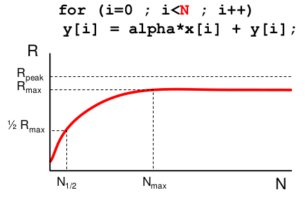
</p>

### 3.4 Ganancia en prestaciones.

#### 3.4.1 Mejora o ganancia de prestaciones (speed-up o ganancia en velocidad).
$\newline$
Si en un computador se incrementan las prestaciones de un recurso haciendo que su velocidad sea p veces mayor (ejemplos: se utilizan p procesadores en lugar de uno, la ALU realiza las operaciones en un tiempo p veces menor...):

El incremento de velocidad que se consigue en la nueva situación con respecto a la previa (máquina base) se expresa mediante la ganancia de velocidad o speed-up, $S_p$

$$S_p = \frac{V_p}{V_1} = \frac{T_1}{T_p}$$

donde

$V_1$: velocidad de la máquina base.

$V_p$: velocidad de la máquina mejorada (un factor p en uno de sus componentes).

$T_1$: tiempo de ejecución en la máquina base.

$T_P$: tiempo de ejecución en la máquina mejorada.

Si se incrementan las prestaciones de un sistema, el incremento en prestaciones (velocidad) que se consigue en la nueva situación, p, con respecto a la previa (sistema base, b) se expresa mediante la ganancia en prestaciones o speed-up, S

$$S = \frac{V_p}{V_b} = \frac{T_b}{T_p}$$

$$S = \frac{T_{CPU}^b}{T_{CPU}^p} = \frac{NI^b \cdot CPI^b \cdot T_{CICLO}^b}{NI^p \cdot CPI^p \cdot T_{ciclo}^p}$$

donde

$V_b$: velocidad de la máquina base.

$V_p$: velocidad de la máquina mejorada (un factor p en uno de sus componentes).

$T_b$: tiempo de ejecución en la máquina base.

$T_P$: tiempo de ejecución en la máquina mejorada.


Mejora en un núcleo de procesamiento: segmentación.

<p>

</p>

Mejora en un núcleo de procesamiento: operación superescalar.

<p>

</p>

Mejora en un núcleo de procesamiento: unidades funcionales SIMD.

<p>

</p>

¿Qué impide que se pueda obtener la ganancia en velocidad pico?

- Riesgos:
    - Datos.
    - Control.
    - Estructurales.
- Accesos a memoria (debido a la jerarquía).


Riesgos de datos y control:

<p>

</p>

<p>

</p>

Riesgos de datos, control y estructural:

<p>
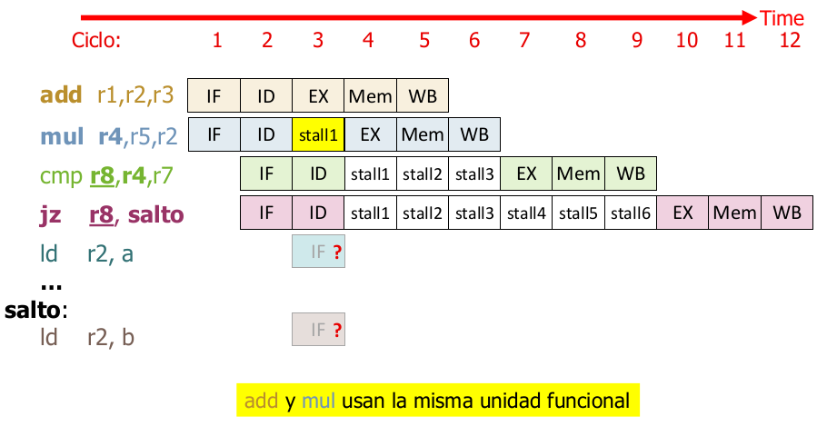
</p>

#### 3.4.2 Ley de Amdahl.
$\newline$
La mejora de velocidad, S, que se puede obtener cuando se mejora un recurso de una máquina en un factor p está limitada por:

$$S = \frac{V_p}{V_b} = \frac{T_b}{T_p} \leq \frac{1}{f + \frac{1-f}{p}} = \frac{p}{1+f(p-1)}$$

Si $p \rightarrow \infty$, entonces $\frac{p}{1+f(p-1)} \rightarrow 1/f$.

Si $f \rightarrow 0$, entonces $\frac{p}{1+f(p-1)} \rightarrow p$.

donde f es la fracción del tiempo de ejecución en la máquina sin la mejora durante el que no se puede aplicar esa mejora.

Ejemplo: Si un programa pasa un 25% de su tiempo de ejecución en una máquina realizando instrucciones de coma flotante, y se mejora la máquina haciendo que estas instrucciones se ejecuten en la mitad de tiempo, entonces p=2; f=0.75.

S $\leq$ 2/(1+0.75)=1.14

S = $\frac{T_b}{T_p} = \frac{1}{0.75+\frac{0.25}{2}} = 1.14$

Hay que mejorar el caso más frecuente (lo que más se usa)

Ley enunciada por Amdahl en relación con la eficacia de los computadores paralelos: dado que en un programa hay código secuencial que no puede paralelizarse, los procesadores no se podrían utilizar eficazmente.

$\pagebreak$

# Tema 2. Programación paralela
## Lección 4. Herramientas, estilos y estructuras en programación paralela.

### Objetivos.

- Distinguir entre los diferentes tipos de herramientas de programación paralela: compiladores paralelos, lenguajes paralelos, API Directivas y API de funciones.
- Distinguir entre los diferentes tipos de comunicaciones colectivas.
- Diferenciar el estilo/paradigma de programación de paso de mensajes del de variables compartidas.
- Diferenciar entre OpenMP y MPI en cuanto a su estilo de programación y tipo de herramienta.
- Distinguir entre las estructuras de tareas/procesos/treads master-slave, cliente-servidor, descomposición de dominio, flujo de datos o segmentación, y divide y vencerás.

### 4.1 Problemas que plantea la programación paralela al programador. Punto de partida.

#### 4.1.1 Problemas que plantea la programación paralela al programador.

$\newline$
Nuevos problemas, respecto a programación secuencial:

- **División** en unidades de cómputo independientes (tareas).
- **Agrupación/asignación** de tareas o carga de trabajo (códigos, datos) en procesos/threads.
- **Asignación** a procesadores/núcleos.
- **Sincronización y comunicación**.

Los debe abordar la herramienta de programación o el programador o SO.
$\newline$
<p>

</p>

#### 4.1.2 Punto de partida.
$\newline$
Para obtener una versión paralela de una aplicación

- se puede partir de una **versión secuencial** que resuelva el problema y buscar la paralelización sobre este. La versión paralela depende de la descripción del problema que se ha utilizado en la versión secuencial de partida. Ventaja: se puede saber el tiempo de ejecución real de las diferentes funciones o tareas, lo que facilita la distribución equilibrada de la carga de trabajo entre procesadores.
- se puede partir de la **definición de la aplicación**.

Se apoya en:

- **Programa** paralelo que resuelva un problema parecido.
- **Versiones** paralelas u optimizadas de bibliotecas de funciones: BLAS (*Basic Linear Algebra Subroutine*), LAPCK (*Linear Algebra PACKage*)...

#### 4.1.3 Modos de programación MIMD.

- **SPMD** (*Single-Program Multiple Data*): paralelismo de datos. Todos los códigos que se ejecutan en paralelo se obtienen compilando el mismo programa. Cada copia trabaja con un conjunto de datos distintos y se ejecuta en un procesador diferente. Es recomendable en sistemas masivamente paralelos. Se usa en sistemas con memoria distribuida, en multiprocesadores y multicomputadores.

    <p>
    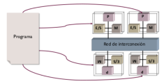
    </p>

- **MPMD** (*Multiple-Program Multiple Data*): paralelismo de tareas o funciones. Los códigos que se ejecutan en paralelo se obtienen compilando programas independientes. La aplicación a ejecutar (o el código secuencial inicial) se divide en unidades independientes. Cada unidad trabaja con un conjunto de datos y se asigna a un procesador distinto.

    <p>
    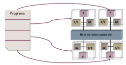
    </p>

### 4.2 Herramientas para obtener código paralelo.

<p>
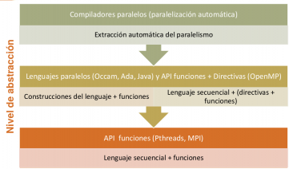
</p>

- Las **herramientas** permiten de forma implícita (lo hace la propia herramienta) o explícita (lo hace el programador):
    - Localizar **paralelismo** o descomponer en **tareas independientes** (*decomposition*).
    - Asignar las tareas, es decir, la **carga de trabajo** (código + datos), a procesos/threads (*scheduling*).
    - **Crear y terminar** procesos/threads (o enrolar y desenrolar en un grupo).
    - **Comunicar y sincronizar** procesos/threads.
- El programador, la herramienta o el SO se encarga de **asignar procesos/threads** a unidades de procesamiento (*mapping*).

Ejemplo: cálculo de PI con OpenMP/C.

<p>

</p>

reduction: tiene que sumar todas las variables `sum` y las guarda en `sum`.

Ejemplo: cálculo de PI en MPI/C. (Modificación del bucle `for` para repartir el trabajo entre los procesos)

<p>

</p>

#### 4.2.1 Comunicaciones colectivas.
$\newline$
<p>

</p>

#### 4.2.2 Comunicación uno-a-todos.
$\newline$

Un proceso envía y todos los procesos reciben. Hay variantes en las que el proceso que envía no forma parte del grupo y otras en las que reciben todos los del grupo excepto el que envía. Dentro de este grupo están:

- **Difusión**: todos los procesos reciben el mismo mensaje.
- **Dispersión** (*scatter*): cada proceso receptor recibe un mensaje diferente.

<p>

</p>

#### 4.2.3 Comunicación todos-a-uno.
$\newline$

Todos los procesos en el grupo envían un mensaje a un único proceso:

- **Reducción**: los mensajes enviados por los procesos se combinan en un solo mensaje mediante un operador. La operación de combinación es usualmente conmutativa y asociativa.
- **Acumulación** (*gather*): los mensajes se reciben de forma concatenad en el receptor (en una estructura vectorial). El orden en la que se concatenan depende del identificador del proceso.

<p>

</p>

En la reducción, lo que envían todos los procesos se reduce a un único valor, aplicando conmutativa y asociativa. En acumulación se aplican los valores tal cual.

#### 4.2.4 Comunicación múltiple uno-a-uno.
$\newline$

Hay componentes del grupo que envían (escriben) un único mensaje y componentes que reciben (leen) un único mensaje. Si todos los componentes envían y reciben, se implementa una **permutación**.

<p>

</p>

#### 4.2.5 Comunicación todos-a-todos.
$\newline$

Todos los procesos del grupo ejecutan una comunicación uno-a-todos. Cada proceso recibe $n$ mensajes, cada uno de un proceso diferente del grupo.

- **Todos difunden**: todos los procesos realizan una difusión. Usualmente las $n$ transferencias recibidas por un proceso se concatenan en función del identificador del proceso que envía, de forma que todos los procesos reciben lo mismo.
- **Todos dispersan**: los procesadores concatenan diferentes transferencias. En la figura se ilustra la trasposición de una matriz 4x4: el procesador $P_i$ dispersa la fila $i$ ($x_{i0}, x_{i1}, x_{i2}, x_{i3}$), tras la ejecución, el procesador $P_i$ tendrá la columna $i$ ($x_{0i}, x_{1i}, x_{2i}, x_{3i}$).

<p>

</p>


#### 4.2.6 Servicios compuestos.
$\newline$

- **Todos combinan** o **reducción y extensión**: el resultado de aplicar una reducción se obtiene en todos los procesos porque la reducción se difunde una vez obtenida (reducción y extensión) o porque se realizan tantas reducciones como procesos (todos combinan).

<p>

</p>

En la desviación típica se haría un todo reduce:

$$ s = \sqrt{\frac{\sum_{i=1}^N (x_i-media)^2}{N-1}} $$

- **Recorrido** (*scan*): todos los procesos envían un mensaje, recibiendo cada uno de ellos el resultado de reducir un conjunto de estos mensajes.
    - **Recorrido prefijo paralelo**: el proceso $P_i$ recibe la reducción de los mensajes $P_0,...,P_i$.
    - **Recorrido sufijo paralelo**: recibe la reducción de $P_i,...,P_{n-1}$.

<p>

</p>

Ejemplo: comunicación colectiva en OpenMP.

<p>

</p>

$\pagebreak$

Ejemplo: comunicación en MPI.

<p>

</p>


### 4.3 Estilos/paradigmas de programación paralela.

#### 4.3.1 Estilos de programación y arquitecturas paralelas.
- **Paso de mensajes**: también se puede usar en multiprocesadores.
- **Paralelismo de datos**: se corresponde con la arquitectura SIMD.

<p>

</p>

$\pagebreak$

#### 4.3.2 Estilos de programación y herramientas de programación.

- **Paso de mensajes** (*message passing*): cada procesador en el sistema tien su espacio de direcciones propio. Los mensajes llevan datos de uno a otro espacio de direcciones y además se pueden aprovechar para sincronizar procesos. Los datos transferidos estarán duplicados en el sistema de memoria.
    - Lenguajes de programación: Ada, Occam.
    - API (Bibliotecas de funciones): MPI, PVM.
- **Variables compartidas** (*shared memory, shared variables*): se supone que los procesadores en el sistema comparten el mismo espacio de direcciones. Luego no necesitan transferir datos explícitamente, implícitamente se realiza la transferencia utilizando instrucciones del procesador de lectura y escritura en memoria. Para sincronizar, el programador utiliza primitivas que ofrece el software que se amparan en primitivas hardware para incrementar prestaciones.
    - Lenguajes de programación: Ada, Java.
    - API (directivas del compilador + funciones): OpenMP.
    - API (Bibliotecas de funciones): POSIX Threads, shmem, Intel TBB.
- **Paralelismo de datos** (*data parallelism*): las mismas operaciones se ejecutan en paralelo en múltiples unidades de procesamiento de forma que cada unidad aplica la operación a un conjunto de datos distinto. Solo soporta paralelismo a nivel de bucle. La sincronización está implícita. Dispone de construcciones para la distribución de datos entre los elementos de procesamiento.
    - Lenguajes de programación + funciones: HPF (High Performance Fortran), Fortran 95 (forall, operaciones con matrices/vectores), Nvidia CUDA.
    - API (directivas del compilador + funciones - stream processing): OpenACC.

### 4.4 Estructuras típicas de códigos paralelos.

#### 4.4.1 Estructuras típicas de procesos/threads/tareas.

$\newline$
Estructuras típicas de procesos/threads en código paralelo:

- Descomposición de dominio o descomposición de datos cliente/servidor.
- Divide y vencerás o descomposición recursiva.
- Segmentación o flujo de datos.
- Master-Slave, o granja de tareas.

#### 4.4.2 Master-Slave o granja de tareas.

$\newline$
Las tareas se representan con un círculo y los arcos representan flujo de datos.

Tenemos un flujo de instrucciones que se encarga de repartir el trabajo entre esclavos y recolecta resultados. Los esclavos están ejecutando el mismo código. El máster puede hacer un trabajo distinto. Luego combinamos un MPMD con SPMP. La distribución de tareas entre los esclavos se puede realizar de forma dinámica o estática.

La escalabilidad del programa paralelo va a depender del número de esclavos y del camino de comunicación entre los esclavos y el dueño. Para incrementar la escalabilidad se puede dividir el dueño en múltiples dueños, cada uno con un conjunto diferente de esclavos.

Se puede llegar a esta estructura al paralelizar las iteraciones de un bucle

<p>
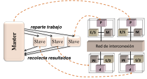
</p>


#### 4.4.3 Cliente-Servidor.
$\newline$

<p>

</p>

#### 4.4.4 Descomposición de dominio o descomposición de datos.
$\newline$
Es muy utilizada en problemas en los que se opera con grandes estructuras de datos. La estructura de datos de entrada o de salida o ambas se dividen en partes y se derivan las tareas paralelas, que realizan operaciones similares.

Los procesos pueden englobar varias tareas. Los diferentes procesos ejecutan típicamente el mismo código (SPMD), aunque cad uno trabaja sobre un conjunto de datos distintos.Puede haber comunicaciones entre los procesos.

- Se pueden representar con matrices
- Aplicación: inundaciones, software metereológico...

<p>
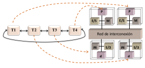
</p>


Ejemplo: filtrado imagen.

<p>

</p>

#### 4.4.5 Estructura segmentada o de flujo de datos.
$\newline$
Aparece en problemas en los que se aplica a un flujo de datos en secuencia distintas funciones (paralelismo de tareas). La estructura de los procesos y de las tareas es la de un cauce segmentado. Cada proceso ejecuta por tanto distinto código (MPMD). Necesitamos que en la aplicación se aplique a una un flujo de entrada en secuencia una serie de operaciones, una detrás de otra. Ejemplo: MP3, MP4, multimedia...

En el caso de JPEG, los bloques se dividen en 8x8 bloques y se decodifica en el orden que indiquen las flechas. No puedo aplicar descomposición de dominio porque hay dependencia de bloques.

Podemos paralelizar una sola etapa, cuando se encuentren distintas estructuras en etapas.

<p>
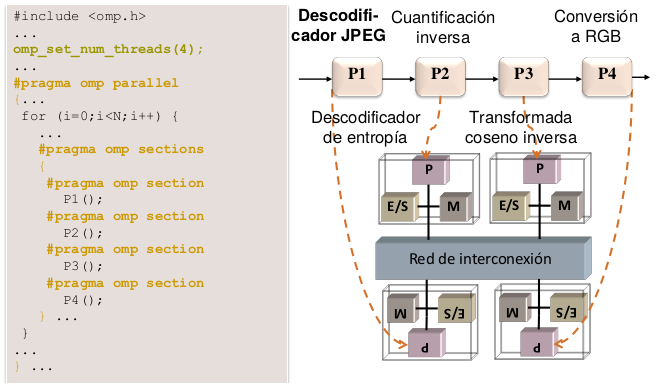
</p>

#### 4.4.6 Divide y vencerás o descomposición recursiva.
$\newline$
Se utiliza cuando un problema se puede dividir en dos o más subproblemas, de forma que cada uno se puede resolver independientemente, combinándose los resultados para obtener un resultado final.

Las tareas presentan una estructura en forma de árbol. No habrá interacciones entre las tareas que cuelgan del mismo padre. Puede haber paralelismo de tareas y de datos.

Los arcos representan flujo de datos. (flechas negras).

Agrupación/Asignación de tareas a flujos de instrucciones. (flechas negras).

En la imagen, usaríamos 4 flujos de datos como máximo porque el grado de paralelismo es 4. Las flechas naranjas representan la asignación de flujos de instrucciones.

<p>
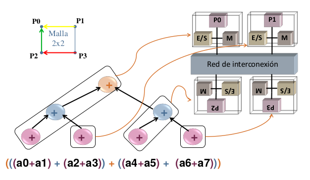
</p>

## Lección 5. Proceso de paralelización.

### 5.1 Objetivos.

- Programar en paralelo una aplicación sencilla.
- Distinguir entre asignación estática y dinámica (ventajas e inconvenientes).

### 5.2 Proceso de paralelización.

Los arcos en el grafo representan flujo de datos y de control, y los vértices, tareas.

- **Descomponer en tareas independientes.**
    - Análisis de dependencia entre **funciones**. Para extraer el paralelismo de tareas, tenemos que analizar las dependencias entre las funciones que pueden ser independientes o pueden hacerse independientes.
    - Análisis de dependencia entre **iteraciones de bucles**. Analizando las iteraciones de los bucles dentro de una función, podemos encontrar si son o se pueden hacer independientes. Podemos detectar paralelismo de datos. Si hay varios bucles, se puede analizar la dependencia entre ellos para ver si se pueden ejecutar en paralelo las iteraciones de múltiples bucles.

    En la siguiente imagen podemos ver la descomposición en tareas. Una de las funciones consta de dos bucles. Dado el grafo de dependencias entre tareas de la figura, se ha encontrado que son independientes las iteraciones del `for`, cada iteración es una tarea en el grafo. También son independientes las iteraciones de `while`. Además, el grafo muestra que la salida del bucle `for` se usa en `while`, por eso las tareas de ambos ciclos se encuentran en el grafo a distinto nivel.

    <p>
    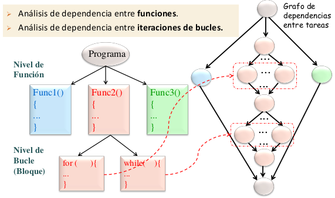
    </p>

    - Ejemplo de cálculo PI: descomposición en tareas independientes.

    Se puede paralelizar pi fácilmente. Como la integral en el intervalo [0,1] de la derivada del arco tangente de $x$ es $\pi /4$:

    <p>
    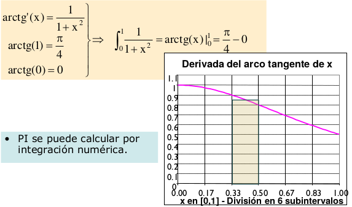
    </p>

    En la siguiente imagen se calcula $\pi$ con una versión secuencial aproximando el área en cada subintervalo utilizando rectángulos en los que la altura es el valor de la derivada del arco tangente en el punto medio.

    <p>
    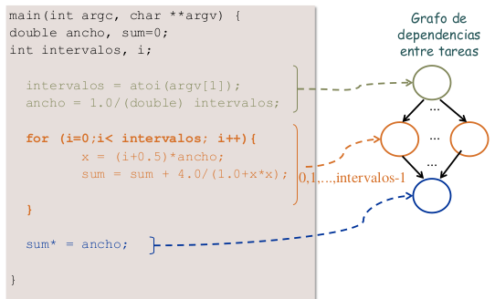
    </p>

- **Asignar (planificar+mapear) tareas a procesos y/o threads**. La asignación a procesos o hebras está ligada con la asignación a procesadores, incluso se puede realizar la asignación asociando los procesos (hebras) a procesadores concretos.
    - Ejemplo: filtrado de imagen.

    <p>
    
    </p>

    - Incluimos: agrupación de tareas en procesos/threads (scheduling) y mapeo a procesadores/cores (mapping).
    - La **granularidad** de la carga de trabajo (tareas) asignada a los procesos/threads depende de:
        - número de cores o procesadores o elementos de procesamiento, cuanto mayor sea su número, menos tareas se asignarán a cada proceso (hebra).
        - tiempo de comunicación/sincronización frente a tiempo de cálculo.
    - Para disminuir este tiempo, se pueden asignar más tareas a un proceso (hebra), así se reduce el número de interacciones entre tareas a través de la red.
    - ¿Utilizar hebras o procesos? Depende de
        - **Arquitectura**:
            - Es más eficiente usar hebras en SMP y procesadores multihebra.
              - En arquitecturas mixtas se usan hebras y procesos, especialmente si el número de procesadores de un SMP es mayor que el número de nodos de un cluster.
        - **Sistema operativo**: debe ser multihebra.
        - **Herramientas de programación** para crear hebras y procesos.
    - Se asignan hebras a las iteraciones de un **bucle** (paralelismo de datos).
    - Se asignan procesos a **funciones** (paralelismo de tareas).
    - **Equilibrado de la carga** (tareas = código + datos) o load balancing:
        - Objetivo: unos procesos/threads no deben hacer esperar a otros.
    - ¿De qué depende el equilibrado?
        - La **arquitectura**:
            - homogénea frente a la heterogénea.
            - uniforme frente a no uniforme.
        - La aplicación/descomposición.
    - Tipos de asignación:
        - **Estática.**
            - Está determinado qué tarea va a realizar cada procesador o core.
            - Explícita: programador.
            - Implícita: herramienta de programación al generar el código ejecutable.
        - **Dinámica** (en tiempo de ejecución).
            - Permite que acabe una aplicación aunque falle algún procesador.
            - Consume un tiempo adicional de comunicación y sincronización.
            - Distintas ejecuciones pueden asignar distintas tareas a un procesador o core.
            - Explícita: el programador.
            - Implícita: herramienta de programación al generar el código ejecutable.
    - Mapeo de procesos/threads a unidades de procesamiento.
        - Normalmente se deja al SO el mapeo de threads (light process).
        - Lo puede hacer el entorno o sistema en tiempo de ejecución (runtime system de la herramienta de programación).
        - El programador puede influir.

$\pagebreak$

  - **Códigos filtrado por imagen.**

    Descomposición por **columnas**.


    ```c
    #include <omp.h>
    ...
    omp_set_num_threads(M)
    #pragma omp parallel private(i)
    {
          for (i=0;i<N;i++) {
              #pragma omp for
              for (j=0;j<M;j++) {
                  pS[i,j] = 0,75*p[i,j] + 0,0625*(p[i-1,j]+p[i,j-1]
                            + p[i+1,j]+ p[i,j+1]);
              }
          }
     }
      ...
    ```

      Descomposición por **filas**.

    ```c
      #include <omp.h>
      ...
      omp_set_num_threads(N)
      #pragma omp parallel private(j)
      {
          #pragma omp for
          for (i=0;i<N;i++) {
              for (j=0;j<M;j++) {
                  pS[i,j] = 0,75*p[i,j] + 0,0625*(p[i-1,j]+p[i,j-1]+ p[i+1,j]+ p[i,j+1]);
              }
          }
      }
      ...
    ```
$\pagebreak$

  - Ejemplo: filtrado de  imagen.

    <p>
    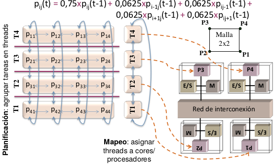
    </p>

      - Ejemplo de asignación estática del paralelismo de tareas y datos con OpenMP.

      <p>
      
      </p>

      - **Asignación estática**.
          - Asignación estática y explícita de las iteraciones de un bucle.

          En la siguiente imagen se pueden ver dos alternativas que el programador puede utilizar explícitamente para asignar las iteraciones de un bucle a procesos (hebras) de forma estática. En la asignación turno rotatorio (*round-robin*), iteraciones consecutivas del bucle se asignan a procesos consecutivos (con identificador consecutivo). En el otro ejemplo se asignan iteraciones consecutivas al mismo proceso.

          <p>
          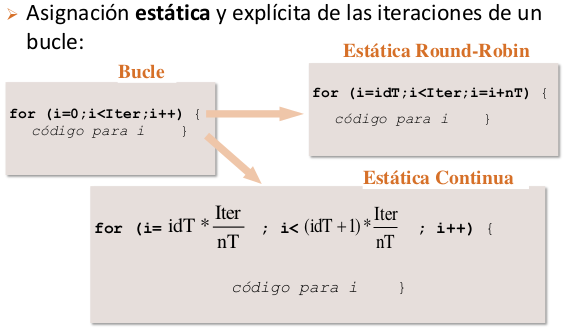
          </p>

      - **Asignación dinámica**.
          - Asignación dinámica y explícita de las iteraciones de un bucle.

          En la siguiente imagen se ve cómo el programador puede implementar explícitamente en el código una asignación dinámica para memoria compartida. Las iteraciones se reparten en orden. La variable `i` es compartida. Los procesos (hebras) consultan la variable `i` para "coger" la siguiente iteración que van a realizar, e incrementan su valor en uno par que el siguiente proceso no coja una iteración ya asignada. Para que una iteración no se ejecute dos veces, se utiliza un cerrojo `k` para excluir la lectura y modificación. Esquema: dueño-esclavo.

          <p>
          
          </p>

          - **Dinámica e implícita.**

          $\pagebreak$

      - Asignación. Ejemplo: multiplicación matriz por vector.
          <p>
          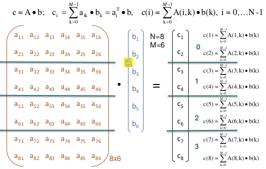
          </p>

- **Redactar código paralelo.**
    - El código depende de:
        - Estilo de programación (variables compartidas, paralelismo...).
        - Modo de programación (SPMD, MPMD...).
        - Punto de partida.
        - Herramienta software para el paralelismo.
        - Estructura.
    - Se añaden o utilizan en el programa las funciones, directivas o construcciones del lenguaje que hagan falta para:
        - Crear y terminar procesos (hebras). Si se crean de forma estática, enrolar o desenrolar procesos en el grupo que va a cooperar en el cálculo.
        - Localizar paralelismo.
        - Asignar la carga de trabajo.
        - Comunicar y sincronizar.
    - Ejemplo: cálculo de PI con OpenMP/C.

      Con la clausula de planificación, estamos haciendo la carga dinámica.

      <p>
      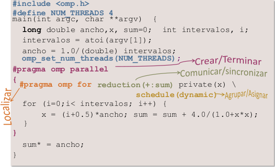
      </p>

    - Asignación de tareas a 2 threads estática por turno rotatorio.

      <p>
      
      </p>

    - Ejemplo: cálculo de PI en MPI/C.
        - `MPI_Init()`: enrola el proceso que lo ejecuta dentro del mundo MPI, es decir, dentro del grupo de procesos denominado MPI_COMM_WORLD.
        - `MPI_Finalize()`: se debe llamar antes de que un proceso enrolado en MPI acabe su ejecución.
        - `MPI_Comm_size(MPI_COMM_WORLD, &nproc)`: pregunta a MPI el número de procesos enrolados en el grupo, se devuelve en `nproc`.
        - `MPI_Comm_rank(MPI_COMM_WORLD, &iproc)`: se devuelve al proceso su identifciador, `iproc`, dentro del grupo.

      <p>
      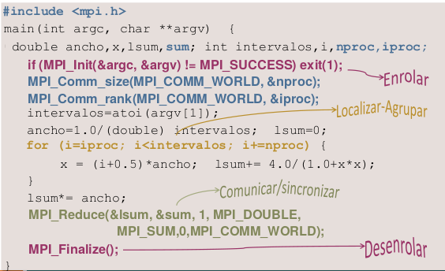
      </p>

- Evaluar prestaciones. Para ver la bondad, es decir, para ver si hemos hecho un buen código.


## Lección 6. Evaluación de prestaciones en procesamiento paralelo.

### Objetivos.

- Obtener ganancia y escalabilidad en el contexto de procesamiento paralela
- Aplicar la ley de Amdahl en el contexto de procesamiento paralela
- Comparar la ley de Amdahl y ganancia escalable.

### 6.1 Ganancia de prestaciones y escalabilidad.

#### 6.1.1 Evaluación de prestaciones.

- **Medidas usuales**.
    - Tiempo de respuesta.
        - Real (wall-clock time, elapsed time) (/usr/bin/time).
        - Usuario, sistema, CPU time = user + sys.
    - Productividad.
- **Escalabilidad**. Evolución del incremento (ganancia) en prestaciones (tiempo de respuesta o productividad) que se consigue en el sistema conforme se añaden recursos.
- **Eficiencia**.
    - Relación prestaciones/prestaciones máximas.
    - Rendimiento = prestaciones/no_recursos.
    - Otras: Prestaciones/consumo_potencia, prestaciones/área_ocupada.

#### 6.1.2 Ganancia en prestaciones. Escalabilidad.
$\newline$

Ganancia de prestaciones:

$$S(p) = \frac{Prestaciones(p)}{Prestaciones(1)} = \frac{T_S}{T_P(p)}$$

$$T_p(p) = T_C(p) + T_O(p)$$

$Prestaciones(p)$: prestaciones para la aplicación en el sistema multiprocesador con $p$ procesadores.

$Prestaciones(1)$: prestaciones obtenidas ejecutando la versión secuencial en un sistema uniprocesador.

$T_S$: tiempo de ejecución (respuesta) del programa secuencial. Para obtener $T_S$ se debería escoger el mejor programa secuencial para la aplicación.

$T_P(p)$: tiempo de ejecución del programa paralelo con  $p$ procesadores.

$T_O(p)$: tiempo de penalización.

Ganancia en velocidad (Speedup)

- Ganancia máxima de la eficiencia = 1
- Ganancia mínima de la eficiencia = 1/p

$$T_p(p) = \frac{T_s}{p} \rightarrow S(p)= T_s / T_p(p) = \frac{T_s}{T_s/p} = p$$

- Sobrecarga (*overhead*):
    - Comunicación/sincronización.
    - Crear/terminar procesos/threads.
    - Cálculos o funciones no presentes en versión secuencial.
    - Falta de equilibrado.

$$E(p) = \frac{Prest(p)}{PrestMax(p)}=\frac{Prest(p)}{p\cdot Prest(l)}=\frac{S(p)}{p}$$

En la siguiente imagen, se mantiene constante el tamaño del problema ($T_S$).

<p>
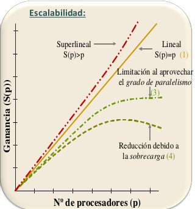
</p>

<p>

</p>

$\pagebreak$

- Número de procesadores óptimo:

$$S(p) = \frac{T_S}{T_P(p)} = \frac{T_S}{T_C(p)+T_O(p)} = \frac{1}{f+\frac{1-f}{p} + \frac{T_O(p)}{T_S}}$$

$$T_C(p) = O(\frac{1}{p})$$

$$T_O(p) = O(p)$$

<p>

</p>

### 6.2 Ley de Amdahl.
- Ley de Amdahl: la ganancia en prestaciones utilizando $p$ procesadores está limitada por la fracción de código que no se puede paralelizar.

$$S(p) = \frac{T_S}{T_P(p)} \leq \frac{T_S}{f\cdot T_S + \frac{(1-f)T_S}{p}} = \frac{p}{1+f(p-1)} \rightarrow \frac{1}{f} (p \rightarrow \infty)$$

- $S$: incremento en velocidad que se consigue al aplicar una mejora. (paralelismo)
- $p$: Incremento en velocidad máximo que se puede conseguir si se aplica la mejora todo el tiempo. (número de procesadores)
- $f$: fracción de tiempo en el que no se puede aplicar la
mejora. (fracción de t. no paralelizable)

<p>

</p>


### 6.3 Ganancia escalable.

<p>

</p>

$\pagebreak$

En la siguiente imagen, al incrementar el número de procesadores, se añade más trabajo y se incrementa el tamaño del problema ($T_S$), pero el tiempo paralelo se mantiene constante ($T_p$).

$f$: fracción de ejecución paralelo frente a la no paraleli zable.

<p>

</p>

$\pagebreak$

# Tema 3. Arquitecturas con paralelismo a nivel de thread (TLP)

## Lección 7. Arquitecturas TLP.

### Objetivos.

- Distinguir entre cores multithread, multicores y multiprocesadores.
- Comparar entre cores multithread de grano fino, cores multithread de grano grueso y cores con multithread simultánea.

### 7.1 Clasificación y estructura de arquitecturas con TLP explícito y una instancia del SO.

- **Mutiprocesador**. Ejecutan varios threads en paralelo en un computador con varios cores/procesadores (cada thread en un core/procesador distinto). Diversos niveles de empaquetamiento: dado, encapsulado, placa, chasis y sistema.
- **Multicore o multiprocesador en un chip o CMP** (*Chip MultiProcessor*). Ejecutan varios threads en paralelo en un chip de procesamiento multicore (cada thread en un core distinto).
- **Core multithread**. Core que modifica su arquitectura ILP para ejecutar threads concurrentemente o en paralelo.

### 7.2 Multiprocesadores.

Ejecutan varios threads en paralelo en un computador con varios cores/procesadores (cada thread en un core/procesador distinto).

#### 7.2.1 Criterio clasificación: sistema de memoria.

- **Multiprocesador con memoria centralizada (UMA)**. Mayor latencia y poco escalable.
- **Multiprocesador con memoria distribuida (NUMA)**. Menor latencia y escalable, pero requiere distribución de datos/código.

<p>
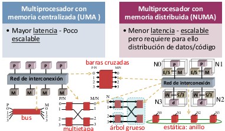
</p>

#### 7.2.2 Criterio de clasificación: nivel de empaquet./conexión.
$\newline$

<p>
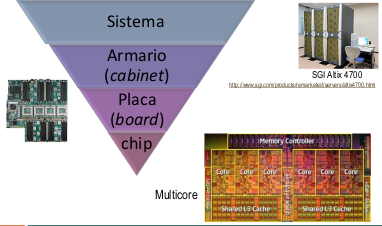
</p>


#### 7.2.3 Multiprocesador en una placa: evolución de UMA a NUMA.

- **UMA**.
    - Controlador de memoria en chipset (*Northbrigde* chip).
    - Red: bus (medio compartido).
- **NUMA**.
    - Controlador de memoria en chip del procesador.
    - Red: enlaces (conexiones punto a punto) y conmutadores (en el chip del procesador).
    - Ejemplos en servidores:
        - AMD Opteron (2003): enlaces HyperTransport (2001).
        - Intel (Nehalem) Xeon 7500 (2010): enlaces QPI (*Quick Path Interconnect*, 2008).

<p>
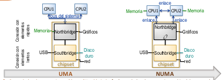
</p>


Multiprocesador en una placa: UMA con bus (Intel Xeon 7300):

<p>

</p>


Multiprocesador en una placa: CC-NUMA con red estática (Intel Xeon 7500):

<p>
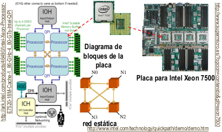
</p>


### 7.3 Multicores.

Ejecutan varios threads en paralelo en un chip de procesamiento multicore (cada thread en un core distinto).

Multiprocesador en un chip o Multicore o CMP (*Chip MultiProcessor*):

<p>
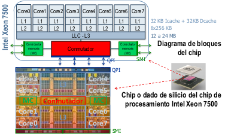
</p>


Multicore: otras posibles estructuras:

<p>

</p>


### 7.4 Cores Multithread.

Modifican su arquitectura ILP (segmentada, escalar o VLIW) para ejecutar threads concurrentemente o en paralelo.

#### 7.4.1 Arquitecturas ILP.

$\newline$
Se modifica la arquitectura para el mismo nivel de instrucción para paralelizar para aprovechar el hardware de paralelización.

- Etapa de captación de instrucciones (*Instruction Fetch*).
- Etapa de decodificación de instrucciones y emisión a unidades funcionales (*Instruction Decode/Instruction Issue*).
- Etapas de ejecución (*Execution*). Etapa de acceso a memoria (*Memory*).
- Etapa de almacenamiento de resultados (*Write-Back*): capta el resultado del registro de arquitectura (para los programas en ensamblador).

<p>
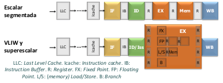
</p>


- **Procesadores/cores segmentados**. Ejecutan instrucciones concurrentemente segmentando el uso de sus componentes.
- **Procesadores/cores VLIW** (*Very Large Instruction Word*) y
**superescalares**. Ejecutan instrucciones concurrentemente (segmentación) y en paralelo (tienen múltiples unidades funcionales y emiten múltiples
instrucciones en paralelo a unidades funcionales).
    - **VLIW**.
        - Las instrucciones que se ejecutan en paralelo se captan juntas de memoria.
        - Este conjunto de instrucciones conforman la palabra de instrucción muy larga a la que hace referencia la denominación VLIW.
        - El hardware presupone que las instrucciones de una palabra son independientes: no tiene que encontrar instrucciones que pueden emitirse y ejecutarse en paralelo.
    - **Superescalares**.
        - Tiene que encontrar instrucciones que puedan emitirse y ejecutarse en paralelo (tiene hardware para extraer paralelismo a nivel de instrucción).

#### 7.4.2 Modificación de la arquitectura ILP en Core Multithread (ej. SMT).

- Almacenamiento: se multiplexa, se reparte o comparte entre threads, o se replica.
    - Con SMT: repartir, compartir o replicar.
- Hardware dentro de etapas: se multiplexa, o se reparte o comparte entre threads.
    - Con SMT: unidades funcionales (etapa Ex) compartidas, resto etapas repartidas o compartidas; multiplexación es posible (p. ej. predicción de saltos y decodificación).

<p>
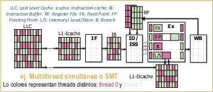
</p>


#### 7.4.3 Clasificación de cores multithread.

- **Temporal Multithreading** (*TMT*),
    - Ejecutan varios threads concurrentemente en el mismo core.
        - La conmutación entre threads la decide y controla el hardware.
    - Emite instrucciones de un único thread en un ciclo
- **Simultaneous MultiThreading** (*SMT*) o **multihilo simultáneo** o **horizontal multithread**.
    - Ejecutan, en un core superescalar, varios threads en paralelo.
    - Pueden emitir (para su ejecución) instrucciones de varios threads en un ciclo.

<p>
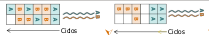
</p>


#### 7.4.4 Clasificación de cores con TMT.

- **Fine-grain multithreading** (*FGMT*) o **interleaved
multithreading**.
    - La conmutación entre threads la decide el hardware cada ciclo (coste 0).
        - por turno rotatorio (*round-robin*) o
        - por eventos de cierta latencia combinado con alguna técnica de planificación (ej. thread menos recientemente ejecutado)
            - Eventos: dependencia funcional, acceso a datos a cache L1, salto no predecible, una operación de cierta latencia (ej. div), ...
- **Coarse-grain multithreading** (*CGMT*) o **blocked
multithreading**.
    - La conmutación entre threads la decide el hardware (coste de
0 a varios ciclos).
        - tras intervalos de tiempo prefijados (timeslice multithreading) o
        - por eventos de cierta latencia (switch-on-event multithreading).

<p>
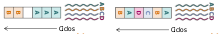
</p>


#### 7.4.5 Clasificación de cores con CGMT con conmutación por eventos.

- **Estática**.
    - Conmutación.
        - Explícita: instrucciones explícitas para conmutación (instrucciones añadidas al repertorio).
        - Implícita: instrucciones de carga, almacenamiento, salto.
    - Ventaja/Inconveniente: coste cambio contexto bajo (0 o 1 ciclo) / cambios de contextos innecesarios.
- **Dinámica**.
    - Conmutación típicamente por fallo en la última cache dentro del chip de procesamiento (conmutación por fallo de cache), interrupción (conmutación por señal), ...
    - Ventaja/Inconveniente: reduce cambios de contexto innecesarios / mayor sobrecarga al cambiar de contexto.

#### 7.4.6 Alternativas en un core escalar segmentado.
$\newline$
En un core escalar se emite una instrucción cada ciclo de reloj.

<p>
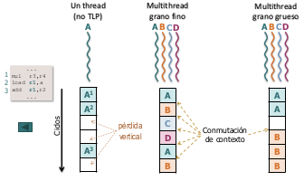
</p>


#### 7.4.7 Alternativas en un core con emisión múltiple de instrucciones de un thread.
$\newline$
En un core superescalar o VLIW se emiten más de una instrucción cada ciclo de reloj; en las alternativas de abajo, de un único thread.

<p>
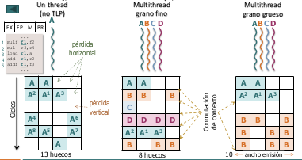
</p>


#### 7.4.8 Core multithread simultánea y multicores.
$\newline$
En un multicore y en un core superescalar con SMT (Simultaneous MultiThread) se pueden emitir instrucciones de distintos threads cada ciclo de reloj.

<p>
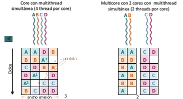
</p>


### 7.5 Hardware y arquitecturas TLP en un chip.
$\newline$

<p>
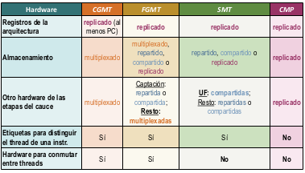
</p>

$\pagebreak$

## Lección 8. Coherencia del sistema de memoria.

### Objetivos.

- Comparar los métodos de actualización de memoria principal implementados en cache.
- Comparar las alternativas para propagar un escritura en protocolos de coherencia de cache.
- Explicar qué debe garantizar el sistema de memoria para evitar problemas por incoherencias.
- Describir las partes en las que se puede dividir el análisis o el diseño de protocolos de coherencia.
- Distinguir entre protocolos basados en directorios y protocolos de espionaje (snoopy).
- Explicar el protocolo de mantenimiento de coherencia de espionaje MSI.
- Explicar el protocolo de mantenimiento de coherencia de espionaje MESI.
- Explicar el protocolo de mantenimiento de coherencia MSI basado en directorios con difusión y sin difusión.

Computadores que implementan en hardware mantenimiento de coherencia:

<p>
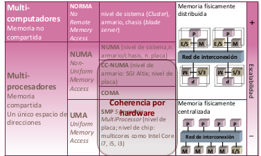
</p>


### 8.1 Sistema de memoria en multiprocesadores.

- El sistema de memoria **incluye**:
    - Caches de todos los nodos.
    - Memoria principal.
    - Controladores.
    - Buffers:
        - Buffer de escritura/almacenamiento.
        - Buffer que combinan escrituras/almacenamientos, etc.
    - Medio de comunicación de todos estos componentes (red de interconexión).
- La comunicación de datos entre procesadores la realiza el sistema de memoria.
    - La lectura de una dirección debe devolver lo último que se ha escrito (desde el punto de vista de todos los componentes del sistema).

<p>
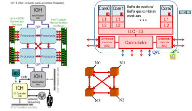
</p>


### 8.2 Concepto de coherencia en el sistema de memoria: situaciones de incoherencia y requisitos para evitar problemas en estos casos.

#### 8.2.1 Incoherencia en el sistema de memoria.

$\newline$
Si en el sistema de memoria las copias de una dirección no tienen el mismo contenido, tendremos una **incoherencia** en el sistema de memoria. Esto puede provocar problemas si los componentes del sistema se comunican a través de posiciones de memoria (escribiendo y leyendo en posiciones de memoria). No se podrá conseguir llevar a cabo satisfactoriamente la comunicación si el componente que recibe no lee a través de la dirección de memoria a la que accede lo último que se ha escrito.

En la imagen de abajo a la izquierda, el procesador $P_k$ lee de la posición de memoria $D$ (1L), lo que provoca que el bloque de memoria donde se encuentra esta dirección se copie a su caché. Tras la transferencia, el contenido de la posición de memoria $D$ en la caché es 3, coincide con el contenido de la dirección en memoria principal. Si $P_k$ escribe un nuevo valor, 4, en la dirección $D$ (2E), escribirá en la copia de la dirección que tienen en su caché. Tendremos entonces una incoherencia en el sistema de memoria, ya que en la posición $D$ no tiene el mismo contenido en memoria principal y en la caché. También pueden dar problemas las situaciones de incoherencia entre caché y memoria principal para datos modificables privados de un proceso si el SO permite que los procesos migren de un procesador a otro. Supongamos que el proceso $P_k$ que acaba de modificar $D$ en su caché, emigra al procesador $P_j$. Si en $P_j$ el proceso accede a $D$, leería de memoria un contenido no actualizado.

En la imagen de abajo a la derecha, dos procesos que se ejecutan en procesadores distintos, $P_k$ y $P_j$, acceden a una dirección $D$ que comparten y que además pueden modificar. Primero leen (1L y 2L) el contenido de la dirección de memoria $D$, lo que provoca los correspondientes fallos de caché y la transferencia del bloque de memoria donde se encuentra esta dirección a la caché de los dos procesadores. Uno de ellos $P_k$, escribe en $D$, pasando el contenido de $D$ en su caché a 4. Por lo que se produce una falta de coherencia en el sistema de memoria entre la caché de $P_j$ y $P_k$, además de una falta de coherencia con la memoria principal. Si un dispositivo de E/S escribe en la posición $D$, modificará la copia de memoria. Entonces ninguna de las tres copias de $D$ en el sistema tendrá el mismo contenido. La falta de coherencia entre cachés provocada al modificar un dato compartido, se hace patente si el proceso $P_j$ vuelve a leer el contenido de $D$, ya que el valor que obtiene, es el contenido no actualizado de su caché.

<p>
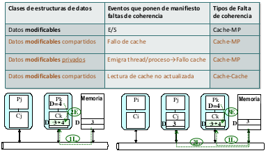
</p>


#### 8.2.2 Métodos de actualización de memoria principal implementados en caches.

- **Escritura inmediata** (*write-through*). Cada vez que un procesador escribe en su cache escribe también en memoria principal. Cada escritura supone la utilización de la red y para transferir datos aislados, con el consiguiente desaprovechamiento del ancho de banda de la red. La situación del tráfico empeora en sistemas con múltiples procesadores, ya que puede haber varios procesadores escribiendo simultáneamente.

    Como en una aplicación se escribe varias veces en un bloque (a las variables contiguas en el código del programa se les asigna posiciones consecutivas en memoria), en la misma dirección o en distintas direcciones, se incrementarían entonces las prestaciones si el bloque se transfiere por la red una vez realizadas todas las modificaciones (se disminuye el número de accesos, y cuando se accede, se aprovecha en mayor medida el ancho de banda de la red).

    Con escritura inmediata se opta por no provocar incoherencia entre caché y memoria principal cuando se escribe en caché; pero no se evita la incoherencia entre cachés, o entre caché y memoria cuando escribe en memoria principal algún componente.

<p>
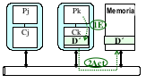
</p>

- **Posescritura** (*write-back*). Se actualiza memoria principal escribiendo todo el bloque cuando se desaloja de la caché. Cuando un procesador modifica una dirección solo se escribe en la caché del procesador; el dato no se transfiere a memoria principal, por lo que se puede escribir varias veces en un bloque sin acceder a memoria principal. La actualización de memoria se realiza posteriormente, cuando el bloque que contiene la dirección modificada se elimina de caché a fin de dejar espacio para otro bloque. Se debe mantener información en el directorio caché sobre los bloques de memoria modificados en la caché.

    Se permite que aparezcan incoherencias entre caché y memoria también cuando se escribe en caché. La situación empeora con posescritura frente a escritura inmediata.

<p>
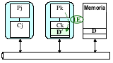
</p>


#### 8.2.3 Alternativas para propagar una escritura en protocolos de coherencia de cache.

$\newline$
La falta de coherencia entre cachés y los problemas debidos a la incoherencia entre memoria principal y caché se pueden solventar con hardware específico.

- **Escritura con actualización** (*write-update*). Cada vez que un procesador escribe en una dirección en su cache se escribe en las copias de esa dirección en otras caches.

<p>
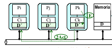
</p>

Para reducir tráfico, sobre todo si los datos están compartidos por pocos procesadores.

- **Escritura con invalidación** (*write-invalidate*). Antes que un procesador modifique una dirección en su cache se invalidan las copias del bloque de la dirección en otras caches. El procesador que va a modificar una dirección, primero obtiene acceso exclusivo al bloque que la contiene. Cuando otro procesador lea la dirección, su caché falla, provocando que tenga que acceder a memoria principal, consiguiendo así el dato actualizado. El acceso exclusivo pretende asegurar que no hay otras copias del bloque en cachés de otros procesadores que se puedan leer o escribir cuando se está realizando la escritura. Invalidar es más rápido que actualizar, ya que solo se debe transferir la dirección (bloque) en la que se va a escribir, mientras que al actualizar, se deben transferir además los datos a escribir. Usando invalización solo se permite compartir un bloque de memoria mientras se lee del bloque.

    Si se escribe varias veces sucesivas en un bloque sin que otro procesador lea, usando invalidación se puede reducir el acceso a la red (transferencias) frente a la política de actualización, ya que una vez invalidado un bloque, nuevas modificaciones del bloque por parte del mismo procesador no originan transferencias. Por contra, si se escribe para que a continuación otro u otros procesadores lean lo escrito, podría ser más eficiente actualizar, ya que al invalidar las copias en otras cachés cuando se escribe, las lecturas posteriores de esa dirección por otros procesadores provocan fallos de caché, lo que origina tráfico en la red.

<p>

</p>


#### 8.2.4 Situación de incoherencia aunque se propagan las escrituras (usa difusión).

- Contenido inicial de las copias de la dirección A en calabaza. P0 escribe en A un 1 y, después, P1 escribe en A un 2.
- Se utiliza actualización para propagar las escrituras (las propagación se nota con flechas).
- Llegan en distinto orden las escrituras debido al distinto tiempo de propagación (se está suponiendo que los Proc. están ubicados en la placa tal y como aparecen en el dibujo). En cursiva se puede ver el contenido de las copias de la dirección A tras las dos escrituras.
    - Se da una situación de incoherencia aunque se propagan las escrituras: P0 y P3 acaban con 2 en A y P1 y P2 con 1.

<p>

</p>


#### 8.2.5 Requisitos del sistema de memoria para evitar problemas por incoherencia.

- **Propagar** las escrituras en una dirección.
    - La escritura en una dirección debe hacerse visible en un tiempo finito a otros procesadores.
    - Componentes conectados con un bus:
        - Los paquetes de actualización/invalidación son visibles a todos los nodos conectados al bus (controladores de cache).

- **Serializar** las escrituras en una dirección.
    - Las escrituras en una dirección deben verse en el mismo orden por todos los procesadores (el sistema de memoria debe parecer que realiza en serie las operaciones de escritura en la misma dirección).
    - Componentes conectados con un bus:
        - El orden en que los paquetes aparecen en el bus determina el orden en que se ven por todos los nodos.

<p>

</p>


#### 8.2.6 Requisitos del sistema de memoria para evitar problemas por incoherencia: la red no es un bus.

- **Propagar** escrituras en una dirección
    - Usando difusión:
        - Los paquetes de actualización/invalidación se envían a todas las caches.
    - Para conseguir mayor escalabilidad:
        - Se debería enviar paquetes de actualización/invalidación sólo a caches (nodos) con copia del bloque.
        - Mantener en un directorio, para cada bloque, los nodos con copia del mismo.
- **Serializar** escrituras en una dirección.
    - El orden en el que las peticiones de escritura llegan a su home (nodo que tiene en MP la dirección) o al directorio centralizado sirve para serializar en sistemas de comunicación que garantizan el orden en las trasferencias entre dos puntos.

<p>

</p>


#### 8.2.7 Directorio de memoria principal.

$\newline$
<p>

</p>


#### 8.2.8 Alternativas para implementar el directorio.

- **Centralizado**.
    - Compartido por todos los nodos.
    - Contiene información de los bloques de todos los módulos de memoria.
- **Distribuido**.
    - Las filas se distribuyen entre los nodos.
    - Típicamente el directorio de un nodo contiene información de los bloques de sus módulos de memoria.

<p>

</p>


#### 8.2.9 Serialización de las escrituras por el home. Usando difusión.

- Contenido inicial de las copias de la dirección A en calabaza. P0 escribe en A un 1 y, después, P1 escribe en A un 2.
- Se utiliza actualización para propagar las escrituras (las propagación se nota con flechas).
- El orden de llegada al home es el orden real para todos.

<p>

</p>

- Contenido inicial de las copias de la dirección A en calabaza.
- Se utiliza actualización para propagar las escrituras (las propagación se nota con flechas).

<p>

</p>

- Se utiliza actualización para propagar las escrituras (las propagación se nota con flechas).

<p>

</p>


#### 8.2.10 Serialización de las escrituras por el home. Sin difusión y con directorio distribuido.

- Contenido inicial de las copias de la dirección A en calabaza. P0 escribe en A un 1 y, después, P1 escribe en A un 2.
- Se utiliza actualización para propagar las escrituras (las propagación se nota con flechas).
- El orden de llegada al home es el orden real para todos.

<p>

</p>

- Contenido inicial de las copias de la dirección A en calabaza.
- Se utiliza actualización para propagar las escrituras (las propagación se nota con flechas).

<p>

</p>

- Se utiliza actualización para propagar las escrituras (las propagación se nota con flechas).

<p>

</p>


### 8.3 Protocolos de mantenimiento de coherencia: clasificación y diseño.

#### 8.3.1 Clasificación de protocolos para mantener coherencia en el sistema de memoria.

- Protocolos de espionaje (snoopy).
    - Para buses, y en general sistemas con una difusión eficiente (bien porque el número de nodos es pequeño o porque la red implementa difusión).

    <p>
    
    </p>

- Protocolos basados en directorios.
    - Para redes sin difusión o escalables (multietapa y estáticas).
- Esquemas jerárquicos.
    - Para redes jerárquicas: jerarquía de buses, jerarquía de redes escalables, redes escalables-buses.

<p>

</p>


#### 8.3.2 Facetas de diseño lógico en protocolos para coherencia.

- Política de actualización de MP:
    - escritura inmediata, posescritura, mixta.
- Política de coherencia entre caches:
    - escritura con invalidación, escritura con actualización, mixta
- Describir comportamiento:
    - Definir posibles estados de los bloques en cache, y en memoria.
    - Definir transferencias (indicando nodos que intervienen y orden entre ellas) a generar ante eventos:
        - lecturas/escrituras del procesador del nodo.
        - como consecuencia de la llegada de paquetes de otros nodos.
    - Definir transiciones de estados para un bloque en cache, y en memoria.

### 8.4 Protocolo MSI de espionaje.

#### 8.4.2 Protocolo de espionaje de tres estados (MSI) – posescritura e invalidación.

- **Estados** de un bloque en **caché**:
    - **Modificado** (M): es la única copia del bloque válida en todo el sistema. La caché debe proporcionar el bloque si observa al espiar el bus que algún componente lo solicita y debe invalidarla si algún otro nodo solicita una copia exclusiva del bloque para su modificación. El procesador tiene el uso exclusivo del bloque, de forma que puede disponer de él para leer y escribir sin informar al resto del sistema. La caché debe atender a las peticiones a través del bus.
    - **Compartido** (C,S): está válido, también válido en memoria y puede que haya copia válida en otras caches. La caché debe invalidar su copia si observa al espiar el bus que algún otro nodo solicita una copia exclusiva del bloque para su modificación.
    - **Inválido** (I): no está físicamente o se ha invalidado por el controlador como consecuencia de la escritura en el bloque en otra caché. El procesador tiene que acceder al bloque a través de la red.

Se pueden ordenar en función del grado de propiedad o disponibilidad del bloque por parte del procesador al que pertenece la caché (orden creciente): inválido, compartido y modificado.

- **Estados** de un bloque en **memoria** (en realidad se evita almacenar esta información):
    - **Válido**: puede haber copia válida en una o varias caches.
    - **Inválido**: habrá copia válida en una cache.
- **Transferencias** generadas por un nodo con caché (tipos de paquetes):
    - **Petición de lectura de un bloque** (**PtLec**): por lectura con fallo de caché del procesador del nodo (**PrLec**). El controlador de la caché inicia la transacción de lectura poniendo en el bus la dirección a la que se desea acceder. El sistema de memoria (memoria principal u otra caché) proporcionará el bloque donde se encuentra la dirección solicitada.
    - **Petición de acceso exclusivo** (**PtLecEx**): por escritura del procesador (**PrEsc**) en bloque compartido o inválido. El controlador de la caché genera el paquete que indicará la dirección en la que se desea escribir. El resto de cachés con copias válidas del bloque invalidan sus copias. También se invalida el bloque en memoria si se encuentra en estado válido. El procesador puede solicitar una confirmación de este paquete.
    - **Petición de posescritura** (**PtPEsc**): por el reemplazo del bloque modificado (el procesador del nodo no espera respuesta). El bloque a reemplazar generado por la circuitería de reemplazo debe transferirse a memoria principal si está en estado modificado (ya que la memoria no tiene el bloque actualizado). El controlador de la caché genera la transferencia poniendo en el bus la dirección del bloque a escribir en memoria y el contenido del propio bloque. El procesador no conoce este hecho y no espera ninguna respuesta.
    - **Respuesta con bloque** (**RpBloque**): al tener en estado modificado el bloque solicitado por una **PtLec** o **PtLecEx** recibida.

<p>

</p>


#### 8.4.3 Diagrama MSI de transiciones de estados.

$\newline$
Las líneas discontinuas son transiciones provocadas por paquetes del bus; las líneas continuas son transiciones provocadas por acciones del procesador de la caché. Las líneas de han etiquetado con el evento que provoca la transición y el paquete que generan (evento/paquete).

<p>

</p>


#### 8.4.4 Tabla de descripción de MSI.

<p>

</p>

- **Fallo de lectura**: el procesador lee (PrLec) y el bloque no está en caché (estado inválido). El controlador de caché del procesador que lee difunde un paquete de petición de lectura de un bloque de memoria (PtLec); el estado del bloque en la caché después de la lectura será de compartido. La copia del bloque en otras cachés también tendrá estado compartido, y en la memoria, válido. El paquete PtLec provoca los siguientes efectos en otras cachés:

    1. Si el bloque se encuentra en otra caché en estado modificado, deposita el bloque en el bus (respuesta RpBloque) y pasa a estado compartido. La memoria también recoge el bloque del bus pasando a estado válido.

    2. Si el bloque está compartido, la memoria proporciona el bloque a la caché que lo solicita. El bloque sigue en estado compartido.

- **Fallo de escritura al no estar el bloque en la caché**: el procesador escribe (PrEsc) y el bloque no está en caché. El controlador de caché del procesador que escribe difunde un paquete de petición de acceso exclusivo al bloque (PtLecEx); el estado del bloque en la caché después de la escritura se promociona a modificarlo. El paquete PtLecEx provoca los siguientes efectos:
    1. Si la memoria tiene el bloque válido, lo deposita en el bus y pasa a estado inválido.
    2. Si una caché tiene el bloque en estado modificado, deposita el bloque en el bus y pasa a estado inválido.
    3. Si una caché tiene en estado compartido, pasa a estado inválido.
- **Acierto de escritura en bloque compartido**: el procesador escribe (PrEsc) y el bloque está en caché en estado compartido. Si el bloque está en la caché en estado compartido, antes de escribir se debe obtener acceso exclusivo al bloque, para lo cual el controlador de caché difunde un paquete de petición de acceso exclusivo al bloque (PtLecEx); el estado del bloque en la caché después de la escritura se promociona modificando (el acierto de escritura en bloque compartido se trata como el fallo de escritura). El paquete PtLecEx generado provoca los siguientes efectos:
    1. La memoria deposita el bloque en el bus, ya que lo tiene válido (el bloque depositado se puede ignorar), y pasa a estado inválido. Para evitar que la memoria deposite en este caso el bloque en el bus y reducir así el tráfico, se debe añadir un nuevo paquete al sistema para esta situación en la que el procesador escribe y el bloque está en  estado compartido. Sería un paquete de petición de acceso exclusivo, pero sin lectura (PtEx).
    2. El bloque no puede estar en estado modificado en otra caché.
    3. Si una caché tiene el bloque en estado compartido, pasa a estado inválido.
- **Acierto de escritura en bloque modificado**: el procesador escribe (PrEsc) y el bloque está en caché en estado modificado. Como el nodo ya tiene la propiedad exclusiva del bloque, no se genera ningún paquete. El bloque sigue en estado modificado.
- **Acierto de lectura**: el procesador lee (PrLec) y el bloque se encuentra actualizado en la caché. En este caso el bloque se mantiene en el mismo estado. No genera ningún paquete.
- **Reemplazo**: fallo en el acceso del procesador a otro bloque, y la política de reemplazo selecciona este bloque para hacer sitio al nuevo. Si el bloque reemplazado se encuentra en estado modificado, el controlador de caché del procesador que escribe difunde un paquete de posescritura en memoria (PtPEsc), el estado del bloque en la caché pasa a ser de inválido (no está presente físicamente). Hay que tener en cuenta que se utiliza posescritura como política de actualización de memoria principal. Este paquete PtPEsc provoca que el bloque se transfiera a memoria pasando el estado del bloque en memoria a válido.


#### 8.4.5 Ejemplo MSI.

$\newline$
<p>

</p>

<p>

</p>

<p>

</p>

<p>

</p>


### 8.5 Protocolo MESI de espionaje.

#### 8.5.1 Protocolo de espionaje de cuatro estados (MESI) – posescritura e invalidación.

- Estados de un bloque en cache:
    - **Modificado** (M):es la única copia del bloque válida en todo el sistema, el resto de cachés y la memoria tienen una copia no actualizada. La caché debe proporcionar el bloque si observa al espiar el bus que algún componente lo solicita, y debe invalidarla si algún otro nodo solicita una copia exclusiva del bloque para su modificación.
    - **Exclusivo** (E): es la única copia del bloque válida en caches, la memoria también está actualizada. La caché debe invalidar su copia si observa al espiar el bus que algún otro nodo solicita una copia exclusiva del bloque para su modificación.
    - **Compartido** (C,Shared): es válido en esta caché, también válido en memoria y en al menos otra caché. La caché debe invalidar su copia si observa al espiar el bus que algún otro nodo solicita una copia exclusiva del bloque para su modificación.
    - **Inválido** (I): se ha invalidado o no está físicamente.
- Estados de un bloque en memoria (en realidad se evita almacenar esta información):
    - **Válido**: puede haber copia válida en una o varias caches.
    - **Inválido**: habrá copia valida en una cache.

#### 8.5.2 Diagrama MESI de transiciones de estados.

$\newline$

Las líneas discontinuas son transiciones provocadas por paquetes del bus, las líneas continuas por acciones del procesador de la caché. Las líneas se han etiquetado con el evento que provoca la transición y el paquete que generan (evento/paquete).

<p>

</p>


#### 8.5.3 Tabla de descripción de MESI.

$\newline$
<p>

</p>

- **Fallo de lectura**: el procesador lee una dirección del bloque (PrLec) y este no está en caché. El controlador de caché del procesador que lee difunde un paquete de petición de lectura de un bloque de memoria (PtLec). El estado del bloque en la caché después de la lectura pasará a ser compartido si hay copias del bloque en otras cachés, y pasará a estado exclusivo si no hay copias del bloque en otras cachés. El controlador de la caché que solicita el bloque, requiere conocer si el bloque solicitado se encuentra en otras cachés. Se puede añadir una línea OR cableada que informe si hay cachés con copias del bloque solicitado. La actualización de esta OR por parte de los controladores de caché se realizaría en la fase de direccionamiento. La memoria dispondrá del bloque válido al terminar el proceso. El paquete PtLec provoca los siguientes efector en otras cachés:
    1. Si el bloque se encuentra en otra caché en estado modificado, deposita el bloque en el bus y pasa a estado compartido. La memoria también coge el bloque del bus.
    2. Si el bloque está compartido, sigue en estado compartido. El bloque que llega a la caché del nodo que lo solicita procede de memoria.

Hay implementaciones en las que, si el bloque solicitado está disponible en estado válido en alguna caché, en lugar de obtener el bloque de memoria, se proporciona por parte de alguna de estas cachés con bloque válido. Hay que añadir entonces hardware, que decida qué caché con bloque válido va a generar la respuesta con el bloque. Esta alternativa es interesante en sistemas con memoria físicamente distribuida (protocolos basados en directorios), ya que se puede proporcionar el bloque desde el nodo más cercano al que lo solicita.
- **Fallo de escritura al no estar el bloque en caché**: el procesador escribe (PrEsc) y el bloque no está en caché. El controlador de caché del procesador que escribe difunde un paquete de petición de acceso exclusivo al bloque (PtLecEx). El estado del bloque en la caché después de la escritura será de modificado. El paquete PtLecEx provoca los siguientes efectos:
    1. Si una caché tiene el bloque en estado modificado, bloquea la lectura de memoria y deposita el bloque en el bus. El bloque pasa en esta caché a estado inválido.
    2. Si una caché tiene el bloque en estado compartido, pasa a estado inválido.
- **Acierto de escritura en bloque compartido**: el procesador escribe (PrEsc) y hay una copia del bloque en su caché y en la caché de algún otro procesador. El controlador de caché del procesador que escribe difunde un paquete de petición de acceso exclusivo al bloque (PtLecEx). El estado del bloque en la caché después de la escritura será de modificado. El paquete PtLecEx provoca los siguientes efectos:
    1. La memoria puede depositar el bloque en el bus, pero se puede ignorar (la caché que ha generado la petición PtLecEx tiene el bloque válido). Para evitar que se utilice el bus de datos innecesariamente se puede añadir al diseño otro paquete distinto que pida acceso exclusivo pero no la lectura de los datos (PtEx).
    2. El bloque no puede estar en estado modificado en otra caché.
    3. Si una caché tiene bloque en estado compartido, pasa a estado inválido.
- **Acierto de escritura en bloque modificado**: el procesador escribe (PrEsc) y el bloque está en caché en estado modificado. Como no hay otro nodo con copia válida del bloque en su caché no es necesario generar un paquete. El bloque continúa en estado modificado.
- **Acierto de lectura**: el procesador lee (PrLec) y el bloque se encuentra en la caché actualizado. El bloque se mantiene en el mismo estado. No genera ningún paquete.
- **Reemplazo**: fallo en el acceso del procesador a otro bloque y la política de reemplazo selecciona este bloque para hacer sitio al nuevo bloque. El controlador de caché del procesador que escribe difunde un paquete de posescritura en memoria (PtPEsc) si el bloque reemplazado se encuentra en estado modificado. El bloque pasa a estado inválido (no está presente físicamente). Este paquete PtPEsc provoca que el bloque se transfiera a la memoria pasando el estado del bloque en memoria a válido (si se almacena información de estado en memoria).

### 8.6 Protocolo MSI basado en directorios con o sin difusión.

#### 8.6.1 MSI con directorios (sin difusión).

- Estados de un bloque en **cache**:
    - Modificado (M), Compartido (C), Inválido (I).
- Estados de un bloque en **MP**:
    - Válido e inválido.
- **Transferencias** (tipos de paquetes):
    - Tipos de nodos:
        - **Solicitante (S)**: contiene el procesador que ha emitido una petición sobre el bloque.
        - **Origen (O)**: el bloque tiene como origen el módulo de memoria de este nodo; la entrada del directorio para el bloque se encuentra en este nodo.
        - **Modificado (M)**: único nodo que tiene una copia del bloque en su caché en estado modificado (dirty), no hay otro nodo con copia válida en caché y la memoria principal tampoco tiene copia válida. El nodo modificado y origen pueden coincidir.
        - **Propietario (P)**: nodo con copia válida del bloque en su caché, y que por tanto puede suministrar el bloque. Puede ser el nodo origen, modificado, exclusivo o compartidor.
        - **Compartidor (C)**: nodo con una copia válida del bloque en caché; forma parte de un grupo que comparte el bloque (en caché).
    - **Petición de nodo S a O**: lectura de un bloque (PtLec), lectura con acceso exclusivo (PtLecEx), petición de acceso exclusivo sin lectura (PtEx), posescritura (PtPEsc).
    - **Reenvío de petición de nodo O a nodos con copia (P, M, C)**: invalidación (RvInv), lectura (RvLec, RvLecEx).
    - **Respuesta** de
        - **nodo P a O**: respuesta con bloque (RpBloque), resp. con o sin bloque confirmando inv. (RpInv, RpBloqueInv).
        - **nodo O a S**: resp. con bloque (RpBloque), resp. con o sin bloque confirmando fin inv. (RpInv, RpBloqueInv).

<p>

</p>

| Estado Inicial | Evento | Estado final |
|--------|--------|---------|
| D) Inválido | Fallo de lectura | D) Válido |
| S) Inválido | | S) Compartido |
| P) Modificado | | P) Compartido |
| Acceso remoto | | |

<p>

</p>

<p>

</p>

<p>

</p>

<p>

</p>

<p>

</p>


#### 8.6.2 MSI con directorios (con difusión).
- Estados de un bloque en **cache**:
    - Modificado (M), Compartido (C), Inválido (I).
- Estados de un bloque en **MP**:
    - Válido e inválido.
- **Transferencias** (tipos de paquetes):
    - **Tipos** de nodos: solicitante (S), origen (O), modificado (M), propietario (P) y compartidor (C).
    - **Difusión** de petición del nodo S a
        - **O y P**: lectura de un bloque (PtLec), lectura con acceso exclusivo (PtLecEx), petición de acceso exclusivo sin lectura (PtEx).
        - **O**: posescritura (PtPEsc).
    - **Respuesta** de
        - **nodo P a O**: respuesta con bloque (RpBloque), resp. con o sin bloque confirmando inv. (RpInv, RpBloqueInv).
        - **nodo O a S**: resp. con bloque (RpBloque), resp. con o sin bloque confirmando fin inv. (RpInv, RpBloqueInv).

<p>

</p>

| Estado Inicial | Evento | Estado final |
|--------|--------|---------|
| D) Inválido | Fallo de lectura | D) Válido |
| S) Inválido | | S) Compartido |
| P) Modificado | | P) Compartido |
| Acceso remoto | | |

<p>

</p>

<p>

</p>

$\pagebreak$

## Lección 9. Consistencia del sistema de memoria.

### Objetivos.

- Explicar el concepto de consistencia.
- Distinguir entre coherencia y consistencia.
- Distinguir entre el modelo de consistencia secuencial y los modelos relajados.
- Distinguir entre los diferentes modelos de consistencia relajados.

### 9.1 Concepto de consistencia de memoria.

- Especifica (las restricciones en) el **orden** en el cual las **operaciones de memoria** (lectura, escritura) deben parecer haberse **realizado** (operaciones a las mismas o distintas direcciones y emitidas por el mismo o distinto proceso/procesador).
- La coherencia sólo abarca operaciones realizadas por múltiples componentes (proceso/procesador) en una misma dirección.

<p>

</p>

### 9.2 Consistencia secuencial (SC).

- SC es el modelo de consistencia que espera el programador de las herramientas de alto nivel.
- SC requiere que:
    - Todas las operaciones de un único procesador (thread) parezcan ejecutarse en el orden descrito por el programa de entrada al procesador (**orden del programa**).
    - Todas las operaciones de memoria parezcan ser ejecutadas una cada vez (**ejecución atómica**) -> serialización global.
- SC presenta el sistema de memoria a los programadores como una memoria global conectada a todos los procesadores a través un conmutador central.

<p>

</p>

<p>

</p>

1) (Orden del programa) El programdor espera que que solo un proceso pueda entrar en la sección crítica. Para ello no se debería permitir que las lecturas puedan adelantar escrituras, se debe mandener el orden W -> R.

  Si hay consistencia secuencial, esperaríamos que entraría uno de ellos, no a la vez. Si no, podrían entrar los dos a la vez. Se utiliza para obtener un acceso en exclusión muta a una sección crítca (cuando no se dispone de primitivas atómicas de lectura-modificación-escritura); se basa en que k1 y k2 no pueden ser 0 al mismo tiempo (aunque tiene un problema de interbloqueo). Para que pueda actuar correctamente, no se puede permitir en un procesador que las lecturas adelanten a escrituras.

2) (Atomicidad) Los procesos comparten las variables A y B, que están inicialmente a 0. El programador espera que al finalizar la ejecución reg1 contenga 1. Supongamos que P2 lee 1 de A y entonces escribe en B, y supongoamos que P3 lee 1 de B y a continuación lee de A. La ejecución atómica de las operaciones de acceso a memoria asegura que el valor escrito en A por P1 se ve en todo el sistema (por todos los procesadores) al mismo tiempo. Entonces, puesto que P3 ve la escritura en B de P2 después de que P2 vea la escritura en A de P1, se garantiza que P3 lee en reg1 lo que P1 escribe en A.

   Para garantizar un funcionamiento correcto, la escritura de una dirección debe ser vista al mismo tiempo por todos los procesos. En caso contrario, podría ocurrir que P3 viera un valor de B de 1 y un valor de A de 0.

Ejemplo de consistencia secuencial:

Se cumple que se ejecuta (1) antes de (2) y (a) antes que (b).

<p>

</p>

¿Qué puede ocurrir en el computador?

<p>

</p>

### 9.3 Modelos de consistencia relajados.

- Difieren en cuanto a los requisitos para garantizar SC que relajan (los relajan para incrementar prestaciones):
    - **Orden del programa**:
        - Hay modelos que permiten que se relaje en el código ejecutado en un procesador el orden entre dos acceso a distintas direcciones (W→R, W→W, R→RW).
    - **Atomicidad (orden global)**:
        - Hay modelos que permiten que un procesador pueda ver el valor escrito por otro antes de que este valor sea visible al resto de los procesadores del sistema.
- Los modelos relajados comprenden:
    - Los órdenes de acceso a memoria que no garantiza el sistema de memoria (tanto órdenes de un mismo procesador como atomicidad en las escrituras).
    - Mecanismos que ofrece el hardware para garantizar un orden cuando sea necesario.

Ejemplo de modelos de consistencia hardware relajados.

<p>

</p>

Consistencia secuencial:

<p>

</p>

#### 9.3.1 Modelo que relaja W->R.

- Permiten que una lectura pueda adelantar a una escritura previa en el orden del programa; pero evita dependencias RAW.
    - Lo implementan los sistemas con buffer (FIFO) de escritura para los procesadores (el buffer evita que las escrituras retarden la ejecución del código bloqueando lecturas posteriores).
    - Generalmente permiten que el procesador pueda leer una dirección directamente del buffer (leer antes que otros procesadores una escritura propia)
- Para garantizar un orden correcto se pueden utilizar instrucciones de serialización.
- Hay sistemas en los que se permite que un procesador pueda leer la escritura de otro antes que el resto de procesadores (acceso no atómico).
    - Para garantizar acceso atómico se puede utilizar instrucciones de lectura-modificación-escritura atómicas.

#### 9.3.2 Modelo que relaja W->R y W->W.

- Tiene buffer de escritura que permite que lecturas adelanten a escrituras en el buffer.
- Permiten que el hardware solape escrituras a memoria a distintas direcciones, de forma que pueden llegar a la memoria principal o a caches de todos procesadores fuera del orden del programa.
- En sistemas con este modelo se proporciona hardware para garantizar los dos órdenes. Los sistemas con Sun Sparc implementa un modelo de este tipo.
- Este modelo no se comporta como SC en el siguiente ejemplo:

```
P1
A=1;
k=1;

P2
while (k=0){}
copia=A;
```

#### 9.3.3 Modelo de ordenación débil.

- Se basa en mantener el orden entre accesos solo en los puntos de sincronización del código. Tiene en cuenta que cuando se necesita coordinar el acceso a una variable compartida (para permitir la comunicación de datos entre procesos) se añade código extra de sincronización.
- Relaja W->R, W->W y R->RW.
- Si S es una operación de sincronización (liberación o adquisición), ofrece hardware para garantizar el **orden**:
    - Una operación etiquetada como de sincronización se debe completar antes que las operaciones de acceso a memoria posteriores en el orden del programa, **S->WR**.
    - Las operaciones de acceso a memoria anteriores en el orden del programa a una operación etiquetada como de sincronización, se deben completar antes que las operaciones de acceso a memoria posteriores en el orden del programa, **WR->S**.
- PowerPC implementa un modelo basado en ordenación débil.

En la siguiente imagen vemos el modelo de ordenación débil. Las lecturas y escrituras (bloques 1, 2 y 3) se deben completar antes que una operación de sincronización posterior en el orden del programa, y viceversa.

<p>

</p>

<p>

</p>

#### 9.3.4 Consistencia de liberación.

- Tiene en cuenta adicionalmente que hay dos tipos de código utilizado en el proceso de sincronización. Por una parte se añade código que el proceso ejecuta para ganar el acceso a variables o recursos compartidos. Si hay varios procesos implicados en el acceso, este código permite que solo uno de ellos gane el acceso. Por otra parte, se añde código que permite a un proceso dar permiso a otro para que pueda acceder a las variables o recursos compartidos. Luego distingue entre dos tipos de operaciones de sincronización: adquisición y liberación.
- El código utilizado para adquirir acceso se basa en leer una variable compartida o en una operación de lectura-modificación-escritura.
- Relaja W->R, W->W y R->RW.
- Si SA es una operación de adquisición y SL de liberación,
ofrece hardware para garantizar el orden:
    - SA->WR y WR->SL.
- Sistemas con Itanium implementan un modelo de consistencia de liberación.

En la siguiente imagen vemos que la primera de las operaciones de sincronización es de adquisición y la segunda de liberación, se pueden solapar accesos de lectura y escritura de los bloques 1 y 2, y también se pueden solapar accesos de lectura y escritura de los bloques 2 y 3.

<p>

</p>

$\pagebreak$

## Lección 10. Sincronización.

### Objetivos.

- Explicar por qué es necesaria la sincronización en multiprocesadores.
- Describir las primitivas para sincronización que ofrece el hardware.
- Implementar cerrojos simples, cerrojos con etiqueta y barreras a partir de instrucciones máquina de sincronización y ordenación de accesos a memoria.

### 10.1 Comunicación en multiprocesadores y necesidad de usar código de sincronización.

#### 10.1.1 Comunicación uno-a-uno. Necesidad de sincronización.

Se debe garantizar que el proceso que recibe lea la
variable compartida cuando el proceso que envía haya escrito en la variable el dato a enviar. Si se reutiliza la variable para comunicación, se debe garantizar que no se envía un nuevo dato en la variable hasta que no se haya leído el anterior. En definitiva, se necesita algún mecanismo que asegure que solo un proceso puede estar accediendo en un momento dado a una dirección compartida (acceso en **exclusión mútua**). Una **región** o **sección crítica** es una secuencia de instrucciones con una o varias direcciones compartidas que se deben acceder en exclusión mútua.

En el siguiente código se ha utilizado para sincronizar una variable compartida `k` como bandera (*flag*). Se persigue que el proceso P2 acceda al nuevo valor de A, 1, cuando el proceso P1 haga 1 la bandera `k`.

```c++
// Paralela (inicialmente K=0)
P1
...
A = 1;
K = 1;
...

P2
...
while (K == 0){};
copia = A;
...
```

#### 10.1.2 Comunicación colectiva.

Hay que coordinar el acceso de múltiples procesos a una variable compartida, de forma que escriban uno detrás de otro (sin interferencias entre ellos) o lean cuando tengan disponibles los resultados definitivos en la memoria compartida. Puede haber uno o varios procesos que envían y/o uno o varios procesos que reciben. Se pueden combinar varios envíos en las variables antes de realizar la lectura por parte del o los procesos que reciben. No obstante, debe garantizarse que los procesos acceden a las variables compartidas in interferir unos con otros, es decir, se necesita un acceso en **exclusión mutua**. Además, debe garantizarse que no se accede al resultado hasta que todos los procesos involucrados hayan ejecutado la sección crítica.

- Ejemplo de comunicación colectiva: suma de n números:
    - La lectura-modificación-escritura de `sum` se debería hacer en exclusión mutua (es una sección crítica) => cerrojos.
        - Sección crítica: Secuencia de instrucciones con una o varias direcciones compartidas (variables) que se deben acceder en exclusión mutua.
    - El proceso 0 no debería imprimir hasta que no hayan acumulado sump en sum todos los procesos => barreras.

```c++
// Secuencial
for (i=0; i<n; i++)
    sum = sum + a[i];
printf(sum);


// Paralela (sum=0)
for (i=ithread; i<n; i=i+nthread)
    sump = sump + a[i];
sum = sum + sump;   // SC, sum compart
if (ithread == 0)
    printf(sum);

// sump es compartida
// No se imprime siempre el mismo resultado, necesitaríamos cerrojos pero aun así se imprimiría mal porque lo imprime el thread 0. Habría que poner una barrera también y ya no habría más problemas.
```

### 10.2 Soporte software y hardware para sincronización.

<p>

</p>

### 10.3 Cerrojos.

- Permiten sincronizar mediante dos operaciones:
    - **Cierre** del cerrojo o `lock(k)`: intenta **adquirir** el derecho a acceder a una sección crítica (cerrando o adquiriendo el cerrojo `k`).
        - Si varios procesos intentan la **adquisición** (cierre) a la vez, sólo uno de ellos lo debe conseguir, el resto debe pasar a una **etapa de espera**.
        - Todos los procesos que ejecuten `lock()` con el cerrojo cerrado deben quedar **esperando**.
  - **Apertura** del cerrojo o `unlock(k)`: **libera** a uno de los threads que esperan el acceso a una sección crítica (éste adquiere el cerrojo).
      - Si no hay threads en **espera**, permitirá que el siguiente thread que ejecute la función `lock()` adquiera el cerrojo k sin espera.

- Cerrojos en ejemplo suma:
    - Alternativas para implementar la espera:
        - Espera ocupada.
        - Suspensión del proceso o thread, éste queda esperando en una cola, el procesador conmuta a otro proceso-thread.

```c++
Secuencial
for (i=0; i<n; i++)
    sum = sum + a[i];

Paralela
for (i=ithread; i<n; i=i+nthread)
    sump = sump + a[i];
lock(k);
sum = sum + sump;   // SC, sum compart
unlock(k);
```

- Componentes en un código para sincronización.
    - Método de **adquisición**.
        - Método por el que un thread trata de adquirir el derecho a pasar a utilizar unas direcciones compartidas. Ej.:
            - Utilizando lectura-modificación-escritura atómicas: Intel x86, Intel Itanium, Sun Sparc.
            - Utilizando LL/SC (Load Linked / Store Conditional): IBM Power/PowerPC, ARMv7, ARMv8.
    - Método de **espera**.
        - Método por el que un thread espera a adquirir el derecho a pasar a utilizar unas direcciones compartidas:
            - Espera ocupada (busy-waiting).
            - Bloqueo.
    - Método de **liberación**.
            - Método utilizado por un thread para liberar a uno (cerrojo) o varios (barrera) threads en espera.

### 10.3.1 Cerrojos simples.

- Se implementa con una variable compartida k que toma dos valores: abierto (0), cerrado (1).
- **Apertura** del cerrojo, `unlock(k)`: abre el cerrojo escribiendo un 0 (operación **indivisible**).
- Cierre del cerrojo, `lock(k)`: Lee el cerrojo y lo cierra escribiendo un 1.
    - Resultado de la lectura:
        - si el cerrojo estaba **cerrado** el thread espera hasta que otro thread ejecute `unlock(k)`,
        - si estaba **abierto** adquiere el derecho a pasar a la sección crítica.
    - `leer-asignar_1-escribir` en el cerrojo debe ser **indivisible (atómica)**.
- Se debe añadir lo necesario para garantizar el acceso en exclusión mutua a k y el orden imprescindible en los accesos a memoria.

```c++
lock(k) {
    while (leer-asignar_1-escribir(k) == 1) {} ;
} // k compartida

unlock(k) {
    k = 0 ;
} // k compartida
```

- Cerrojos en OpenMP:

| Descripción | Función de la biblioteca OpenMP |
|--------------|-------------------|-----------------------|
| Iniciar (estado `unlock`) | `omp_init_lock(&k)` |
| Destruir un cerrojo | `omp_destroy_lock(&k)` |
| Cerrar el cerrojo `lock(k)` | `omp_set_lock(&k)` |
| Abrir el cerrojo `unlock(k)` | `omp_unset_lock(&k)` |
| Cierre del cerrojo pero sin bloqueo | `omp_test_lock(&k)` |
| (devuelve 1 si estaba cerrado y 0 si está abierto) | |

### 10.3.2 Cerrojos con etiqueta.

Fijan un orden FIFO en la adquisición del cerrojo (se debe añadir lo necesario para garantizar el acceso en exclusión mutua al contador de adquisición y el orden imprescindible en los accesos a memoria):

```c++
// lock (contadores)
contador_local_adq = contadores.adq; //contadores.adq inicialmente es 0
contadores.adq = (contadores.adq+1) mod max_flujos;
while (contador_local_adq <> contadores.lib){}  // <> es !=

// unlock (contadores)
contadores.lib = (contadores.lib + 1) mod max_flujos;
```

### 10.3.3 Barreras.

```c++
//Thread 0 (lo mismo para 1, 2, 3)
main (){
    ...
    Barrera(g,4)
    ...
}
```

El siguiente algoritmo para barreras presenta problemas si los procesos reutilizan la misma barrera, por ejemplo dentro de un bucle, ya que se puede dar la siguiente situación:

1. En la primera utilización de la barrera el SO reemplaza algún proceso $P_i$ que está esperando en la bandera a ser liberado.
2. A continuación llega el último proceso a la barrera activando la variable bandera.
3. Los procesos que están en espera, excepto $P_i$ que está suspendido, verán la bandera a 1 y saldrán del bucle de espera ocupada, abandonando la barrera.
4. Un proceso $P_j$ llega a la segunda función que utiliza la misma barrera desactivando la bandera.
5. $P_i$ vuelve a ejecutarse, pero encuentra la bandera cerrada por lo que se queda en bucle. $P_i$ no supera nunca la primera ejecución de la barrera, y el resto de procesos no supera la segunda ejecución, también se quedarán en el bucle de espera. Ocurre que en la segunda utilización de la barrera el contador no va a poder alcanzar un valor igual al número de procesos, ya que uno de ellos se ha quedado en la primera llamada a la barrera.

```c++
Barrera (id, num_threads){
    if (bar[id].cont == 0)
        bar[id].bandera = 0;      // Acceso Ex. Mutua

    cont_local = ++bar[id].cont;  // Accesp Ex. Mutua

    if (cont_local == num_threads){
        bar[id].cont = 0;
        bar[id].bandera = 1;
    }
    else
        espera mientras bar[id].bandera = 0; // Implementar espera. Si espera ocupada: while (bar[id].bandera == 0){}
}
```

- **Barreras sin problema de reutilización.** Se modifica el código para que cada vez que se reutilice la bandera, los procesos para salir esperen una condición distinta. Se va a cambiar la condición para la liberación entre usos consecutivos de la barrera. Si en la última utilización han esperado para salir a que la bandera sea 1, en la siguiente van a esperar para salir que esta sea 0, y en la siguiente 1.

```c++
// Barrera sense-reversing
Barrera(id, num_procesos) {
    bandera_local = !(bandera_local) //se complementa bandera local
    lock(bar[id].cerrojo);
    cont_local = ++bar[id].cont      //cont_local es privada
    unlock(bar[id].cerrojo);

    if (cont_local == num_procesos) {
        bar[id].cont = 0;           //se hace 0 el cont. de la barrera
        bar[id].bandera = bandera_local; //para liberar thread en espera
    }
    else
        while (bar[id].bandera != bandera_local) {}; //espera ocupada
}
```

### 10.3.4 Apoyo hardware a primitivas software.

#### 10.3.4.1 Instrucciones de lectura-modificación- escritura atómicas.

```c++
// Test&Set (x)
Text&Set(x){
    temp = x;
    x = 1;
    return (temp);
}
// x compartida
```

Se traduce en:

```c
mov   reg,1
xchg  reg,mem
reg <-> mem
# no hace falta poner lock
```

```c++
// Fetch&Oper(x,a)
Fetch&Add(x,a) {
    temp = x ;
    x = x + a ;

    return (temp);
}
// x compartida, a local
```

Se traduce en:

```c
lock xadd reg,mem
reg <- mem |
mem <- reg+mem
```

```c++
// Compare&Swap(a,b,x)
Compare&Swap(a,b,x){
  if (a==x) {
      temp=x;
      x=b;
      b=temp;
  }
}
// x compartida, a yb locales
```

Se traduce en:
```c
lock cmpxchg mem,reg
if eax=mem
then mem <- reg
else eax <- mem
```

#### 10.3.4.2 Cerrojos simples con Test&Set y Fetch&Or.

```c++
// Con Test&Set (x)
lock (k){
  while (test&set(k) == 1){};
}
// k compartida
```

Se traduce en:

```c
lock:     mov   eax,1
repetir:  xchg  eax,k
          cmp   eax,1
          jz    repetir
```

```c++
// Con Fetch&Oper(x,a)
lock (k){
  while (fetch&or (k,1) == 1){};    // true (1, cerrado)
                                    // false (0, abierto)
}
// k compartida
```

#### 10.3.4.3 Cerrojos simples con Compare&Swap.

```c++
// Con Compare&Swap(a,b,x)
lock (k){
  b = 1
  do                          // compare&swap(0,b,k){
      compare&swap(0,b,k);    // if (0 == k) { b=k | k=b; }
  while (b == 1);             }
}
// k compartida, b local
```

#### 10.3.4.4 Cerrojo simple en Itanium (consistencia de liberación) con Compare&Swap.

```c
// Compare&Swap
lock:                               //lock(M[lock])
    mov ar.ccv = 0                  // cmpxchg compara con ar.ccv
                                    // que es un registro de propósito específico
    mov r2 = 1                      // cmpxchg utilizará r2 para poner el cerrojo a 1
spin:                               // se implementa espera ocupada
    ld8 r1 = [lock];;               // carga el valor actual del cerrojo en r1
    cmp.eq p1,p0 = r1, r2;          // si r1=r2 entonces cerrojo está a 1 y se hace p1=1
    (p1) br.cond.spnt spin ;;       // si p1=1 se repite el ciclo; spnt indica que se usa una
                                    // predicción estática para el salto de 'no tomar'
    cmpxchg8.acq r1 = [lock], r2 ;; //intento de adquisición escribiendo 1
                                    // IF [lock]=ar.ccv THEN [lock]<-r2; siempre r1<-[lock]
    cmp.eq p1, p0 = r1, r2          // si r1!=r2 (r1=0) => cer. era 0 y se hace p1=0
    (p1) br.cond.spnt spin ;;       // si p1=1 se ejecuta el salto
// Consistencia
unlock:                             //unlock(M[lock])
    st8.rel [lock] = r0 ;;          //liberar asignando un 0, en Itanium r0 siempre es 0
```

#### 10.3.4.5 Cerrojo simple en PowerPC(consistencia débil) con LL/SC implementando Test&Set.

```c
//Test&Set
lock:                       #lock(M[r3])
        li      r4,1        #para cerrar el cerrojo
bucle:  lwarx   r5,0,r3     #carga y reserva: r5<-M[r3]
        cmpwi   r5,0        #si está cerrado (a 1)
        bne-    bucle       #esperar en el bucle, en caso contrario
        stwcx.  r4,0,r3     #poner a 1 (r4=1): M[r3] <- r4
        bne-    bucle       #el thread repite si ha perdido la reserva
        isync               #accede a datos compartidos cuando sale del bucle

// Consistencia
unlock:                     # unlock(M[r3])
        sync                #espera hasta que terminen los accesos anteriores
        li      r1,0
        stw     r1,0(r3)    #abre el cerrojo
```

#### 10.3.4.6 Cerrojo simple en ARMv7 (consistencia débil) con LL/SC implementando Test&Set.

```c
// Test&Set
lock:                       #lock(M[r1])
        mov     r0,#1       #Para posteriormente cerrar el cerrojo asigna a r0 un 1
bucle:  ldrex   r5,[r1]     #Lee cerrojo
        cmp     r5,#0       #Comprueba si el cerrojo es 0 (abierto)
        strexeq r5,r0,[r1]  #Si el cerrojo está abierto intenta escribir (un 1)
        cmpeq   r5,#0       #Comprueba si ha tenido éxito la escritura
        bne     bucle       #Vuelve a intentarlo si no ha tenido éxito
        dmb                 #Para asegurar que se ha adquirido el cerrojo antes de ...
                            #realizar los accesos a memoria que hay después del lock
//Consistencia
unlock:                     # unlock(M[r1])
        dmb                 #Espera a que terminen los accesos anteriores ...
        mov   r0, #0        #antes de abrir el cerrojo
        str   r0, [r1]      #abre el cerrojo
```

#### 10.3.4.7 Cerrojo simple en ARMv8 (consistencia liberación) con LL/SC para Test&Set.

```c
//Test&Set
lock:                       #lock(M[r1])
        mov     r0,#1       #Para posteriormente cerrar el cerrojo asigna a r0 un 1
bucle:  ldaex   r5,[r1]     #Lee cerrojo con ordenación de adquisición
        cmp     r5,#0       #Comprueba si el cerrojo es 0 (abierto)
        strexeq r5,r0,[r1]  #Si el cerrojo está abierto intenta escribir (un 1)
        cmpeq   r5,#0       #Comprueba si ha tenido éxito la escritura
        bne     bucle       #Vuelve a intentarlo si no ha tenido éxito
//Consistencia de liberación
unlock:                     #unlock(M[r1])
        mov     r0,#0
        stl     r0,[r1]     #Abre el cerrojo usando almacenamiento con liberación
```

$\newline$

#### 10.3.4.8 Algoritmos eficientes con primitivas hardware.

```c++
// NO
// Suma con fetch&add
for (i=ithread; i<n; i=i+nthread)
    fetch&add(sum,a[i]);
//sum variable compartida
```

```c++
// Suma con fetch&add
for (i=ithread; i<n; i=i+nthread)
    sump = sump + a[i];
fetch&add(sum,sump);
// sum variable compartida
```

```c++
// Suma con compare&swap
for (i=ithread; i<n; i=i+nthread)
    sump = sump + a[i];
do
    a = sum;
    b = a + sump;
    compare&swap(a,b,sum);
while (a!=b);
// sum variable compartida
```

$\pagebreak$


# Bibliografía

Ortega, M. Anguita, A. Prieto. Arquitectura de
Computadores, Thomson, 2005.
