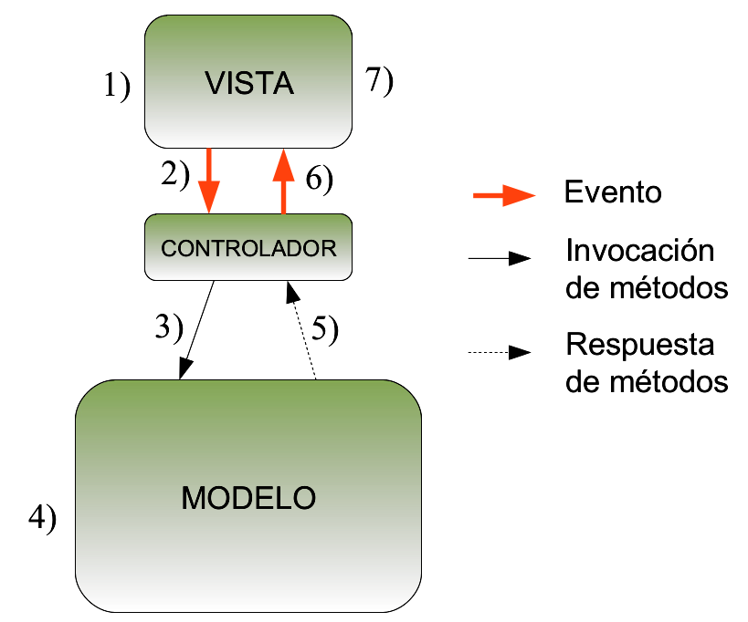

# Prácticas PDOO

Hola gente, os subo este documento porque, a no ser que Lastra cambie el orden de los contenidos, cosa que dudo, cuando os den el material para las prácticas os encontrareis un montón de clases que no sabréis para qué sirven y muy probablemente os pongan a programar un juego que ni vosotros sabéis de qué va.

Antes de nada deciros que estas prácticas son del curso 2017/2018 y es muy posible que cambien ciertas cosas en los guiones y en el diseño del juego más allá de correcciones de erratas, yo os subo lo que hice el año pasado y dudo que cambie demasiado, en cualquier caso supongo que os ayudará. Realmente lo que subo es el contenido de las prácticas hasta la 4, con ciertos cambios. Por ejemplo, vosotros antes de añadir herencia al juego lo haréis de una forma un poco más rudimentaria (y cutre la verdad). La práctica 1 y 2 no deberían costaros demasiado, la tercera quizá un poco más, pero la chunga es la 4, que es casualmente para la que más puede ayudar nuestro código. Hay una práctica 5 que consiste en incluirle en Java una interfaz gráfica al juego. Aconsejo llegar con más de una semana de antelación porque esa práctica a mí me costó mucho, de hecho no os la subo porque está tremendamente mal hecha, seguramente otros compañeros las tengan mejor hechas que nosotros xD. Adjunto también unas clases de test que hice para depurar, quizá os sirvan y si no pues ahí están.

Importante también, tanto las prácticas como el juego están un poco mal hechas y diseñadas a mi parecer, así que si veis que algo no tiene sentido es muy posible que sea así y ya está. De hecho, cuando esté todo implementado, como al iniciar el juego no te toque hangar estás jodido.

Lo último que digo, notareis que la POO en Java está bastante guay en el sentido de que hay muchas funcionalidades implementadas en Java que en Ruby se tienen que simular y la verdad que en ese sentido Ruby da un poco de sidita pero bueno, se tira.

Y poco más, mucha suerte y duro con ello!!

Antes de nada, pongo una pincelada del Modelo Vista-Controlador para que le veais sentido a las prácticas desde el primer momento.

# El Modelo Vista-Controlador

Básicamente el MVC es un patrón de diseño que consiste en separar el juego en tres capas, que como su propio nombre indica, son el modelo, la vista y el controlador. Os pongo un poco de documentación que os volvereis a encontrar en la lección 4.1, pero considero conveniente que os la mireis ahora para entender mejor el desarrollo de las prácticas. 

## Elementos del patrón MVC

- **Modelo**: Conjunto de clases que representan la lógica de negocio de la aplicación (clases deducidas del análisis del problema). Encapsula la funcionalidad y el estado de la aplicación.
- **Vista**: Representación de los datos contenidos en el modelo. Para un mismo modelo pueden existir distintas vistas.
- **Controlador**: Es el encargado de interpretar las ordenes del usuario. Mapea la actividad del usuario con actualizaciones en el modelo. Puesto que el usuario ve la vista y los datos originales están en el modelo, el controlador actúa como intermediario y mantiene ambos coherentes entre sí.

### Flujo de control del MVC:

1. El usuario realiza una acción en la interfaz (vista).
2. El controlador detecta e interpreta el evento generado.
3. Si la acción requiere alguna modificación en el modelo, el controlador inicia el cambio invocando a los métodos apropiados del modelo.
4. El modelo cambia.
5. Notifica la correcta realización del cambio al controlador.
6. El controlador notifica el cambio a las vistas.
7. Las vistas afectadas por el cambio se actualizan.

# Las clases de las prácticas

De primeras el material proporcionado son una serie de clases, aquí explico qué son cada una y para qué sirven. De primeras viene bien saber que esto es como un juego de cartas, hay un mazo de cartas de armas (`Weapon`), de escudos (`shieldBooster`), de hangares (`Hangar`),  de paquetes de suministros (`SuppliesPackage`), siendo estos complementos que le podeis añadir a vuestra propia estación espacial (`SpaceStation`), y por último un mazo de enemigos (`EnemyStarShip`), cada enemigo tiene un botín (`Loot`) asociado que añadireis a vuestra estación si lo venceis. Claramente cuanto más chetada esté la estación, más posibilidades hay de ganar. En caso de que perdais contra el enemigo, se os asignará dependiendo del enemigo un determinado daño pendiente (`Damage`), por el cual debereis entregar algunas de vuestras armas o escudos. En cada turno, antes y después de combatir se pueden montar y desmontar armas y escudos a placer. Dicho esto, las clases extrañas son:

- **`CardDeck`**: Es la clase que representa el mazo de cartas, cada carta es una entidad de las clases antes nombradas. Habrá una entidad de esta clase para cada mazo de los antes nombrados.
- **`CardDealer`**: Es algo así como el croupier del juego, la clase que reparte las cartas.
- **`GameStateController`**: El juego en función de si acabas de ganar o perder un combate, acabas de empezar a jugar, etc. tiene asociado un determinado estado (`GameState`),  esta es la clase que se encarga de ir cambiando el estado del juego según lo que vaya pasando.
- Objetos `****ToUI`: Por cada objeto que pueda salir representado en la interfaz del juego hay una clase ToUI (to user interface) con la información justa y necesaria para representarlo. Por ejemplo, para la clase `Weapon` hay una clase `WeaponToUI` con su potencia, el número de usos y el tipo de arma.
- **`PlayWithUI`**: Play With User Interface, algo así como el "main" del juego, una vez esté todo programado, se puede jugar ejecutando el código de esa clase.
- **`GameUniverse`**: Esta clase la teneis que implementar vosotros, pero para que os ubiqueis os la pongo aquí, desempeña el papel del modelo en el MVC, mejor dicho, la parte más superficial del modelo.
- **`TextUI`**: Básicamente desempeña el papel de la vista, mediante su código y con ayuda de los objetos `ToUI` se va mostrando cada mensaje por pantalla y actualizandose en función de lo que se haga.
- **`Controller`**:  Sirve de puente entre el Modelo (`GameUniverse`) y la vista (`TextUI`) según el flujo explicado anteriormente.

El resto de clases ya las implementareis completamente vosotros, espero que con esta información y con el código os sea suficiente para ir tirando. Si veis algún error o algo que añadir, adelante, todo vuestro. Como siempre un placer :DD