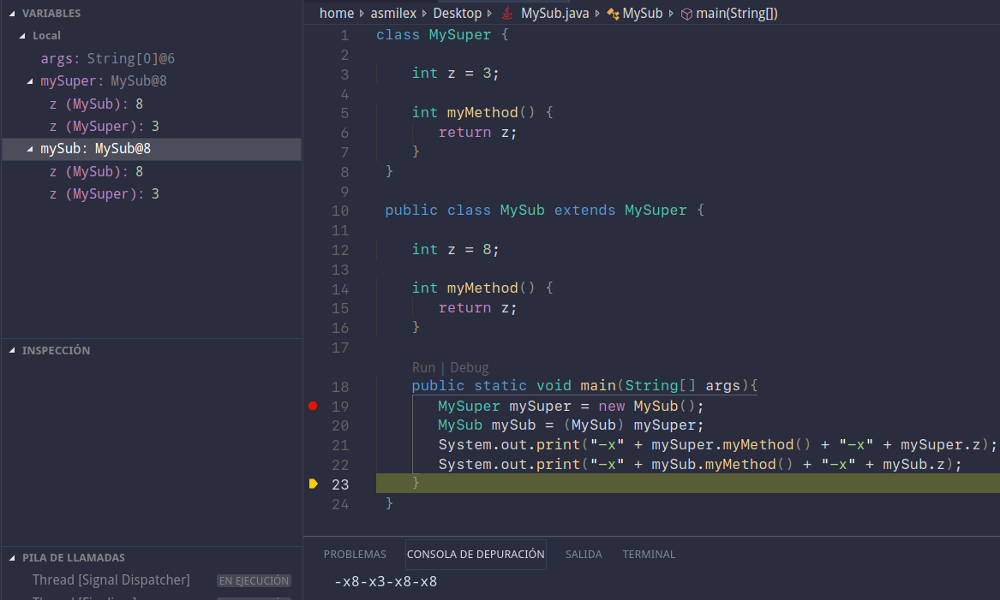
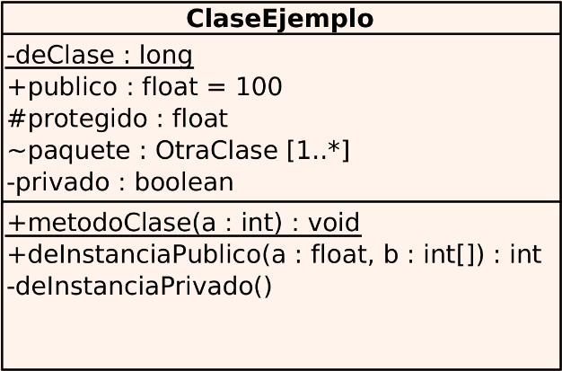

# Apuntes de clase

## Tabla de contenidos

<!-- @import "[TOC]" {cmd="toc" depthFrom=2 depthTo=6 orderedList=false} -->

<!-- code_chunk_output -->

- [ Tabla de contenidos](#tabla-de-contenidos)
- [ 1.- Introducción](#1-introducción)
  - [ Sección especial: Cómo leer código](#sección-especial-cómo-leer-código)
    - [ Código como concepto](#código-como-concepto)
    - [ Funciones y métodos](#funciones-y-métodos)
- [ 2.- Instancias y clases](#2-instancias-y-clases)
    - [ Java](#java)
    - [ Ruby](#ruby)
- [ 3.- Constructores](#3-constructores)
    - [ Java](#java-1)
    - [ Ruby](#ruby-1)
- [ 4.- Pseudovariables](#4-pseudovariables)
- [ 5.- Paquetes](#5-paquetes)
    - [ Java](#java-2)
    - [ Ruby](#ruby-2)
- [ 6.- Visibilidad](#6-visibilidad)
    - [ Java](#java-3)
    - [ Ruby](#ruby-3)
- [ 7.- Herencia](#7-herencia)
    - [ Java](#java-4)
    - [ Ruby](#ruby-4)
- [ 8.- Interfaces y clases abstractas](#8-interfaces-y-clases-abstractas)
    - [ 8.1.- Clases abstractas](#81-clases-abstractas)
    - [ 8.2.- Interfaces](#82-interfaces)
- [ 9.- Polimorfismo](#9-polimorfismo)
  - [ 9.1.- Introducción al polimorfismo en Java](#91-introducción-al-polimorfismo-en-java)
  - [ 9.2.- Casting](#92-casting)
  - [ 9.3.- Polimorfismo paramétrico](#93-polimorfismo-paramétrico)
    - [ Java](#java-5)
    - [ Ruby](#ruby-5)
  - [ 9.4.- Evitar comprobaciones explícitas de tipos](#94-evitar-comprobaciones-explícitas-de-tipos)
- [ 10.- Revisitando herencia](#10-revisitando-herencia)
  - [ 10.1.- ¿Qué método se selecciona?](#101-qué-método-se-selecciona)
    - [ Ruby](#ruby-6)
  - [ 10.2.- Herencia y atributos](#102-herencia-y-atributos)
    - [ Java](#java-6)
      - [ Resumen Java](#resumen-java)
    - [ Ruby](#ruby-7)
      - [ Resumen de Ruby](#resumen-de-ruby)
- [ 11.- Copia de objetos](#11-copia-de-objetos)
- [ 12.- Reflexión](#12-reflexión)
    - [ Java](#java-7)
    - [ Ruby](#ruby-8)
- [ 13.- UML](#13-uml)
    - [ Tipos de relaciones](#tipos-de-relaciones)
    - [ Paquetes](#paquetes)
  - [ 14.- Para practicar...](#14-para-practicar)
  - [ 14.1.- Errores comunes](#141-errores-comunes)
  - [ Java](#java-8)
    - [ Java](#java-9)
  - [ 15.- Créditos](#15-créditos)

<!-- /code_chunk_output -->


## 1.- Introducción

Estos apuntes repasan la asignatura Programación y Diseño Orientado a Objetos. Están pensados para usarlos como guía de estudio. Señalarán los conceptos más importantes, así como posibles fallos que se puedan dar a la hora de programar. La parte más básica se verá bastante por encima, puesto que es relativamente sencillo y en cualquier libro aparece bien. Sin embargo, trataremos herencia, polimorfismo y similares con más profundidad.

Antes de empezar, hay que tener en cuenta lo siguiente:

**En Java y en Ruby todo son referencias.**

En Java son todo referencias.

¿He dicho que en en Java son referencias siempre?

Pues lo son. Ten cuidado con eso. Si metemos mano a lo que no debemos, y aunque parezca aparentemente pudiera estar bien, podríamos haber expuesto el comportamiento interno de la clase desde fuera. Por ejemplo:

```java
class ShitHappens {
    ArrayList<String> array;

    ArrayList<String> getArray () {
        return array;
    }
}
```

No está devolviendo una copia. Está devolviendo **la dirección del array**. Aunque es un getter, cambiar lo que devuelve modifica el array de la clase. Por ejemplo, podríamos hacer un `.clear()`. Bueno, y... ¿Qué pasará si devolvemos una copia?

```java
class ShitHappens {
    ArrayList<String> array;

    ArrayList<String> getArray () {
        ArrayList<String> retorno = new ArrayList<>();

        for (String elemento: array)
            retorno.add(elemento);

        return retorno;
    }
}
```

Tampoco nos vale. Estamos devolviendo **las referencias que se hallan dentro del array**. Así que podríamos seguir modificando sus elementos. Veremos más adelante cómo se hacen las copias debidamente. Pero hay que tener en cuenta lo anterior. Aquí todo son referencias

Es también muy importante que tengamos en cuenta siempre cómo debe funcionar una clase. Podría seguir el siguiente esquema por capas:

```
Accedemos justo a esta capa de arriba desde fuera de la clase
                                            |
        ---------------------------         |
        | Comportamiento externo  | < - - - +
        ---------------------------
Clase:  | Comportamiento internto |
        ---------------------------
        |         Estado          |
        ---------------------------
```

Con respecto a Ruby, debemos señalar que no es fuertemente tipado. Usa lo que se denomina *duck typing*. Esto produce lo siguiente:

```ruby
class A
    def metodo (p)
        return p + 5
    end
end
```

¿Qué es `p`? ¿Un String? ¿Un entero? ¿Otra clase nuestra? ¿Tiene definido la suma?

La respuesta es: `¯\_(ツ)_/¯`

Le puedes pasar lo que te dé la absoluta gana. Y ya si peta Ruby, te lo dirá. Porque **Ruby es interpretrado**. Y, si algo no funciona, te lo dirá. Pero si funciona aunque sepa mal, no tendrás ni un warning, ni un fallo al compilar.

Esto al menos te forzará a pensar en el diseño de tus programas y, sobre todo, a apreciar lo maravillosamente pesado que es un compilador.

### Sección especial: Cómo leer código

#### Código como concepto

Es usual en principiantes tener problemas para leer programas y entenderlos. Saben perfectamente qué hace cada sentencia y cada variable, pero no en conjunto. Son capaces de leer línea a línea, pero no de *entender* lo que hace un fragmento de programa.

El primer paso para avanzar y romper esta mentalidad es saber leer. **Leer conceptos**.

Cito un fragmento del profesor F.J. Pérez curioso que lo ejemplifica:

> Para ponerlo de manifiesto vamos a considerar un ejemplo. En uno de los ejercicios al final deesta sección te propongo que pruebes que la igualdad:
> $$\frac{1}{x} + \frac{1}{y} = \frac{1}{x+y}$$
> nunca es cierta. Bien, supongamos que ya lo has probado. Seguidamente te pido que me digas cuándo es cierta la igualdad
> $$\frac{1}{x+y^2} + \frac{1}{z} = \frac{1}{x + y^2 + z}$$
> tienes 15 segundos. Y sobran 2. ¿Sí? ¿No? ¡Son la misma igualdad! Y aquí es donde yo quería llegar: si no te parece la misma igualdad es porque estás *leyendo los símbolos y no los conceptos*

En programación, pasa exactamente lo mismo:

```java
public float fire () {
    float disparo = base.fire();

    for (SpaceStation colaboradores : collaborators)
        disparo += colaboradores.fire();

    return disparo;
}
```

Así es como yo lo leería: *obtén el disparo base, y añádele el disparo de cada colaborador*.

A lo mejor, ahora mismo te estás preguntando... *¿Pero cómo sé yo que se hace eso? No conozco la clase SpaceStation, ni lo que hace el método `fire()`*.

Un buen código será legible incluso para alguien que no lo ha hecho. Programar es un trabajo en equipo. Deberías escribir como si detrás tuvieras una manada de monos furiosos con cuchillos que leyera tu código en cuanto termines.

<div style="text-align:center">
/><p>Mejor tenerlos delante que detrás</p></div>

Las variables deberían ser descriptivas. Las sentencias sencillas. El código debería estar bien estructurado. Y, no, los *hacks* que funcionan mediante superposición cuántica no son útiles. Lo más difícil es hacer un código simple y elegante. Los batiburrillos mejor dejárselos a las empresas que hacen software de DRM.

#### Funciones y métodos

Un método o función es una serie de operaciones, que pueden ser aplicadas o no a ciertos objetos. Vienen dados por un nombre, unos parámetros y una salida. Es un análogo al concepto de función en matemáticas

$$f:X \rightarrow Y$$

Y, como tal, es **muy importante** saber leer y escribir bien una función. Es el 50% del trabajo. Una sola línea.

Antes de escribir cualquier implementación, debes tener muy clara la cabecera. Y deberías ser capaz de leerlo tal que:

> Es una función llamada ___ que recibe ___ y devuelve ___

Esa simple frase facilitará muchísimo la coherencia de tu programa.


Dicho esto, empezamos con el temario propio de la asignatura

---

## 2.- Instancias y clases

#### Java

Sintaxis:

- Métodos y atributos de clase: se usa `static`
- Métodos y atributos de instancia: no tienen ningún matiz en especial. No llevan static

`final` funciona como const. Impide además heredar métodos/variables y sobreescribirlos
`static` comparte un mismo atributo entre todas las clases - atributo de clase

No llamar a métodos de clase desde una instancia. Don't do it. Stahp

#### Ruby

Sintaxis de atributos y variables:
- **En ámbito de instancia**
    - `@variable` crea o llama un atributo de instancia
    - `variable` crea una variable local **que no es de la clase**
- **En ámbito de clase**
    - `@variable` crea o llama un atributo de instancia de clase
    - `@@variable` crea o llama un atributo de clase
    - `variable` crea o llama una variable local

**Recuerda usar los correspondientes `@` en los métodos. Si no, se crearán variables**

Todo lo que empiece por mayúscula es constante. Ponerlo todo en mayúsculas es una buena costumbre.

Los atributos de instancia se definen y se inicializan dentro de métodos de instancia. En teoría, deberíamos hacerlo nada más que dentro de initialize.
Los atributos de instancia de clase se deben definir fuera de los métodos de instancia; es decir, en ámbito de clase.

Para crear los métodos de clase, se usa la partícula `self.` antes de un método

Los métodos de clase se llaman con `nombre_clase.método()`:
```rb
class Persona
    @MAYORIA_EDAD = 18 # atributo de instancia de clase constante

    def self.edad_legal
        @MAYORIA_EDAD # se puede omitir return
    end

end

```
Para llamar a ese método: `Persona.edad_legal`.
Usamos `self` para crear métodos de clase.


## 3.- Constructores

#### Java

```java
class Punto3D {
    ...

    public static void main() {
        Punto3D punto;   // No se crea nada. Es un objeto nulo.
        Punto3D point = new Punto3D(); // Aquí sí
    }
}
```

#### Ruby

No se pueden tener varios `initialize`
Nuevos constructores:

```ruby
class Punto
    def self.new_2D(x, y)
        new(x,y,0)            # Importante llamar siempre a new() alf final. self.new_2D no construye nada por sí mismo
    end

    private_class_method :new # pasa a ser privado. Con esto lo sobreescribimos

end
```

Hay otras formas de recibir parámetros de forma variable: mediante un array o con valores por defecto. Están en la presentación. No los recomienda.


## 4.- Pseudovariables

`this` se refiere a la instancia que está ejecutando el código. Equivalentemente `self`. Si estamos tratando métodos de clase, se refiere a la clase.


## 5.- Paquetes

#### Java

No tiene subpaquetes: el paquete `A` y `A.B` no tienen nada que ver. La única relación es el almacenamiento en disco

#### Ruby

No usar `include`. Simplemente copia y pega contenido de archivos.


## 6.- Visibilidad

#### Java

- `private`
    - Solo accesible desde el código de la propia clase. Tanto en ámbito de instancia como de clase
    - Permite acceder a elementos privados de una instancia de la misma clase
- `package`
    - Elementos públicos dentro del mismo paquete
    - Inaccesibles desde otros paquetes
- `protected`
    - Elementos públicos dentro del mismo paquete
    - Accesibles para subclases, aunque estén en otros paquetes
    - Inaccesibles desde otros paquetes por no subclases
    - Dentro de una misma instancia se podrán acceder a elementos protegidos de la superclase
- `public`
    - Libre albedrío. Como Pedro por su casa.


| **Visibilidad de atributos/métodos** | **`public`** | **`protected`** | **`package`** | **`private`** |
|--------------------------------------|--------------|-----------------|---------------|---------------|
| Misma clase                          | ✓            | ✓               | ✓             | ✓             |
| Clase del mismo paquete              | ✓            | ✓               | ✓             | ✗             |
| Subclase del mismo paquete           | ✓            | ✓               | ✓             | ✗             |
| Subclase de distinto paquete         | ✓            | Solo herencia   | ✗             | ✗             |
| No subclase de distinto paquete      | ✓            | ✗               | ✗             | ✗             |


#### Ruby

Lo anterior no se aplica. Los atributos son siempre privados. Los métodos son públicos por defecto.


`private` solo afecta a los métodos de instancia:

```ruby
private
def self.metodo_clase_privado
    puts "Cosas"
end

# Esta mierda no es privada
```

Para hacer un método de clase privado, hay que hacer lo siguiente:

```ruby
private
def self.metodo_clase_privado
    puts "Cosas"
end

private_class_method :metodo_clase_privado
```

Regla de oro de Ruby para métodos privados: *"no se puede acceder a un método privado si hay algún receptor explícito delante"*. Esto incluye `self` y variables. Esto implica:
- Solo se puede utilizar un método privado de la propia instancia
- No se puede acceder a métodos privados de clase desde el ámbito de instancia
- No se puede acceder a métodos privados de instancia desde el ámbito de clase

`protected` permite que los métodos puedan ser invocados con un receptor explícito siempre que la clase del código que la invoca sea la misma o una subclase. Solo se pueden proteger métodos de instancia.

```ruby
# Las líneas comentadas dan fallos

def Padre
    private
    def privado
    end

    protected
    def protegido
    end

    public
    def publico
    end
end

def Hija < Padre
    def test (p)
        privado
        #self.privado   # Receptor explícito delante de método privado
        #p.privado      # Receptor explícito delante de método privado

        protegido
        self.protegido
        p.protegido

        publico
        self.publico
        p.publico
    end
end

Hija.new.test(Hija.new)
Hija.new.test(Padre.new)

h = Hija.new
#h.privado            # Receptor explícito delante de método privado
#h.protegido          # Receptor explícito delante de método protegido fuera de una subclase
h.publico
```


## 7.- Herencia

La clase hija que hereda del padre añade y/o modifica el comportamiento de la clase padre.

La relación que se establece es del tipo *es-un*. Reutilizar métodos no es motivo suficiente para aplicar herencia. Tampoco debe limitar el comportamiento del padre.

Realmente, podemos ver la herencia como una especie de composición implícita del lenguaje.

#### Java

**Los constructores no se heredan**, pero sí se pueden invocar. Por ello, se necesita llamar a `super`. **En la primera línea**. Si no se hace, la instancia del padre que se halla *"dentro"*
`super.metodo()` permite llamar a cualquier método. No se limita al que se está redefiniendo.

Restricciones de la redefinición:
- Cambiar la visibilidad a una más permisiva
- El valor retornado puede ser de una subclase al indicado en el ancestro
- No se pueden redefinir métodos `final`
- No se pueden redefinir métodos privados

#### Ruby

Ruby llama automáticamente al initialize del padre **si no se ha redefinido su initialize**. Si vas a cambiar algo, necesitas llamar a `super` o de lo contrario, no existirá una instancia del padre *"dentro"* de la hija.
Esto hace que no se puedan usar métodos del padre ni atributos. Cuidado.
`super` únicamente puede llamar al método del padre que se está redefiniendo. Si se utiliza sin argumentos, automáticamente se pasan los argumentos


## 8.- Interfaces y clases abstractas

Ruby no tiene clases abstractas ni interfaces. Se puede simular, pero poco más. Por lo tanto, todo lo que hablaremos a continuación será aplicable principalmente a Java.

#### 8.1.- Clases abstractas

Una clase abstracta no tiene por qué implementar un método. Lo que hacen es **forzar** a que las hijas lo hagan. Estos métodos se denominan `abstract`. Tener hijos para esto...
**No se puede instanciar una clase abstracta**

#### 8.2.- Interfaces

Una interfaz es un contrato. Es una colección de métodos abstractos y propiedades constantes. Especifican qué se debe hacer, pero no cómo. Por tanto, las clases que implementen esa interfaz, están obligadas a proporcionar dichos métodos.

La principal diferencia entre una clase abstracta y una interfaz es que las interfaces no fuerzan a usar herencia.

No obstante, se puede diseñar una implementación por defecto para un método de la interfaz con `default`. Esto hace que los hijos no tengan por qué implementarlo obligatoriamente.

Características:
- Las instancias de una clase pueden realizar varias interfaces
- Una interfaz puede heredar de una o más interfaces
- Una interfaz solo puede tener: constantes, signaturas de métodos, métodos tipo default y el equivalente a los métodos de clase (static)
- Solo los métodos tipo default y static pueden tener asociada implementación
- Todos los métodos son públicos y las constantes public, static, y final
- No pueden ser instanciadas, solo realizadas o extendidas por otras interfaces
- Una clase puede heredar de otra e implementar varias interfaces.

Para resolver las colisiones de nombres, se puede hacer lo siguiente:

```java
interface A {
    default int metodo() { return 2; }
}

interface B {
    default int metodo() { return 1; }
}

class clase implements A, B {
    @Override
    int metodo() {
        return A.metodo() + B.metodo();
    }
}
```


## 9.- Polimorfismo

En términos generales, el [polimorfismo es la propiedad que permite enviar mensajes sintácticamente iguales a objetos de distinto tipo](https://es.wikipedia.org/wiki/Polimorfismo_(inform%C3%A1tica)). También es la capacidad de un objeto de tomar diferentes formas. Como vemos, la definición es muy general. Por lo que es normal que nos encontremos diferentes tipos.

Existen 3 principalmente:
- Polimorfismo ad-hoc: una interfaz común para un conjunto de individuos de tipos específicos
- Polimorfismo paramétrico: capacidad de definir un método común a varios tipos distintos con propiedades comunes
- Subtyping: cuando un nombre denota instancias de diferentes clases relacionadas por una superclase común

En los lenguajes sin declaración de variables, el polimorfismo se da sin limitaciones y de forma natural. Cuando sí se usan tipos, hay ciertos aspectos que debemos tener en cuenta.

Aunque no lo hemos tratado explícitamente, en esta asignatura se hace mucho incapié en los principios SOLID (*Single responsibility, Open-closed, Liskov substitution, Interface segregation and Dependency inversion*).
En esta sección nos aseguraremos de seguir el principio de sustitución de Barbara Liskov:

> *["Cada clase que hereda de otra puede usarse como su padre sin necesidad de conocer las diferencias entre ellas"](https://es.wikipedia.org/wiki/Principio_de_sustituci%C3%B3n_de_Liskov)*
> \- *Barbara Liskov*

Es decir, si B es un subtipo de A, se pueden utilizar instancias de B donde se esperan las de A

---

### 9.1.- Introducción al polimorfismo en Java

Java utliza tanto tipos estáticos como dinámicos. Cuando declaramos una variable sin hacer new, estamos usando el tipo estántico. Lo que viene tras `new` denota su tipo dinámico:

```java
estatico objeto = new dinamico();
```

Ruby no tiene mecanismo de declaración de variables. Cualquier variable puede referencias cualquier tipo de objeto.

El polimorfimo cobra sentido cuando se combina con ligadura dinámica. Es decir, el tipo dinámico determina el objeto que se ejecutará asociado a la llamada de un objeto. Como contrapartida, la ligadura estática hace que el código asociado a la llamada de un método se
determine en tiempo de compilación.

**El tipo estático limita lo que puede referenciar una variable**. Solo es capaz de referenciar instancias del tipo estático o subclases del tipo estático.
Además, **limita también los métodos que pueden ser invocados**. Solo se permiten invocar los métodos de los que dispone el tipo estático.

```java
class Persona {
    String andar()  {return "Ando como una persona"}

    String hablar() {return "Hablo como una persona"}
}

class Profesor extends Persona {
    @Override
    String hablar() {return "Hablo como un profesor"}
}

public class Main {
    public static void main (String[] args ){
        Persona p1 = new Persona();
        Persona p2 = new Profesor();  // <-----

        p1.hablar() // => "Hablo como una persona"
        p2.hablar() // => "Hablo como un profesor"
    }
}
```
Vemos que en el caso de `p2`, **se ha ejecutado el código asociado al tipo dinámico**.

> La disponibilidad de métodos de una variable viene dada por la intersección de los métodos de estático y dinámico, dándole prioridad a los del tipo dinámico

Se pueden ejecutar los métodos que tenga `Persona`, pero si se encuentran en `Profesor`, se usarán esos. Si no, recaen a los de `Persona`.

Veamos un ejemplo en el que el programa explota:

```java
class Profesor extends Persona {
    String impartir_clase() { // Este método no se haya en las superclases
        return "Impartiendo clase"
    }
}

public class Main {
    public static void main (String[] args ){
        Persona p = new Profesor();

        p.impartir_clase()
    //  ^^^^^^^^^^^^^^^^^^ Fallo de compilación: No se puede encontrar el método

        p = new Object()
    //  ^^^^^^^^^^^^^^^^^^ Fallo de compilación: Object no es una subclase de Persona
    }
}
```

---

### 9.2.- Casting

Para arreglar ciertos problemas de compilación, haremos casting o *casteo*, un *spanglishmo* que suena bastante bien. Consiste en cambiar una expresión de un tipo de dato a otro. Esto puede ocurrir de forma implícita o explícita:

```java
double d;
int i;

if (d < i) // Implícita
    ...
```

Es importante matizar que castear no hace ninguna transformación en el objeto referenciado ni cambia su comportamiento. Únicamente es una indicación al compilador. El **programador se responsabiliza de lo que ocurra a partir de ahí con el objeto.**

> 
>
> \- *Compilador*

La forma de esquivar ciertos erores de compilación esto son casteos. Pero te la juegas a que pete en tiempo de ejecución. Si estás seguro de que se puede encontrar el método, puedes hacerlo. Si no, ten cuidado.

A continuación veremos la forma explícita. Existen diferentes tipos de casteos:
- Downcast: se le indica al compilador que el tipo dinámico de una referencia es una subclase del tipo estático.
- Upcast: normalmente innecesario y reduntante. Aporta 0.
- Sidecast: nombre técnico para algo que seguro hará que explote tu programa.

El único tipo de casteo que produce errores en tiempo de compilación es el sidecast. El resto en ejecución.

Hay una excepción a lo dicho con upcast, y ocurre cuando una función tenga distinto comportamiento al ser pasado con un objeto u otro. Pero este caso no lo vemos nosotros.

Retomemos el ejemplo de antes usando casteos:

```java
public class Main {
    public static void main (String[] args ){
        Persona p = new Profesor();

        p.impartir_clase() // Fallo de compilación: No se puede encontrar el método
        p = new Object()   // Fallo de compilación: Object no es una sublcase de Persona

        Profesor prof = p; // Fallo de compilación. Un profesor no es en general una persona

    // ────────────────────────────────────────────────────────────────────────────────


        ((Profesor) p).impartir_clase();
    /*    ^^^^^^^^
        Cambiamos el tipo dinámico momentáneamente a Profesor. Y, entonces,
        Podemos saltarnos la restricción de la intersección de los tipos.
        Como el tipo dinámico es Profesor, y new hace que SÍ TENGAMOS disponibles los métodos
        de la clase Profesor, esto no tendrá ningún problema
    */


    // ────────────────────────────────────────────────────────────────────────────────


        Profesor profe = (Profesor) p;
    /*                    ^^^^^^^^
        Del mismo modo, como el tipo dinámico ha construido correctamente los elementos de Profesor,
        podemos hacer un downcast y asignarlo correctamente a la variable nueva.

        De hecho, fíjate en el error anterior, el de Profesor prof = p. Ahí no se puede hacer
        debido a que no hicimos el casteo.
    */


    // ────────────────────────────────────────────────────────────────────────────────


        profe.hablar(); // => "Hablo como un profesor". Se le da prioridad al tipo dinámico

        ((Persona) profe).hablar(); // => "Hablo como un profesor"
        /*
            Recuerdas lo que dijimos? Los upcast en general no hacen nada
            Efectivamente, ha conseguido hacer absolutamente 0 este upcast.
            Dissapointed but not surprised
        */

        Persona p2 = profe;
        p2.hablar(); // => "Hablo como un profesor"
        /*
            Este es un ejemplo de upcast implícito. Tampoco hace nada.
        */
    }
}
```

`new` construye la instancia del objeto. Por lo tanto, si NO has construido un objeto `X`, no vas a poder castear y usas métodos del objeto final. Dará error en tiempo de ejecución.

Pero, como lo más normal es que la caguemos olímpicamente al castear, analicemos algunos fallos:

```java
public class Main {
    public static void main (String[] args ){
        Persona p = new Persona();

        Profesor profe = (Profesor) p; // Fallo en tiempo de ejecución
        // No tenemos construido los datos necesarios de Profesor, por lo que castear hacia abajo es imposible

        ( (Profesor) new Persona() );      // Fallo en tiempo de ejecución
        ( (Profesor) p).impartir_clase();  // Fallo en tiempo de ejecución
        // De nuevo, no tenemos los métodos de Profesor porque nunca se construyeron. No se pueden usar

        ( (Profesor) ((Object) new Profesor()) ).impartir_clase(); // Este funciona
    /*
        Veamos por qué funciona el anterior:

        Primero, se crea un nuevo Profesor. A continuación se castea hacia arriba => no se hace nada.
        Lo siguiente que se hace es downcastearlo a un profesor. Por lo que tampoco se hace nada.
        Nos hemos quedado como estábamos
        Por último, se intenta usar impartir_clase(). Perfecto, porque hemos construido Profesor
    */

    }
}
```

Veamos ahora unos poquitos ejemplos de sidecast. Darán fallos, pero no tienen por qué ser en ejecución:

```java
class Alumno extends Persona {
    // Clase hermana
}

public class Main {
    public static void main (String[] args ){
        Alumno a1 = new Profesor();          // Error en compilación: tipos incompatibles
        Alumno a2 = (Alumno) new Profesor()  // Error en compilación: tipos incompatibles

        Alumno a3 = ( (Alumno) ((Object) new Profesor()) );
    /*
        Fallo en ejecución: Profesor no puede ser casteado a alumno.

        Como el primer casteo ha funcionado, a partir de ahí es responsabilidad del programador.
        Sí, el casteo de nuevo es inútil, pero ha funcionado.
        Por lo tanto, el compilador ya no comprobará nada
    */

    }
}
```

### 9.3.- Polimorfismo paramétrico

También conocido como *generics* o *templates*. Permiten definir métodos y clases genéricas cuyas operaciones son aplicables a distintos tipos de datos. Por ejemplo, si un método devuelve la suma de dos objetos, esta operación es válida para strings, floats, enteros, dobles o cualquier clase que tenga definida la suma.

#### Java

Se pueden pasar parámetros a clases, interfaces y métodos que serán tipos.

```java
class Array<T> {...}
```

Además, se puede forzar a que dicho parámetro herede de cierta clase:

```java
abstract class Forma {}

class Cuadrado extends Forma {...}
class Circulo extends Forma {...}
class Triangulo extends Forma {...}

class ArrayFormas <T extends Forma>
```

Aunque lo siguiente es una chapuza, si nos ponemos farrucos, podemos tener arrays con distintos tipos de datos que no tienen demasiado sentido a priori. Por ejemplo, un array con `[String, int]`

#### Ruby

Ruby no es fuertemente tipado. Tiene duck typing. Así que... Todo es genérico `¯\_(ツ)_/¯`

### 9.4.- Evitar comprobaciones explícitas de tipos

Hemos aprendido a usar diferentes tipos en mismas funciones, así como métodos genéricos. Esto nos puede incitar a intentar comprobar el tipo de dato que estemos pasando a nuestras funciones.
Esto es un fallo de diseño muy gordo.
No lo hagáis.
Lo digo en serio.
Evitadlo. Buscad otras formas. Pero, si llegado el momento, nos vemos forzado a usar comprobación de tipos, debemos dar un paso atrás y replantear nuestro diseño. Porque tiene fallos.


## 10.- Revisitando herencia

Dado que ya hemos aprendido qué es el polimorfismo, la harencia, y otros conceptos más básicos, es hora de revisitar lo que sabemos para juntarlo todo. El comportamiento de la llamada de métodos y el acceso a atributos podría sorprendernos, porque no funciona exactamente igual en estos dos mensajes.

### 10.1.- ¿Qué método se selecciona?

Cuando invocamos un método, cada lenguaje necesita saber dónde está el código que se debe usar. Con ligadura dinámica, primero lo buscará en el tipo dinámico. Si no se encuentra, se busca en el antecesor más próximo. Y así, hasta que se encuentre.

#### Ruby

Veamos un ejemplo en Ruby:

```ruby
class Padre
    def interno
        puts "Yo soy tu padre"
    end

    def metodo
        puts "¿Quién soy?"
        interno
    end
end

class Hijo < Padre
    def interno # Lo sobreescribimos
        puts "Soy el hijo!"
    end
end

Padre.new.metodo # => ¿Quién soy? Yo soy tu padre
Hijo.new.metodo  # => ¿Quién soy? Soy el hijo!
```

Planteémoslo de la siguiente forma: En Ruby, cuando se decide buscar un método, se vuelve siempre al tipo dinámico. Y va subiendo hasta que lo encuentre.

### 10.2.- Herencia y atributos

#### Java

Java no permite la redefinición de métodos de clase al mismo nivel que de instancia. Por ello, pueden existir métodos de clase con el mismo nombre que producen efectos distintos. Analicemos algunos ejemplos:

```java
class Padre {
    public static final int DECLASE = 1;

    public static int getDECLASE () {
        return DECLASE;
    }
}

class Hija extends Padre {
    public static final int DECLASE = 2;
/*
    A partir de ahora, todos los hijos tendrán como valor de la variable 2.
    Esto ocurrirá hasta que se modifique de nuevo, como acabamos de hacer.
    La variable del padre queda intacta. No es la misma en Java.
*/

}

class Nieta extends Hija {
    public static int getDECLASE() { // NO se está redefiniendo
        // No podemos hacer super.getDECLASE()

        return DECLASE;
    }
}

public class Main {
    public static void main (String[] args) {
        System.out.println(Padre.DECLASE);   // 1
        System.out.println(Hija.DECLASE);    // 2
        System.out.println(Nieta.DECLASE);   // 2

        System.out.println(Padre.getDECLASE());  // 1
        System.out.println(Hija.getDECLASE());   // 1. Esto ocurre porque busca la variable de clase en el ámbito más cercano
        System.out.println(Nieta.getDECLASE());  // 2. Se ha "redefinido" el método. Ahora busca la más cercana desde Nieta.

    /*
        Aunque lo siguiente es válido y no arroja errores, no se deben invocar
        métodos de clase desde instancias. No es nada recomendable.

        El tipo estático también influye en la llamada
    */

        Padre p = new Padre();
        System.out.println(p.getDECLASE()); // 1

        p = new Nieta();
        System.out.println(p.getDECLASE()); // 1

        Nieta n = new Nieta();
        System.out.println(n.getDECLASE()); // 2
    }
}
```

El término correcto para describir lo que ocurre con la variable de clase es *shadowing*. Este concepto denota la capacidad de llamar a dos variables distintas de la misma forma. Esto es posible dado que se encuentran en diferente ámbito.

En el siguiente ejemplo, seguiremos el flujo de llamadas de Java con el objetivo de comprender cómo funciona:

```java
class Super {
    protected int x = 5;

    public Super() {
        x++;
        System.out.print("-" + method(7, 3));
    }

    public int method (int i) {
        return x + i - 4;
    }

    public int method (int i, int i2) {
        return method(i) + i - i2;
    }
}

class Sub extends Super {
    int x = 3;

    public int method (int i) {
        return ( (x * 2) + (i + super.x) );
    }

    public static void main (String[] args) {
        Super s = new Sub();
        System.out.print("-" + s.x);
        Super sup = new Super();
    }
}
```

La salida del programa es `-17-6-13`.

1. `Super s = new Sub()`: Llama al constructor de la clase `Sub`. Como no existe, llama por defecto al del padre `Super`
    2. Incrementa la variable Super.x => x = 6. Esto ocurre porque toma el atributo más cercano al lugar donde se define el método
    3. Llama a `Super.method(7, 3)`
        4. Suma `method(7) + 7 - 3`. Llama a `Sub.method(7)`. Para métodos, siempre intenta tomar los del tipo dinámico. Si no los encuentra, asciende
        5. `method(7)` devuelve `( (x * 2) + (i + super.x) )`, donde
            - `x = 0`, dado que todavía no se ha inicializado. La operación de **`super()` siempre tiene prioridad al resto del cuerpo del constructor**. Debe ser puesto en la primera línea. Por lo tanto, y, aunque la clase tenga un valor por defecto en x, este todavía no se ha usado, puesto que se ha ejecutado primero el constructor del padre.
            - `super.x = 6`
            - Por tanto, se devuelve (0 * 2) + 7 + 6 = 13
    6. Saca a pantalla `(13 + 7 - 3) = 17`
7. En `main()`, saca `s.x`. Como se le da prioridad al tipo estático, se saca `- 6`
8. `Super sup = new Super()`.
9. El desarrollo es más o menos el mismo, pero en este caso, se usa `Super.method(int i)`.  El resultado es `13`.

Finalmente, veamos este ejemplo:



Lo más interesante es que en la clase existen dos `z`: una que pertenece a la clase MySuper, y otra a MySub. Son copias. Por tanto, cuando hacemos `mySuper.z`, se le da prioridad a la `z` de la clase `MySuper`. Por ello sale 3.

---

##### Resumen Java

Debemos de tener bastantes matices en cuenta, así que resumámoslos:

- Se tomará el método de instancia más profundo en el árbol de herencia. Esto es, el más cercano al tipo dinámico
- Se tomará el atributo más cercano adonde se implemente el método usado. Pero debemos tener cuidado con el shadowing
- Si se accede a un atributo desde fuera, se usará el tipo estático


#### Ruby

Aquí, las clases son *first-class-citizens*. Esto nos dice que las clases son entidades que también soportan operaciones comunes a otros tipos de datos. Por ejemplo, ser pasadas como argumentos, retornadas como valores, ser modificados o asignados...

Ruby funciona de forma diferente a Java. Veamos el siguiente ejemplo:

```ruby
class Padre
    @instancia_clase1 = 1
    @instancia_clase2 = 2

    def self.salida
        puts @instancia_clase1
        puts @instancia_clase2 unless @instancia_clase2.nil?
    end

    def self.salida2
        salida
    end
end

class Hija < Padre
    @instancia_clase1 = 3

    #####################################################
    # Los atributos de instancia de clase NO SE heredan #
    #####################################################

    def self.salida2
        super
        puts @instancia_clase1
    end
end

Padre.salida    # 1, 2
Hija.salida     # Acaba en el método del padre => 3
Padre.salida2   # 1, 2

Hija.salida2
# Usa Hija.salida. Llama a super => se ejecuta Padre.salida2 => busca salida
# empezando por la Hija. No lo encuentra, por lo que se va a buscarlo al Padre.
# lo encuentra => 3. Como los atributos de instancia de clase no se heredan, @instancia_clase2 no existe
# finalmente, saca @instancia_clase1 => 3
# Salida final: 3,3
```

Hemos sacado en claro entonces que:
- Los métodos se buscan siempre desde abajo hacia arriba
- Las variables de instancia de clase no se heredan

Ahora, observemos un ejemplo con variables de clase:

```ruby
class Padre
  @@de_clase=6

  def self.de_clase
    @@de_clase
  end
end

puts Padre.de_clase # 6

class Hija < Padre
  @@de_clase=666
end

puts Padre.de_clase # 666 !!!!
puts Hija.de_clase
```
Lo que podemos aprender aquí es que las **variable de clase son compartidas en Ruby**. Al contrario que en Java. Si modificamos una en una subclase, todos los ancestros se verán modificados. Además, se heredan.

Finalmente, juntemos todo lo aprendido en un último ejemplo, que repasará todo:

```ruby
class Padre
    @instanciaDeClase = 1
    @duda             = 2
    @@deClase         = 11
    @@duda            = 22

    def initialize
        @deInstancia = 333
        @duda        = 444
    end

    def self.salida
        puts @instanciaDeClase+1
        puts @duda+1 unless @duda.nil? # desde Hija?
        puts @@deClase+1
        puts @@duda+1
    end

    def salida
        puts @deInstancia+1
        puts @duda+1
        puts @@deClase+1
        puts @@duda+1
    end
end

class Hija < Padre
    @instanciaDeClase = -1
    # Sobreescribimos el valor fijado anteriormente
    # Este atributo es compartido
    @@deClase = -11

    def modifica
    # Acceso a los atributos definidos en Padre
        @duda += 111
    end
end


# Fuera de cualquier clase
Padre.salida
Hija.salida # Atención a lo que ocurre con la segunda línea

p = Padre.new
p.salida

h = Hija.new
h.salida
h.modifica

h.salida
p.salida
```

Este caso lo haremos poco a poco. Pero debemos tener en cuenta todo lo que hemos aprendido en los ejemplos anteriores.
Primero, debemos entender bien qué hacen nuestras variables y bajo qué ámbito se encuentran.
Lo más destacable es el caso de `@duda`. Durante todo el código, existirán 2 `@duda` independientes: uno de instancia, y otra de instancia de clase.
Otro detalle de importancia es el método salida. Hay uno de clase, y otro de instancia. Cuidado, porque sacarán información diferente.

Dicho esto, empecemos:

- `Padre.salida`: `2, 3, -10, 23`.
Lo único que podría sorprendernos es el -10. Esto es debido a que la clase hija sobreescribe la variable de clase. Y, al ser interpretado Ruby, y haber leído esa línea, su valor queda modificado también para el padre
- `Hija.salida`: `0, -10, 23`. O, de otra forma: `0, nil, -10, 23`
Recordemos que los atributos de instancia de clase no se heredan. En la clase Hija se crea uno nuevo que se llama exactamente igual que el anterior. Ruby busca el método `salida` en Hija, pero no lo encuentra. Por tanto, se va al Padre. Ahí, busca las variables de línea en línea. Cuando intenta buscarlas, siempre empieza por Hija, y asciende poco a poco. Usa `@instanciaDeClase = -1`, y como `@duda` no existe en la hija, su valor es nil. Las variables de clase se comportan como esperamos. Estas sí se heredan. A partir de aquí, no las comentaré, porque su valor será exactamente el mismo.
- `p.salida`: `334, 445, -10, 23`. Nada que objetar aquí
- `h.salida`: `334, 445, -10, 23`. Ahora sí tenemos chicha.
Al no haber definido `initialize`, automáticamente se llama al constructor del padre. Por tanto, construye una copia de los atributos de instancia del padre, y se los guarda en la clase Hija. Los valores que saca son exactamente los mismos que antes, porque, a fin de cuentas, solo los ha copiado.
- `h.salida` tras `h.modifica`: `334, 556, -10, 23`.
Mira el párrafo de arriba. Y haz incapié en lo siguiente: *construye una copia de los atributos de instancia del padre, y se los guarda en la clase Hija*. Copia. Efectivamente. Hemos modificado el atributo de instancia `@duda`, pero solo para la instancia de Hija. Veamos qué ocurre con la instancia del padre...
- `p.salida`: `334, 445, -10, 23`. Bingo. No se ve afectado.

---

##### Resumen de Ruby

Dado que es mucha información, hagamos un resumen sobre los atributos y las clases:
- Se buscan siempre empezando en el mayor descendiente y ascendiendo (Desde la hija a los padres y más allá).
- Atributos de instancia:
    - Es necesario llamar a super para construirlos.
    - Se hereda una copia del valor de las variables en ese momento.
- Atributos de clase:
    - Se heredan.
    - Son compartidos.
    - Modificar uno cambia el valor de la variable en toda la familia.
- Atributos de instancia de clase:
    - No se heredan.
    - Solo se sobreescriben en ámbitos cercanos.


## 11.- Copia de objetos

Copia de profundidad baja:

```java
Arraylist<tipo> getArray(){
    return (ArrayList) (array.clone());
}
```

Ojo, que esto te sigue permitiendo modificar los elementos de dentro. Simplemente evita que le hagas operaciones al array del tipo `clear()`

Copia defensiva de mayor nivel. Es decir, copia profunda:

```java
class Numero implements Cloneable {
    private Interger i;

    @Override
    public Numero clone() throws CloneNotSupportedException {
        Numero nuevo = (Numero) super.clone();
        nuevo.i = i.clone();
        return nuevo;
    }
}

class ComplejaMasSegura implements Cloneable {
    ArrayList numeros;

    ArrayList getNumeros() {
        // Copia profunda
        ArrayList<Numero> nuevo = new ArrayList<>();
        Numero n = null;

        for (Numero i: this.numeros) {
            try {
                n = i.clone(); // Implementada en Numero. Ya es segura
            } catch (CloneNotSupportedException e) {
                System.err.println("CloneNotSupportedException");
            }

            nuevo.add(n);
        }

        return nuevo;
    }

    public ComplejaMasSegura clone() throws CloneNotSupportedException {
        ComplejaMasSegura nuevo = (ComplejaMasSegura) super.clone();
        nuevo.numeros = this.getNumeros(); // Ya se hace la copia profunda
        return nuevo;
    }
}
```


## 12.- Reflexión

La reflexiónes la capacidad de un programa para manipularse a si mismo y comprender sus estructuras en tiempo de ejecución. Hay dos mecanismos:

- **Introspección**, que es la habilidad del programa para observar y razonar sobre su estado en tiempo de ejecución
- **Modificación**, el cual sí nos permite modificarlo. Este es más típico de lenguajes interpretrados

#### Java

Se permite introspección. Es algo más limitado, pero podría ser de utilidad. Veamos un pequeño ejemplo:

```java
A obj = new A();
Class clase = obj.getClass();

Field[] var_instancia = clase.getFields();
Constructor[] construct = clase.getConstructors();
Method[] metodos_instancia = clase.getMethods();
String class_name = clase.getSimpleName();
```

#### Ruby

Aquí nos encontramos tanto con introspección como modificación:

```ruby
class Libro
    def initialize titulo
        @titulo = titulo
    end
end

libro1 = Libro.new("¿Sueñan los androides con ovejas eléctricas?")

# Añadimos un método de instancia nuevo
Libro.class_eval do def publicacion (year)
                        @ano_pubicacion = year
                    end

libro1.publicacion(1968)
puts libro1.inspect     # ahora aparece también @ano_pubicacion

# Solo para esta instancia
libro1.instance_eval do def autor (autor)
                            @autor = autor
                        end
libro1.autor("Philip K. Dick")

libro2 = Libro.new("Metro 2033")
libro2.autor("Dmitri Glujovski") # error: undefined method 'autor'

puts  Libro.instance_methods(false) # publicacion
# El parámetro indica si queremos solo los métodos de esa clase (false)
# o también los heredados (true)

puts libro1.instance_variables
    # @autor,  @titulo,  @añoPublicacionputs

libro2.instance_variables       # @titulo
puts libro1.instance_of?(Libro) # true

```

Recordatorio. No uséis `instance_of`. Ni comprobéis tipos. No lo hagáis.

---

## 13.- UML

Sintaxis:


#### Tipos de relaciones

- Asociación: relación estructural fuerte y duradera en el tiempo. Línea continua. Navegabilidad indicada por puntas de flechas. Son líneas continuas.
Pueden tener, además, una clase asociada que se usa como enlace. Con respecto a las propiedades, se pueden indicar cuántos elementos tienen la asociación y otras propiedades. Ejemplo de asociación:

```
--------------------               --------------------
|   Lista éxitos   |   contiene    |     Canción      |
-------------------- x━━━━━━━━━━►  --------------------
| - nombre: string |        0..*   |- titulo: string  |
--------------------               |- artista: string |
                                   |- fecha: Date     |
                                   --------------------
```

- Hay otros tipos de asociaciones especiales.
    - Agregación: una clase representa el todo y la otra las partes (Rombo vacío: ♢)
    - Composición: agregación donde todas las partes no tienen sentido sin el todo. La cardinalidad debe ser 0..1 o 1 (Rombo relleno: ♦)
- Dependencia: relación débil y poco duradera. Por ejemplo, un parámetro. Se utiliza línea discontinua:
```
---------------------------            ---------------------
|          Gestor         |            |      Factura      |
--------------------------- x------->  ---------------------
| GenerarFactura: Factura |            |- referencia: int  |
---------------------------            |- CIF: string      |
                                       |- cantidad: float  |
                                       ---------------------
```
- Generalización
- Realización

La herencia se indica como una asociación con una punta de flecha hueca

#### Paquetes
Se pueden dar relaciones de dependencia entre paquetes

### 14.- Para practicar...

### 14.1.- Errores comunes

Esta sección está pensada para practicar los exámenes de la UGR de PDOO. Se señalan algunos fallos típicos en el código:

### Java

- Restringir visibilidad de métodos al heredar produce fallo de compilación
- Fallo en los constructores por no usar `super`. No se crean atributos y otros problemas
- ¿Qué método se llama?
- Instanciar una interfaz (`new Interface()`) es un fallo

#### Java

[Varios tests](https://www.geeksforgeeks.org/quiz-corner-gq/#Java%20Programming%20Mock%20Tests)
[Casting](http://www.sarmaroof.com/exercise-beginner-java-object-casting/)


### 15.- Créditos

El contenido de esta guía está sacado principalmente de las diapositivas de M. Lastra, profesor de la UGR. Además, algunas definiciones se han sacado de Wikipedia.